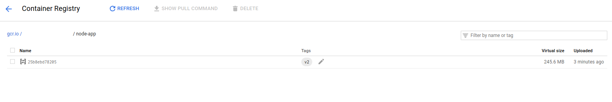

# Introduction to Docker

## GSP055


## Overview

Docker is an open platform for developing, shipping, and running applications. With Docker, you can separate your applications from your infrastructure and treat your infrastructure like a managed application. Docker helps you ship code faster, test faster, deploy faster, and shorten the cycle between writing code and running code.

Docker does this by combining kernel containerization features with workflows and tooling that helps you manage and deploy your applications.

Docker containers can be directly used in Kubernetes, which allows them to be run in the Kubernetes Engine with ease. After learning the essentials of Docker, you will have the skillset to start developing Kubernetes and containerized applications.

### What you'll learn

In this lab, you will learn how to do the following:

- How to build, run, and debug Docker containers.
- How to pull Docker images from Docker Hub and Google Container Registry.
- How to push Docker images to Google Container Registry.

### Prerequisites

This is an **introductory level** lab. Little, to no prior experience with Docker and containers is assumed. Familiarity with Cloud Shell and the command line is suggested, but not required. If you are looking for more advanced material in this service area, be sure to check out the following labs:

- [App Dev: Deploying the Application into Kubernetes Engine - Python](https://google.qwiklabs.com/catalog_lab/979)
- [Hello Node Kubernetes](https://google.qwiklabs.com/catalog_lab/468)
- [Managing Deployments Using Kubernetes Engine](https://google.qwiklabs.com/catalog_lab/572)

Once you're ready, scroll down to get your lab environment set up.

## Setup and Requirements

### **Qwiklabs setup**

#### Before you click the Start Lab button

Read these instructions. Labs are timed and you cannot pause them. The timer, which starts when you click Start Lab, shows how long Cloud resources will be made available to you.

This Qwiklabs hand-on lab lets you do the lab activities yourself in a real cloud environment, not in a simulation or demo environment. It does so by giving you new, temporary credentials that you use to sign in and access the Google Cloud Platform for the duration of the lab.

#### What you need

To complete this lab, you need:

- Access to a standard internet browser (Chrome browser recommended).
- Time to complete the lab.

**Note:** If you already have your own personal GCP account or project, do not use it for this lab.

#### How to start your lab and sign in to the Console

1. Click the **Start Lab** button. If you need to pay for the lab, a pop-up opens for you to select your payment method. On the left, the **Connection Details** panel becomes populated with the temporary credentials that you must use for this lab.

   

2. Copy the username, and then click **Open Google Console**. The lab spins up resources, and then opens another tab that shows the **Choose an account** page.

   **Tip:** Open the tabs in separate windows, side-by-side.

3. On the Choose an account page, click **Use Another Account**.

   

4. The Sign in page opens. Paste the username that you copied from the Connection Details panel. Then copy and paste the password.

   **Important:** You must use the credentials from the Connection Details panel. Do not use your Qwiklabs credentials. If you have your own GCP account, do not use it for this lab (avoids incurring charges).

5. Click through the subsequent pages:

   - Accept the terms and conditions.
   - Do not add recovery options or two-factor authentication (because this is a temporary account).
   - Do not sign up for free trials.

After a few moments, the GCP console opens in this tab.

**Note:** You can view the menu with a list of GCP Products and Services by clicking the **Navigation menu** at the top-left, next to “Google Cloud Platform”. 

### Activate Google Cloud Shell

Google Cloud Shell is a virtual machine that is loaded with development tools. It offers a persistent 5GB home directory and runs on the Google Cloud. Google Cloud Shell provides command-line access to your GCP resources.

1. In GCP console, on the top right toolbar, click the Open Cloud Shell button.

   

2. In the dialog box that opens, click **START CLOUD SHELL**:

   

   You can click "START CLOUD SHELL" immediately when the dialog box opens.

It takes a few moments to provision and connect to the environment. When you are connected, you are already authenticated, and the project is set to your *PROJECT_ID*. For example:


**gcloud** is the command-line tool for Google Cloud Platform. It comes pre-installed on Cloud Shell and supports tab-completion.

You can list the active account name with this command:

```
gcloud auth list
```

Output:

```output
Credentialed accounts:
 - <myaccount>@<mydomain>.com (active)
```

Example output:

```Output
Credentialed accounts:
 - google1623327_student@qwiklabs.net
```

You can list the project ID with this command:

```
gcloud config list project
```

Output:

```output
[core]
project = <project_ID>
```

Example output:

```Output
[core]
project = qwiklabs-gcp-44776a13dea667a6
```

Full documentation of **gcloud** is available on [Google Cloud gcloud Overview](https://cloud.google.com/sdk/gcloud).

## Hello World

Open up Cloud Shell and enter the following command to run a hello world container to get started:

```
docker run hello-world
```

(Command Output)

```bash
Unable to find image 'hello-world:latest' locally
latest: Pulling from library/hello-world
9db2ca6ccae0: Pull complete
Digest: sha256:4b8ff392a12ed9ea17784bd3c9a8b1fa3299cac44aca35a85c90c5e3c7afacdc
Status: Downloaded newer image for hello-world:latest

Hello from Docker!
This message shows that your installation appears to be working correctly.
...
```

This simple container returns `Hello from Docker!` to your screen. While the command is simple, notice in the output the number of steps it performed. The docker daemon searched for the hello-world image, didn't find the image locally, pulled the image from a public registry called Docker Hub, created a container from that image, and ran the container for you.

Run the following command to take a look at the container image it pulled from Docker Hub:

```
docker images
```

(Command Output)

```bash
REPOSITORY     TAG      IMAGE ID       CREATED       SIZE
hello-world    latest   1815c82652c0   6 days ago    1.84 kB
```

This is the image pulled from the Docker Hub public registry. The Image ID is in [SHA256 hash](https://www.movable-type.co.uk/scripts/sha256.html) format—this field specifies the Docker image that's been provisioned. When the docker daemon can't find an image locally, it will by default search the public registry for the image. Let's run the container again:

```
docker run hello-world
```

(Command Output)

```bash
Hello from Docker!
This message shows that your installation appears to be working correctly.

To generate this message, Docker took the following steps:
...
```

Notice the second time you run this, the docker daemon finds the image in your local registry and runs the container from that image. It doesn't have to pull the image from Docker Hub.

Finally, look at the running containers by running the following command:

```
docker ps
```

(Command Output)

```bash
CONTAINER ID        IMAGE               COMMAND             CREATED             STATUS              PORTS               NAMES
```

There are no running containers. The hello-world containers you ran previously already exited. In order to see all containers, including ones that have finished executing, run `docker ps -a`:

```
docker ps -a
```

(Command Output)

```bash
CONTAINER ID      IMAGE           COMMAND      ...     NAMES
6027ecba1c39      hello-world     "/hello"     ...     elated_knuth
358d709b8341      hello-world     "/hello"     ...     epic_lewin
```

This shows you the `Container ID`, a UUID generated by Docker to identify the container, and more metadata about the run. The container `Names` are also randomly generated but can be specified with `docker run --name [container-name] hello-world`.

## Build

Let's build a Docker image that's based on a simple node application. Execute the following command to create and switch into a folder named `test`.

```
mkdir test && cd test
```

Create a `Dockerfile`:

```
cat > Dockerfile <<EOF
# Use an official Node runtime as the parent image
FROM node:6

# Set the working directory in the container to /app
WORKDIR /app

# Copy the current directory contents into the container at /app
ADD . /app

# Make the container's port 80 available to the outside world
EXPOSE 80

# Run app.js using node when the container launches
CMD ["node", "app.js"]
EOF
```

This file instructs the Docker daemon on how to build your image.

- The initial line specifies the base parent image, which in this case is the official Docker image for node version 6.
- In the second, we set the working (current) directory of the container.
- In the third, we add the current directory's contents (indicated by the `"."` ) into the container.
- Then we expose the container's port so it can accept connections on that port and finally run the node command to start the application.

Spend some time reviewing the [Dockerfile command references](https://docs.docker.com/engine/reference/builder/#known-issues-run) to understand each line of the `Dockerfile`.

Now you'll write the node application, and after that you'll build the image.

Run the following to create the node application:

```
cat > app.js <<EOF
const http = require('http');

const hostname = '0.0.0.0';
const port = 80;

const server = http.createServer((req, res) => {
    res.statusCode = 200;
      res.setHeader('Content-Type', 'text/plain');
        res.end('Hello World\n');
});

server.listen(port, hostname, () => {
    console.log('Server running at http://%s:%s/', hostname, port);
});

process.on('SIGINT', function() {
    console.log('Caught interrupt signal and will exit');
    process.exit();
});
EOF
```

This is a simple HTTP server that listens on port 80 and returns "Hello World."

Now let's build the image.

Note again the `"."`, which means current directory so you need to run this command from within the directory that has the Dockerfile:

```
docker build -t node-app:0.1 .
```

It might take a couple of minutes for this command to finish executing. When it does, your output should resemble the following:

```
Sending build context to Docker daemon 3.072 kB
Step 1 : FROM node:6
6: Pulling from library/node
...
...
...
Step 5 : CMD node app.js
 ---> Running in b677acd1edd9
 ---> f166cd2a9f10
Removing intermediate container b677acd1edd9
Successfully built f166cd2a9f10
```

The `-t` is to name and tag an image with the `name:tag` syntax. The name of the image is `node-app` and the `tag` is `0.1`. The tag is highly recommended when building Docker images. If you don't specify a tag, the tag will default to `latest` and it becomes more difficult to distinguish newer images from older ones. Also notice how each line in the `Dockerfile` above results in intermediate container layers as the image is built.

Now, run the following command to look at the images you built:

```
docker images
```

Your output should resemble the following:

```
REPOSITORY     TAG      IMAGE ID        CREATED            SIZE
node-app       0.1      f166cd2a9f10    25 seconds ago     656.2 MB
node           6        5a767079e3df    15 hours ago       656.2 MB
hello-world    latest   1815c82652c0    6 days ago         1.84 kB
```

Notice `node` is the base image and `node-app` is the image you built. You can't remove `node` without removing `node-app` first. The size of the image is relatively small compared to VMs. Other versions of the node image such as `node:slim` and `node:alpine` can give you even smaller images for easier portability. The topic of slimming down container sizes is further explored in Advanced Topics. You can view all versions in the official repository [here](https://hub.docker.com/_/node).

## Run

In this module, use this code to run containers based on the image you built:

```
docker run -p 4000:80 --name my-app node-app:0.1
```

(Command Output)

```bash
Server running at http://0.0.0.0:80/
```

The `--name` flag allows you to name the container if you like. The `-p` instructs Docker to map the host's port 4000 to the container's port 80. Now you can reach the server at `http://localhost:4000`. Without port mapping, you would not be able to reach the container at localhost.

Open another terminal (in Cloud Shell, click the `+` icon), and test the server:

```
curl http://localhost:4000
```

(Command Output)

```bash
Hello World
```

The container will run as long as the initial terminal is running. If you want the container to run in the background (not tied to the terminal's session), you need to specify the `-d` flag.

Close the initial terminal and then run the following command to stop and remove the container:

```
docker stop my-app && docker rm my-app
```

Now run the following command to start the container in the background:

```
docker run -p 4000:80 --name my-app -d node-app:0.1

docker ps
```

(Command Output)

```bash
CONTAINER ID   IMAGE          COMMAND        CREATED         ...  NAMES
xxxxxxxxxxxx   node-app:0.1   "node app.js"  16 seconds ago  ...  my-app
```

Notice the container is running in the output of `docker ps`. You can look at the logs by executing `docker logs [container_id]`.

**Tip:** You don't have to write the entire container ID, as long as the initial characters uniquely identify the container. For example, you can execute `docker logs 17b` if the container ID is `17bcaca6f....`

```
docker logs [container_id]
```

(Command Output)

```bash
Server running at http://0.0.0.0:80/
```

Let's modify the application. In your Cloud Shell, open the test directory you created earlier in the lab:

```
cd test
```

Edit `app.js` with a text editor of your choice (for example nano or vim) and replace "Hello World" with another string:

```bash
....
const server = http.createServer((req, res) => {
    res.statusCode = 200;
      res.setHeader('Content-Type', 'text/plain');
        res.end('Welcome to Cloud\n');
});
....
```

Build this new image and tag it with `0.2`:

```
docker build -t node-app:0.2 .
```

(Command Output)

```bash
Step 1/5 : FROM node:6
 ---> 67ed1f028e71
Step 2/5 : WORKDIR /app
 ---> Using cache
 ---> a39c2d73c807
Step 3/5 : ADD . /app
 ---> a7087887091f
Removing intermediate container 99bc0526ebb0
Step 4/5 : EXPOSE 80
 ---> Running in 7882a1e84596
 ---> 80f5220880d9
Removing intermediate container 7882a1e84596
Step 5/5 : CMD node app.js
 ---> Running in f2646b475210
 ---> 5c3edbac6421
Removing intermediate container f2646b475210
Successfully built 5c3edbac6421
Successfully tagged node-app:0.2
```

Notice in Step 2 we are using an existing cache layer. From Step 3 and on, the layers are modified because we made a change in `app.js`.

Run another container with the new image version. Notice how we map the host's port 8080 instead of 80. We can't use host port 4000 because it's already in use.

```
docker run -p 8080:80 --name my-app-2 -d node-app:0.2
docker ps
```

(Command Output)

```bash
CONTAINER ID     IMAGE             COMMAND            CREATED             
xxxxxxxxxxxx     node-app:0.2      "node app.js"      53 seconds ago      ...
xxxxxxxxxxxx     node-app:0.1      "node app.js"      About an hour ago   ...
```

Test the containers:

```
curl http://localhost:8080
```

(Command Output)

```bash
Welcome to Cloud
```

And now test the first container you made:

```
curl http://localhost:4000
```

(Command Output)

```bash
Hello World
```

## Debug

Now that we're familiar with building and running containers, let's go over some debugging practices.

You can look at the logs of a container using `docker logs [container_id]`. If you want to follow the log's output as the container is running, use the `-f` option.

```
docker logs -f [container_id]
```

(Command Output)

```bash
Server running at http://0.0.0.0:80/
```

Sometimes you will want to start an interactive Bash session inside the running container. You can use docker exec to do this. Open another terminal (in Cloud Shell, click the + icon) and enter the following command:

```
docker exec -it [container_id] bash
```

The `-it` flags let you interact with a container by allocating a pseudo-tty and keeping stdin open. Notice bash ran in the `WORKDIR` directory (/app) specified in the `Dockerfile`. From here, you have an interactive shell session inside the container to debug.

(Command Output)

```bash
root@xxxxxxxxxxxx:/app#
```

Look at the directory

```
ls
```

(Command Output)

```bash
Dockerfile  app.js
root@xxxxxxxxxxxx:/app#
```

Exit the Bash session. In the new terminal, enter:

```
exit
```

You can examine a container's metadata in Docker by using Docker inspect:

```
docker inspect [container_id]
```

(Command Output)

```
[
    {
        "Id": "xxxxxxxxxxxx....",
        "Created": "2017-08-07T22:57:49.261726726Z",
        "Path": "node",
        "Args": [
            "app.js"
        ],
...
```

Use `--format` to inspect specific fields from the returned JSON. For example:

```
docker inspect --format='{{range .NetworkSettings.Networks}}{{.IPAddress}}{{end}}' [container_id]
```

(Example Output)

```
192.168.9.3
```

Be sure to check out the following resources for more information on debugging:

- Docker inspect [reference](https://docs.docker.com/engine/reference/commandline/inspect/#examples)
- Docker exec [reference](https://docs.docker.com/engine/reference/commandline/exec/)

## Publish

Now you're going to push your image to the [Google Container Registry](https://cloud.google.com/container-registry/) (gcr). After that you'll remove all containers and images to simulate a fresh environment, and then pull and run your containers. This will demonstrate the portability of Docker containers.

To push images to your private registry hosted by gcr, you need to tag the images with a registry name. The format is `[hostname]/[project-id]/[image]:[tag]`.

For gcr:

- `[hostname]`= gcr.io
- `[project-id]`= your project's ID
- `[image]`= your image name
- `[tag]`= any string tag of your choice. If unspecified, it defaults to "latest".

You can find your project ID by running:

```
gcloud config list project
```

(Command Output)

```bash
[core]
project = [project-id]

Your active configuration is: [default]
```

Tag `node-app:0.2`. Replace `[project-id]` with your configuration..

```
docker tag node-app:0.2 gcr.io/[project-id]/node-app:0.2
docker images
```

(Command Output)

```bash
REPOSITORY                      TAG         IMAGE ID          CREATED
node-app                        0.2         76b3beef845e      22 hours ago
gcr.io/[project-id]/node-app    0.2         76b3beef845e      22 hours ago
node-app                        0.1         f166cd2a9f10      26 hours ago
node                            6           5a767079e3df      7 days ago
hello-world                     latest      1815c82652c0      7 weeks ago
```

Push this image to gcr. Remember to replace `[project-id]`.

```
gcloud docker -- push gcr.io/[project-id]/node-app:0.2
```

Command output (yours may differ):

```bash
The push refers to a repository [gcr.io/[project-id]/node-app]
057029400a4a: Pushed
342f14cb7e2b: Pushed
903087566d45: Pushed
99dac0782a63: Pushed
e6695624484e: Pushed
da59b99bbd3b: Pushed
5616a6292c16: Pushed
f3ed6cb59ab0: Pushed
654f45ecb7e3: Pushed
2c40c66f7667: Pushed
0.2: digest: sha256:25b8ebd7820515609517ec38dbca9086e1abef3750c0d2aff7f341407c743c46 size: 2419
```

Check that the image exists in gcr by visiting the image registry in your web browser. You can navigate via the console to **Tools** > **Container Registry** or visit: `http://gcr.io/[project-id]/node-app`. You should land on a similar page:



Let's test this image. You could start a new VM, ssh into that VM, and install gcloud. For simplicity, we'll just remove all containers and images to simulate a fresh environment.

Stop and remove all containers:

```
docker stop $(docker ps -q)
docker rm $(docker ps -aq)
```

You have to remove the child images (of `node:6`) before you remove the node image. Replace `[project-id]`.

```
docker rmi node-app:0.2 gcr.io/[project-id]/node-app node-app:0.1
docker rmi node:6
docker rmi $(docker images -aq) # remove remaining images
docker images
```

(Command Output)

```bash
REPOSITORY          TAG                 IMAGE ID            CREATED             SIZE
```

At this point you should have a pseudo-fresh environment. Pull the image and run it. Remember to replace the `[project-id]`.

```
gcloud docker -- pull gcr.io/[project-id]/node-app:0.2
docker run -p 4000:80 -d gcr.io/[project-id]/node-app:0.2
curl http://localhost:4000
```

(Command Output)

```bash
Welcome to Cloud
```

Here we showcased the portability of containers. As long as Docker is installed on the host (either on-premise or VM), it can pull images from public or private registries and run containers based on that image. There are no application dependencies that have to be installed on the host except for Docker.

## Congratulations

Congratulations on completing the Introduction to Docker. To recap, you:

- Ran containers based on public images from Docker Hub.
- Built your own container images and pushed them to Google Container Registry.
- Learned ways to debug running containers.
- Ran containers based on images pulled from Google Container Registry.


### Finish Your Quest

This self-paced lab is part of the Qwiklabs [Kubernetes in the Google Cloud](https://google.qwiklabs.com/quests/29) Quest. A Quest is a series of related labs that form a learning path. Completing this Quest earns you the badge above, to recognize your achievement. You can make your badge public and link to them in your online resume or social media account. [Enroll in this Quest](http://google.qwiklabs.com/learning_paths/29/enroll) and get immediate completion credit if you've taken this lab. [See other available Qwiklabs Quests](http://google.qwiklabs.com/catalog).

### Take Your Next Lab

Continue your Quest with [Hello Node Kubernetes](https://google.qwiklabs.com/catalog_lab/468), or check out these suggestions:

- [Orchestrating the Cloud with Kubernetes](https://google.qwiklabs.com/catalog_lab/486)
- [Managing Deployments Using Kubernetes and Kubernetes Engine](https://google.qwiklabs.com/catalog_lab/572)

### Next Steps / Learn More

- [Dockerfile reference](https://docs.docker.com/engine/reference/builder/)
- [Docker Hub](https://hub.docker.com/)
- Learn more about Docker in the [official documentation](https://docs.docker.com/engine/userguide/)
- Container Registry [documentation](https://cloud.google.com/container-registry/docs/)

### Google Cloud Training & Certification

...helps you make the most of Google Cloud technologies. [Our classes](https://cloud.google.com/training/courses) include technical skills and best practices to help you get up to speed quickly and continue your learning journey. We offer fundamental to advanced level training, with on-demand, live, and virtual options to suit your busy schedule. [Certifications](https://cloud.google.com/certification/) help you validate and prove your skill and expertise in Google Cloud technologies.

##### Manual Last Updated January 16, 2019

##### Lab Last Tested January 16, 2019

Copyright 2018 Google LLC All rights reserved. Google and the Google logo are trademarks of Google LLC. All other company and product names may be trademarks of the respective companies with which they are associated.