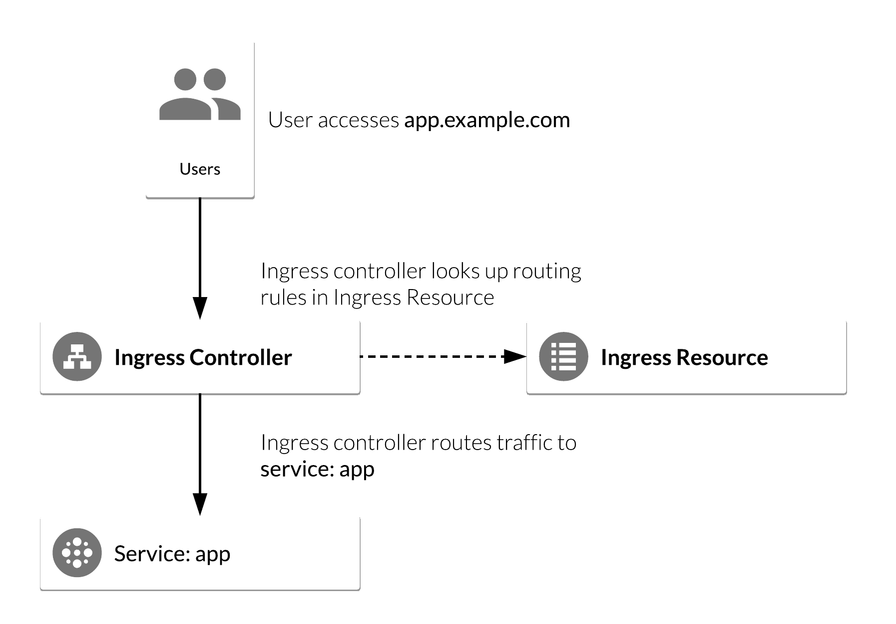
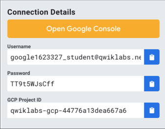
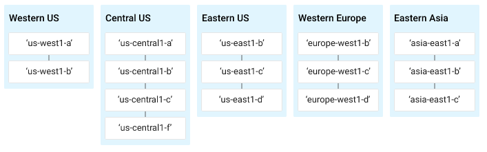
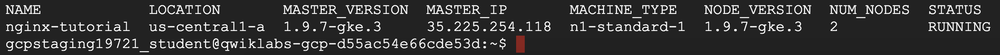
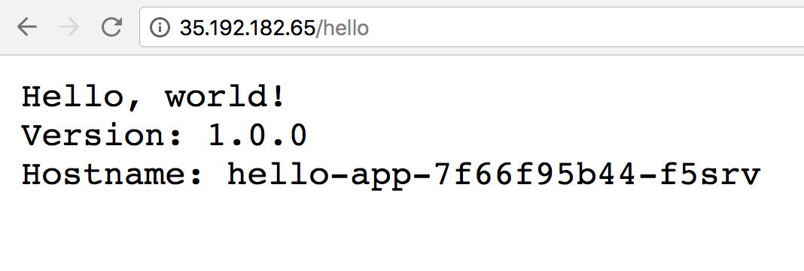
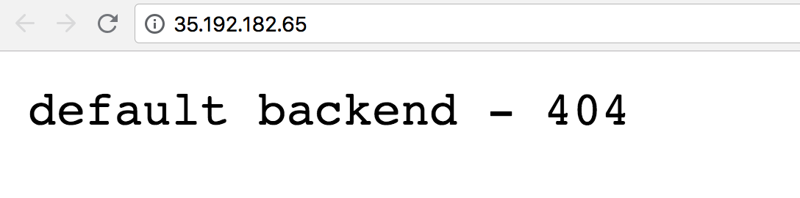
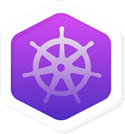

# NGINX Ingress Controller on Google Kubernetes Engine

## GSP181


## Overview

In Kubernetes, [Ingress](https://kubernetes.io/docs/concepts/services-networking/ingress/) allows external users and client applications access to HTTP services. Ingress consists of two components: an *Ingress Resource* and an *Ingress Controller*:

- **Ingress Resource** is a collection of rules for the inbound traffic to reach Services. These are Layer 7 (L7) rules that allow hostnames (and optionally paths) to be directed to specific Services in Kubernetes.
- **Ingress Controller** acts upon the rules set by the Ingress Resource, typically via an HTTP or L7 load balancer. It is vital that both pieces are properly configured so that traffic can be routed from an outside client to a Kubernetes Service.

NGINX—a high performance web server—is a popular choice for an Ingress Controller because of its robustness and the many features it boasts. For example, it supports:

- **Websockets**, which allows you to load balance Websocket applications.
- **SSL Services**, which allows you to load balance HTTPS applications.
- **Rewrites**, which allows you to rewrite the URI of a request before sending it to the application.
- **Session Persistence** (NGINX Plus only), which guarantees that all the requests from the same client are always passed to the same backend container.
- **JWTs** (NGINX Plus only), which allows NGINX Plus to authenticate requests by validating JSON Web Tokens (JWTs).

The following diagram illustrates the basic flow of an Ingress Controller in GCP and gives you a rough idea of what you'll be building:



## Objectives

In this lab, you will configure a Kubernetes deployment with an Ingress Resource. You will use NGINX as an Ingress Controller, which you will use to route and load balance traffic from external clients to the deployment. More specifically, you will:

- Deploy a simple Kubernetes web application.
- Deploy an NGINX Ingress Controller using a stable Helm Chart.
- Deploy an Ingress Resource for the application that uses NGINX Ingress as the controller.
- Test NGINX Ingress functionality by accessing the Google Cloud L4 (TCP/UDP) Load Balancer frontend IP and ensure it can access the web application.

## Prerequisites

This is an **advanced level** lab. Experience with Kubernetes and/or containerized applications is suggested. Familiarity with NGINX and Helm is recommended, but not required. If you are looking to get up to speed in these services, be sure to check out the following labs:

- [Kubernetes Engine: Qwik Start](https://google.qwiklabs.com/catalog_lab/911)
- [Managing Deployments Using Kubernetes Engine](https://google.qwiklabs.com/catalog_lab/572)
- [Distributed Load Testing Using Kubernetes](https://google.qwiklabs.com/catalog_lab/936)
- [Helm Package Manager](https://google.qwiklabs.com/catalog_lab/958)

Once you're ready, scroll down to get your lab environment set up.

## Setup

#### Before you click the Start Lab button

Read these instructions. Labs are timed and you cannot pause them. The timer, which starts when you click Start Lab, shows how long Cloud resources will be made available to you.

This Qwiklabs hand-on lab lets you do the lab activities yourself in a real cloud environment, not in a simulation or demo environment. It does so by giving you new, temporary credentials that you use to sign in and access the Google Cloud Platform for the duration of the lab.

#### What you need

To complete this lab, you need:

- Access to a standard internet browser (Chrome browser recommended).
- Time to complete the lab.

**Note:** If you already have your own personal GCP account or project, do not use it for this lab.

#### How to start your lab and sign in to the Console

1. Click the **Start Lab** button. If you need to pay for the lab, a pop-up opens for you to select your payment method. On the left, the **Connection Details** panel becomes populated with the temporary credentials that you must use for this lab.

   

2. Copy the username, and then click **Open Google Console**. The lab spins up resources, and then opens another tab that shows the **Choose an account** page.

   **Tip:** Open the tabs in separate windows, side-by-side.

3. On the Choose an account page, click **Use Another Account**.

   

4. The Sign in page opens. Paste the username that you copied from the Connection Details panel. Then copy and paste the password.

   **Important:** You must use the credentials from the Connection Details panel. Do not use your Qwiklabs credentials. If you have your own GCP account, do not use it for this lab (avoids incurring charges).

5. Click through the subsequent pages:

   - Accept the terms and conditions.
   - Do not add recovery options or two-factor authentication (because this is a temporary account).
   - Do not sign up for free trials.

After a few moments, the GCP console opens in this tab.

**Note:** You can view the menu with a list of GCP Products and Services by clicking the **Navigation menu** at the top-left, next to “Google Cloud Platform”. 

### Activate Google Cloud Shell

Google Cloud Shell is a virtual machine that is loaded with development tools. It offers a persistent 5GB home directory and runs on the Google Cloud. Google Cloud Shell provides command-line access to your GCP resources.

1. In GCP console, on the top right toolbar, click the Open Cloud Shell button.

   

2. In the dialog box that opens, click **START CLOUD SHELL**:

   

   You can click "START CLOUD SHELL" immediately when the dialog box opens.

It takes a few moments to provision and connect to the environment. When you are connected, you are already authenticated, and the project is set to your *PROJECT_ID*. For example:


**gcloud** is the command-line tool for Google Cloud Platform. It comes pre-installed on Cloud Shell and supports tab-completion.

You can list the active account name with this command:

```
gcloud auth list
```

Output:

```output
Credentialed accounts:
 - <myaccount>@<mydomain>.com (active)
```

Example output:

```Output
Credentialed accounts:
 - google1623327_student@qwiklabs.net
```

You can list the project ID with this command:

```
gcloud config list project
```

Output:

```output
[core]
project = <project_ID>
```

Example output:

```Output
[core]
project = qwiklabs-gcp-44776a13dea667a6
```

Full documentation of **gcloud** is available on [Google Cloud gcloud Overview](https://cloud.google.com/sdk/gcloud).

### Understanding Regions and Zones

Certain Compute Engine resources live in regions or zones. A region is a specific geographical location where you can run your resources. Each region has one or more zones. For example, the us-central1 region denotes a region in the Central United States that has zones `us-central1-a`, `us-central1-b`, `us-central1-c`, and `us-central1-f`.



Resources that live in a zone are referred to as zonal resources. Virtual machine Instances and persistent disks live in a zone. To attach a persistent disk to a virtual machine instance, both resources must be in the same zone. Similarly, if you want to assign a static IP address to an instance, the instance must be in the same region as the static IP.

Learn more about regions and zones and see a complete list in [Regions & Zones documentation](https://cloud.google.com/compute/docs/regions-zones/).

## Set a zone

Before creating a Kubernetes cluster, we'll have to set a default computing zone for our GCP project. Run the following command to see a [list of GCP zones](https://cloud.google.com/compute/docs/regions-zones/):

```
gcloud compute zones list
```

Now run the following command to set your zone (in this case to `us-central1-a`):

```
gcloud config set compute/zone us-central1-a
```

## Create a Kubernetes cluster

Now that our zone is configured, let's deploy a Kubernetes Engine cluster. Run the following command to create a cluster named `nginx-tutorial` that's made up of two nodes (or worker machines):

```
gcloud container clusters create nginx-tutorial --num-nodes 2
```

It will take a few minutes for this command to complete. Continue when you get a similar output in Cloud Shell:



## Install Helm

Now that we have our Kubernetes cluster up and running, let's install [Helm](https://helm.sh/). Helm is a tool that streamlines Kubernetes application installation and management. You can think of it like apt, yum, or homebrew for Kubernetes. Using helm charts is recommended, since they are maintained and typically kept up-to-date by the Kubernetes community. Helm has two parts: a client (`helm`) and a server (`tiller`):

- **Tiller** runs inside your Kubernetes cluster and manages releases (installations) of your Helm Charts.
- **Helm** runs on your laptop, CI/CD, or in this case, the Cloud Shell.

Helm comes preconfigured with an installer script that automatically grabs the latest version of the Helm client and installs it locally. Fetch the script by running the following command:

```
curl https://raw.githubusercontent.com/kubernetes/helm/master/scripts/get > get_helm.sh
```

Next, run the following commands to get the Helm client installed:

```
chmod 700 get_helm.sh
./get_helm.sh
```

Now initialize helm:

```
helm init
```

Great! You now have the latest copy of the Helm client installed and ready for use in your Cloud Shell environment.

## Installing Tiller

Starting with Kubernetes v1.8+, [RBAC](https://en.wikipedia.org/wiki/Role-based_access_control) is enabled by default. Prior to installing tiller you need to ensure that you have the correct `ServiceAccount` and `ClusterRoleBinding` configured for the `tiller` service. This allows tiller to be able to install services in the default namespace.

Run the following commands to install the server-side tiller to the Kubernetes cluster with RBAC enabled:

```
kubectl create serviceaccount --namespace kube-system tiller
kubectl create clusterrolebinding tiller-cluster-rule --clusterrole=cluster-admin --serviceaccount=kube-system:tiller
kubectl patch deploy --namespace kube-system tiller-deploy -p '{"spec":{"template":{"spec":{"serviceAccount":"tiller"}}}}'  
```

Now initialize Helm with your newly-created service account:

```
helm init --service-account tiller --upgrade
```

You can also confirm that `tiller` is running by checking for the `tiller_deploy`Deployment in the `kube-system` namespace. Run the following command to do so:

```
kubectl get deployments -n kube-system
```

The output should have a `tiller_deploy` Deployment as shown below:

```bash
NAME                    DESIRED   CURRENT   UP-TO-DATE   AVAILABLE   AGE
event-exporter-v0.1.7   1         1         1            1           13m
heapster-v1.4.3         1         1         1            1           13m
kube-dns                2         2         2            2           13m
kube-dns-autoscaler     1         1         1            1           13m
kubernetes-dashboard    1         1         1            1           13m
l7-default-backend      1         1         1            1           13m
tiller-deploy           1         1         1            1           4m
```

## Deploy an application in Kubernetes Engine

Now that you have Helm configured, let's deploy a simple web-based application from the Google Cloud Repository. This application will be used as the backend for the Ingress.

From the Cloud Shell, run the following command:

```
kubectl run hello-app --image=gcr.io/google-samples/hello-app:1.0 --port=8080
```

Your output should resemble the following:

```bash
deployment "hello-app" created
```

Now expose the `hello-app` Deployment as a Service by running the following command:

```
kubectl expose deployment hello-app
```

Your output should resemble the following:

```bash
service "hello-app" exposed
```

## Deploying the NGINX Ingress Controller via Helm

The Kubernetes platform gives administrators flexibility when it comes to Ingress Controllers—you can integrate your own rather than having to work with your provider's built-in offering. The NGINX controller must be exposed for external access. This is done using Service `type: LoadBalancer` on the NGINX controller service. On Kubernetes Engine, this creates a Google Cloud Network (TCP/IP) Load Balancer with NGINX controller Service as a backend. Google Cloud also creates the appropriate firewall rules within the Service's VPC to allow web HTTP(S) traffic to the load balancer frontend IP address.

### NGINX Ingress Controller on Kubernetes Engine

The following flowchart is a visual representation of how an NGINX controller runs on a Kubernetes Engine cluster:


### Deploy NGINX Ingress Controller

Now that you have the bigger picture in mind, let's go ahead and deploy the NGINX Ingress Controller. Run the following command to do so:

```
helm install --name nginx-ingress stable/nginx-ingress --set rbac.create=true
```

In the output under `RESOURCES`, you should see a similar output:

```bash
==> v1/Service
NAME                            TYPE          CLUSTER-IP    EXTERNAL-IP  
nginx-ingress-controller        LoadBalancer  10.7.248.226  pending      
nginx-ingress-default-backend   ClusterIP     10.7.245.75   none         
```

Note the second service, `nginx-ingress-default-backend`. The default backend is a Service which handles all URL paths and hosts the NGINX controller. The default backend exposes two URLs:

- `/healthz` that returns 200
- `/` that returns 404

Wait a few moments while the GCP L4 Load Balancer gets deployed. Confirm that the `nginx-ingress-controller` Service has been deployed and that you have an external IP address associated with the service by running the following command:

```
kubectl get service nginx-ingress-controller
```

You receive a similar output:

```bash
NAME                       TYPE           CLUSTER-IP     EXTERNAL-IP      
nginx-ingress-controller   LoadBalancer   10.7.248.226   35.226.162.176   
```

## Configure Ingress Resource to use NGINX Ingress Controller

An Ingress Resource object is a collection of L7 rules for routing inbound traffic to Kubernetes Services. Multiple rules can be defined in one Ingress Resource or they can be split up into multiple Ingress Resource manifests. The Ingress Resource also determines which controller to utilize to serve traffic. This can be set with an annotation, `kubernetes.io/ingress.class`, in the metadata section of the Ingress Resource. For the NGINX controller, you will use the `nginx` value as shown below:

```bash
annotations: kubernetes.io/ingress.class: nginx
```

On Kubernetes Engine, if no annotation is defined under the metadata section, the Ingress Resource uses the GCP GCLB L7 load balancer to serve traffic. This method can also be forced by setting the annotation's value to `gce`, like below:

```bash
annotations: kubernetes.io/ingress.class: gce
```

Let's create a simple Ingress Resource YAML file which uses the NGINX Ingress Controller and has one path rule defined by typing the following commands:

```
touch ingress-resource.yaml
nano ingress-resource.yaml
```

Add the following content in `ingress-resource.yaml` file:

```
apiVersion: extensions/v1beta1
kind: Ingress
metadata:
  name: ingress-resource
  annotations:
    kubernetes.io/ingress.class: nginx
    nginx.ingress.kubernetes.io/ssl-redirect: "false"
spec:
  rules:
  - http:
      paths:
      - path: /hello
        backend:
          serviceName: hello-app
          servicePort: 8080
```

then press **Ctrl-X**, then press **Y**, then press **Enter** to save the file.

The `kind: Ingress` dictates it is an Ingress Resource object. This Ingress Resource defines an inbound L7 rule for path `/hello` to service `hello-app` on port `8080`.

Run the following command to apply those rules to our Kubernetes application:

```
kubectl apply -f ingress-resource.yaml
```

Verify that Ingress Resource has been created:

```
kubectl get ingress ingress-resource
```

**Note:** The IP address for the Ingress Resource will not be defined right away. Wait a few moments for the `ADDRESS` field to get populated.

Your outupt should resemble the following:

```bash
NAME               HOSTS     ADDRESS   PORTS     AGE
ingress-resource   *                   80        
```

### Test Ingress and default backend

You should now be able to access the web application by going to the `EXTERNAL-IP/hello` address of the **NGINX ingress controller** (found by running `kubectl get service nginx-ingress-controller`).

Open a new tab and go to the following, replacing the `external-ip-of-ingress-controller` with the external IP address of the NGINX ingress controller:

```
http://external-ip-of-ingress-controller/hello
```

Your page should look similar to the following:



To check if the `default-backend` service is working properly, access any path (other than the path `/hello` defined in the Ingress Resource) and ensure you receive a `404`message. For example:

```
http://external-ip-of-ingress-controller/test
```

Your page should look similar to the following:



## Congratulations!

Great work! In this lab you deployed a Kubernetes cluster with an NGINX Ingress Controller. You now have the experience and know-how to use Ingress Controllers in your own Kubernetes applications.

 

### Finish Your Quest

This self-paced lab is part of the [Kubernetes in the Google Cloud](https://google.qwiklabs.com/quests/29) and [Kubernetes Solutions](https://google.qwiklabs.com/quests/45) Quests. A Quest is a series of related labs that form a learning path. Completing this Quest earns you the badge above, to recognize your achievement. You can make your badge (or badges) public and link to them in your online resume or social media account. Enroll in a Quest and get immediate completion credit if you've taken this lab. [See other available Qwiklabs Quests](https://google.qwiklabs.com/catalog).

### Take Your Next Lab

Continue your Quest with [Continuous Delivery with Jenkins in Kubernetes Engine](https://google.qwiklabs.com/catalog_lab/984) or check out other labs in the [Continuous Load Testing Using Kubernetes](https://google.qwiklabs.com/catalog_lab/936) quest.

### Google Cloud Training & Certification

...helps you make the most of Google Cloud technologies. [Our classes](https://cloud.google.com/training/courses) include technical skills and best practices to help you get up to speed quickly and continue your learning journey. We offer fundamental to advanced level training, with on-demand, live, and virtual options to suit your busy schedule. [Certifications](https://cloud.google.com/certification/) help you validate and prove your skill and expertise in Google Cloud technologies.

##### Manual Last Updated August 3, 2018

##### Lab Last Tested July 16, 2018

Copyright 2018 Google LLC All rights reserved. Google and the Google logo are trademarks of Google LLC. All other company and product names may be trademarks of the respective companies with which they are associated.