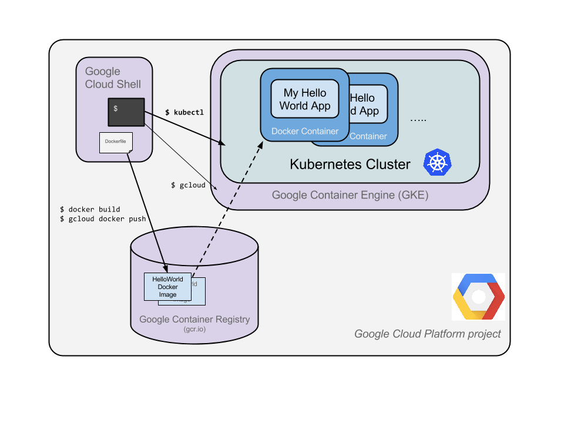
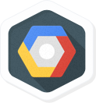

# Hello Node Kubernetes

## GSP005


## Overview

The goal of this hands-on lab is for you to turn code that you have developed into a replicated application running on [Kubernetes](http://kubernetes.io/), which is running on [Kubernetes Engine](https://cloud.google.com/container-engine/). For this lab the code will be a simple Hello World node.js app.

Here's a diagram of the various parts in play in this lab, to help you understand how the pieces fit together with one another. Use this as a reference as you progress through the lab; it should all make sense by the time you get to the end (but feel free to ignore this for now).



Kubernetes is an open source project (available on [kubernetes.io](http://kubernetes.io/)) which can run on many different environments, from laptops to high-availability multi-node clusters; from public clouds to on-premise deployments; from virtual machines to bare metal.

For the purpose of this lab, using a managed environment such as Kubernetes Engine (a Google-hosted version of Kubernetes running on Compute Engine) will allow you to focus more on experiencing Kubernetes rather than setting up the underlying infrastructure.

#### What you'll do

- Create a Node.js server.
- Create a Docker container image.
- Create a container cluster.
- Create a Kubernetes pod.
- Scale up your services.

### Prerequisites

- Familiarity with standard Linux text editors such as `vim`, `emacs`, or `nano` will be helpful.

We encourage students to type the commands themselves, to help encourage learning of the core concepts. Many labs will include a code block that contains the required commands. You can easily copy and paste the commands from the code block into the appropriate places during the lab.

## Setup

#### Before you click the Start Lab button

Read these instructions. Labs are timed and you cannot pause them. The timer, which starts when you click Start Lab, shows how long Cloud resources will be made available to you.

This Qwiklabs hand-on lab lets you do the lab activities yourself in a real cloud environment, not in a simulation or demo environment. It does so by giving you new, temporary credentials that you use to sign in and access the Google Cloud Platform for the duration of the lab.

#### What you need

To complete this lab, you need:

- Access to a standard internet browser (Chrome browser recommended).
- Time to complete the lab.

**Note:** If you already have your own personal GCP account or project, do not use it for this lab.

#### How to start your lab and sign in to the Console

1. Click the **Start Lab** button. If you need to pay for the lab, a pop-up opens for you to select your payment method. On the left, the **Connection Details** panel becomes populated with the temporary credentials that you must use for this lab.

   

2. Copy the username, and then click **Open Google Console**. The lab spins up resources, and then opens another tab that shows the **Choose an account** page.

   **Tip:** Open the tabs in separate windows, side-by-side.

3. On the Choose an account page, click **Use Another Account**.

   

4. The Sign in page opens. Paste the username that you copied from the Connection Details panel. Then copy and paste the password.

   **Important:** You must use the credentials from the Connection Details panel. Do not use your Qwiklabs credentials. If you have your own GCP account, do not use it for this lab (avoids incurring charges).

5. Click through the subsequent pages:

   - Accept the terms and conditions.
   - Do not add recovery options or two-factor authentication (because this is a temporary account).
   - Do not sign up for free trials.

After a few moments, the GCP console opens in this tab.

**Note:** You can view the menu with a list of GCP Products and Services by clicking the **Navigation menu** at the top-left, next to “Google Cloud Platform”. 

### Activate Google Cloud Shell

Google Cloud Shell is a virtual machine that is loaded with development tools. It offers a persistent 5GB home directory and runs on the Google Cloud. Google Cloud Shell provides command-line access to your GCP resources.

1. In GCP console, on the top right toolbar, click the Open Cloud Shell button.

   

2. In the dialog box that opens, click **START CLOUD SHELL**:

   

   You can click "START CLOUD SHELL" immediately when the dialog box opens.

It takes a few moments to provision and connect to the environment. When you are connected, you are already authenticated, and the project is set to your *PROJECT_ID*. For example:


**gcloud** is the command-line tool for Google Cloud Platform. It comes pre-installed on Cloud Shell and supports tab-completion.

You can list the active account name with this command:

```
gcloud auth list
```

Output:

```output
Credentialed accounts:
 - <myaccount>@<mydomain>.com (active)
```

Example output:

```Output
Credentialed accounts:
 - google1623327_student@qwiklabs.net
```

You can list the project ID with this command:

```
gcloud config list project
```

Output:

```output
[core]
project = <project_ID>
```

Example output:

```Output
[core]
project = qwiklabs-gcp-44776a13dea667a6
```

Full documentation of **gcloud** is available on [Google Cloud gcloud Overview](https://cloud.google.com/sdk/gcloud).

## Create your Node.js application

Using Cloud Shell, write a simple Node.js server that you'll deploy to Kubernetes Engine:

```
vi server.js
```

Start the editor:

```
i
```

Add this content to the file:

```
var http = require('http');
var handleRequest = function(request, response) {
  response.writeHead(200);
  response.end("Hello World!");
}
var www = http.createServer(handleRequest);
www.listen(8080);
```

**Note:** We use `vi` here but `nano` and `emacs` are also available in Cloud Shell. You can also use the Web-editor feature of CloudShell as [described here](https://cloud.google.com/shell/docs/features#web_editor).

Save the `server.js` file: **Esc** then:

```
:wq
```

Since Cloud Shell has the `node` executable installed, run this command to start the node server (the command produces no output):

```
node server.js
```

Use the built-in Web [preview feature](https://cloud.google.com/cloud-shell/docs/features#web_preview) of Cloud Shell to open a new browser tab and proxy a request to the instance you just started on port `8080`. If you don't see this feature in the Cloud Shell toolbar, click **Navigation menu** to close the left pane.)


A new browser tab will open to display your results:


Before continuing, return to Cloud Shell and type **Ctrl+c** to stop the running node server. You will now package this application in a Docker container.

## Create a Docker container image

Next, create a `Dockerfile` that describes the image you want to build. Docker container images can extend from other existing images, so for this image, we'll extend from an existing Node image.

```
vi Dockerfile
```

Start the editor.

```
i
```

Add this content :

```
FROM node:6.9.2
EXPOSE 8080
COPY server.js .
CMD node server.js
```

This "recipe" for the Docker image will:

- Start from the `node` image found on the Docker hub.
- Expose port `8080`.
- Copy our `server.js` file to the image.
- Start the node server as we previously did manually.

Save this `Dockerfile` by pressing **Esc**, then type:

```
:wq
```

Build the image with the following, replacing `PROJECT_ID` with your GCP Project ID, found in the Console and the **Connection Details** section of the lab:

```
docker build -t gcr.io/PROJECT_ID/hello-node:v1 .
```

It'll take some time to download and extract everything, but you can see the progress bars as the image builds.

Once complete, test the image locally with the following command which will run a Docker container as a daemon on port 8080 from your newly-created container image. (Replace `PROJECT_ID` with your GCP Project ID, found in the Console and the **Connection Details** section of the lab):

```
docker run -d -p 8080:8080 gcr.io/PROJECT_ID/hello-node:v1
```

Your output should look something like this:

```bash
325301e6b2bffd1d0049c621866831316d653c0b25a496d04ce0ec6854cb7998
```

To see your results you can use the web preview feature of Cloud Shell:


Or use `curl` from your Cloud Shell prompt:

```
curl http://localhost:8080
```

This is the output you should see:

```bash
Hello World!
```

**Note:** Full documentation for the `docker run` command is [found here](https://docs.docker.com/engine/reference/run/).

Next stop the running container.

Find your Docker container ID by running:

```
docker ps
```

Your output you should look like this:

```output
CONTAINER ID        IMAGE                              COMMAND
2c66d0efcbd4        gcr.io/PROJECT_ID/hello-node:v1    "/bin/sh -c 'node
```

Stop the container by running the following, replacing the `CONTAINER ID` provided from the previous step:

```
docker stop [CONTAINER ID]
```

Your console output should resemble the following (your container ID):

```bash
2c66d0efcbd4
```

Now that the image is working as intended, push it to the [Google Container Registry](https://cloud.google.com/tools/container-registry/), a private repository for your Docker images, accessible from your Google Cloud projects.

Run this command, replacing `PROJECT_ID` with your GCP Project ID, found in the Console or the **Connection Details** section of the lab.

```
gcloud docker -- push gcr.io/PROJECT_ID/hello-node:v1
```

The initial push may take a few minutes to complete. You'll see the progress bars as it builds.

```bash
The push refers to a repository [gcr.io/qwiklabs-gcp-6h281a111f098/hello-node]
ba6ca48af64e: Pushed
381c97ba7dc3: Pushed
604c78617f34: Pushed
fa18e5ffd316: Pushed
0a5e2b2ddeaa: Pushed
53c779688d06: Pushed
60a0858edcd5: Pushed
b6ca02dfe5e6: Pushed
v1: digest: sha256:8a9349a355c8e06a48a1e8906652b9259bba6d594097f115060acca8e3e941a2 size: 2002
```

The container image will be listed in your Console. Select **Navigation menu** > **Container Registry**.


Now you have a project-wide Docker image available, which Kubernetes can access and orchestrate.


**Note:** A generic domain is used for the registry (`gcr.io`). You can be more specific about which zone and bucket to use. Details are [documented here](https://cloud.google.com/container-registry/docs/#pushing_to_the_registry).

## Create your cluster

Now you're ready to create your Kubernetes Engine cluster. A cluster consists of a Kubernetes master API server hosted by Google and a set of worker nodes. The worker nodes are Compute Engine virtual machines.

Make sure you have set your project using `gcloud` (replace `PROJECT_ID` with your GCP Project ID, found in the console and in the **Connection Details** section of the lab):

```
gcloud config set project PROJECT_ID
```

Create a cluster with two [n1-standard-1](https://cloud.google.com/compute/docs/machine-types) nodes (this will take a few minutes to complete):

```
gcloud container clusters create hello-world \
                --num-nodes 2 \
                --machine-type n1-standard-1 \
                --zone us-central1-a
```

The console output should look like this:

```bash
Creating cluster hello-world...done.
Created [https://container.googleapis.com/v1/projects/PROJECT_ID/zones/us-central1-a/clusters/hello-world].
kubeconfig entry generated for hello-world.
NAME         ZONE           MASTER_VERSION  MASTER_IP       MACHINE_TYPE   STATUS
hello-world  us-central1-a  1.5.7           146.148.46.124  n1-standard-1  RUNNING
```

**Note:** You can also create this cluster through the Console by opening the Navigation menu and selecting **Kubernetes Engine** > **Kubernetes clusters** > **Create cluster**.

**Note:** It is recommended to create the cluster in the same zone as the storage bucket used by the container registry (see previous step).

If you select **Navigation menu** > **Kubernetes Engine**, you'll see that you now you have a fully-functioning Kubernetes cluster powered by Kubernetes Engine:


It's time to deploy your own containerized application to the Kubernetes cluster! From now on you'll use the `kubectl` command line (already set up in your Cloud Shell environment).

Click **Check my progress** below to check your lab progress.


Create your cluster.

Check my progress


## Create your pod

A Kubernetes **pod** is a group of containers tied together for administration and networking purposes. It can contain single or multiple containers. Here you'll use one container built with your Node.js image stored in your private container registry. It will serve content on port 8080.

Create a pod with the `kubectl run` command (replace `PROJECT_ID` with your GCP Project ID, found in the console and in the **Connection Details** section of the lab):

```
kubectl run hello-node \
    --image=gcr.io/PROJECT_ID/hello-node:v1 \
    --port=8080
```

This is the output you should see:

```bash
deployment "hello-node" created
```

As you can see, you've created a **deployment** object. Deployments are the recommended way to create and scale pods. Here, a new deployment manages a single pod replica running the `hello-node:v1` image.

To view the deployment, run:

```
kubectl get deployments
```

This is the output you should see:

```bash
NAME         DESIRED   CURRENT   UP-TO-DATE   AVAILABLE   AGE
hello-node   1         1         1            1           2m
```

To view the pod created by the deployment, run:

```
kubectl get pods
```

This is the output you should see:

```bash
NAME                         READY     STATUS    RESTARTS   AGE
hello-node-714049816-ztzrb   1/1       Running   0          6m
```

Now is a good time to go through some interesting `kubectl` commands. None of these will change the state of the cluster, full documentation is [available here](https://cloud.google.com/container-engine/docs/kubectl/):

```
kubectl cluster-info
kubectl config view
```

And for troubleshooting :

```
kubectl get events
kubectl logs <pod-name>
```

You now need to make your pod accessible to the outside world.

Click **Check my progress** below to check your lab progress.


Create your pod

Check my progress


## Allow external traffic

By default, the pod is only accessible by its internal IP within the cluster. In order to make the `hello-node` container accessible from outside the Kubernetes virtual network, you have to expose the pod as a Kubernetes **service**.

From Cloud Shell you can expose the pod to the public internet with the `kubectl expose` command combined with the `--type="LoadBalancer"` flag. This flag is required for the creation of an externally accessible IP:

```
kubectl expose deployment hello-node --type="LoadBalancer"
```

This is the output you should see :

```bash
service "hello-node" exposed
```

The flag used in this command specifies that you'll be using the load-balancer provided by the underlying infrastructure (in this case the [Compute Engine load balancer](https://cloud.google.com/compute/docs/load-balancing/)). Note that you expose the deployment, and not the pod, directly. This will cause the resulting service to load balance traffic across all pods managed by the deployment (in this case only 1 pod, but you will add more replicas later).

The Kubernetes master creates the load balancer and related Compute Engine forwarding rules, target pools, and firewall rules to make the service fully accessible from outside of Google Cloud Platform.

To find the publicly-accessible IP address of the service, request `kubectl` to list all the cluster services:

```
kubectl get services
```

This is the output you should see:

```bash
NAME         CLUSTER-IP     EXTERNAL-IP      PORT(S)    AGE
hello-node   10.3.250.149   104.154.90.147   8080/TCP   1m
kubernetes   10.3.240.1     <none>           443/TCP    5m
```

There are 2 IP addresses listed for your hello-node service, both serving port `8080`. The `CLUSTER-IP` is the internal IP that is only visible inside your cloud virtual network; the `EXTERNAL-IP` is the external load-balanced IP.

**Note:** The `EXTERNAL-IP` may take several minutes to become available and visible. If the `EXTERNAL-IP` is missing, wait a few minutes and try again.

You should now be able to reach the service by pointing your browser to this address: `http://<EXTERNAL_IP>:8080`


At this point we've gained several features from moving to containers and Kubernetes - we do not need to specify on which host to run our workload and we also benefit from service monitoring and restart. Let's see what else we can gain from our new Kubernetes infrastructure.

Click **Check my progress** below to check your lab progress.


Create a Kubernetes Service

Check my progress


## Scale up your service

One of the powerful features offered by Kubernetes is how easy it is to scale your application. Suppose you suddenly need more capacity for your application. You can tell the replication controller to manage a new number of replicas for your pod:

```
kubectl scale deployment hello-node --replicas=4
```

This is the output you should see:

```bash
deployment "hello-node" scaled
```

You can request a description of the updated deployment:

```
kubectl get deployment
```

This is the output you should see:

```bash
NAME         DESIRED   CURRENT   UP-TO-DATE   AVAILABLE   AGE
hello-node   4         4         4            4           16m
```

You can also list the all pods:

```
kubectl get pods
```

This is the output you should see:

```bash
NAME                         READY     STATUS    RESTARTS   AGE
hello-node-714049816-g4azy   1/1       Running   0          1m
hello-node-714049816-rk0u6   1/1       Running   0          1m
hello-node-714049816-sh812   1/1       Running   0          1m
hello-node-714049816-ztzrb   1/1       Running   0          16m
```

A **declarative approach** is being used here. Rather than starting or stopping new instances, you declare how many instances should be running at all times. Kubernetes reconciliation loops makes sure that reality matches what you requested and takes action if needed.

Here's a diagram summarizing the state of your Kubernetes cluster:


Click **Check my progress** below to check your lab progress.


Scale up your service

Check my progress


## Roll out an upgrade to your service

At some point the application that you've deployed to production will require bug fixes or additional features. Kubernetes helps you deploy a new version to production without impacting your users.

First, modify the application. Edit the `server.js`:

```
vi server.js
i
```

Then update the response message:

```bash
response.end("Hello Kubernetes World!");
```

Save the `server.js` file: Press **Esc** then:

```
:wq
```

Now you can build and publish a new container image to the registry with an incremented tag (`v2` in this case).

Run the following, replacing `PROJECT_ID` with your lab project ID, found in the Console and in the **Connection Details** section of the lab:

```
docker build -t gcr.io/PROJECT_ID/hello-node:v2 .
gcloud docker -- push gcr.io/PROJECT_ID/hello-node:v2
```

**Note:** Building and pushing this updated image should be quicker caching is being taken advantage of.

Kubernetes will smoothly update your replication controller to the new version of the application. In order to change the image label for your running container, you will edit the existing `hello-node deployment` and change the image from `gcr.io/PROJECT_ID/hello-node:v1` to `gcr.io/PROJECT_ID/hello-node:v2`.

To do this, use the `kubectl edit` command. It opens a text editor displaying the full deployment yaml configuration. It isn't necessary to understand the full yaml config right now, just understand that by updating the `spec.template.spec.containers.image` field in the config you are telling the deployment to update the pods with the new image.

```
kubectl edit deployment hello-node
# Please edit the object below. Lines beginning with a '#' will be ignored,
# and an empty file will abort the edit. If an error occurs while saving this file will be
# reopened with the relevant failures.
#
apiVersion: extensions/v1beta1
kind: Deployment
metadata:
  annotations:
    deployment.kubernetes.io/revision: "1"
  creationTimestamp: 2016-03-24T17:55:28Z
  generation: 3
  labels:
    run: hello-node
  name: hello-node
  namespace: default
  resourceVersion: "151017"
  selfLink: /apis/extensions/v1beta1/namespaces/default/deployments/hello-node
  uid: 981fe302-f1e9-11e5-9a78-42010af00005
spec:
  replicas: 4
  selector:
    matchLabels:
      run: hello-node
  strategy:
    rollingUpdate:
      maxSurge: 1
      maxUnavailable: 1
    type: RollingUpdate
  template:
    metadata:
      creationTimestamp: null
      labels:
        run: hello-node
    spec:
      containers:
      - image: gcr.io/PROJECT_ID/hello-node:v1 ## Update this line ##
        imagePullPolicy: IfNotPresent
        name: hello-node
        ports:
        - containerPort: 8080
          protocol: TCP
        resources: {}
        terminationMessagePath: /dev/termination-log
      dnsPolicy: ClusterFirst
      restartPolicy: Always
      securityContext: {}
      terminationGracePeriodSeconds: 30
```

After making the change, save and close this file: Press **Esc**, then:

```
:wq
```

This is the output you should see:

```
deployment "hello-node" edited
```

Run the following to update the deployment with the new image. New pods will be created with the new image and the old pods will be deleted.

```
kubectl get deployments
```

This is the output you should see:

```
NAME         DESIRED   CURRENT   UP-TO-DATE   AVAILABLE   AGE
hello-node   4         4         4            4           1h
```

While this is happening, the users of your services shouldn't see any interruption. After a little while they'll start accessing the new version of your application. You can find more details on rolling updates in [this documentation](https://cloud.google.com/container-engine/docs/rolling-updates).

Hopefully with these deployment, scaling, and updated features, once you've set up your Kubernetes Engine cluster, you'll agree that Kubernetes will help you focus on the application rather than the infrastructure.

## Kubernetes graphical dashboard (optional)

A graphical web user interface (dashboard) has been introduced in recent versions of Kubernetes. The dashboard allows you to get started quickly and enables some of the functionality found in the CLI as a more approachable and discoverable way of interacting with the system.

To get started, run the following command to grant cluster level permissions:

```
kubectl create clusterrolebinding cluster-admin-binding --clusterrole=cluster-admin --user=$(gcloud config get-value account)
```

Now that you have the appropriate permissions set, run the following command to create a new dashboard service:

```
kubectl apply -f https://raw.githubusercontent.com/kubernetes/dashboard/v1.10.1/src/deploy/recommended/kubernetes-dashboard.yaml
```

You should receive a similar output:

```output
secret "kubernetes-dashboard-certs" created
serviceaccount "kubernetes-dashboard" created
role.rbac.authorization.k8s.io "kubernetes-dashboard-minimal" created
rolebinding.rbac.authorization.k8s.io "kubernetes-dashboard-minimal" created
deployment.apps "kubernetes-dashboard" created
service "kubernetes-dashboard" created
```

Now run the following command to edit the `yaml` representation of the dashboard service:

```
kubectl -n kube-system edit service kubernetes-dashboard
```

Press `i` to enter the editing mode. Change `type: ClusterIP` to `type: NodePort`. After making the change, save and close this file. Press **Esc**, then:

```
:wq
```

To login into Kubernetes dashboard, you must authenticate using a token. Use a token allocated to a service account, such as the `namespace-controller`. To get the token value, run the following command:

```
kubectl -n kube-system describe $(kubectl -n kube-system \
get secret -n kube-system -o name | grep namespace) | grep token:
```

You should receive a similar Output:

```bash
token:      eyJhbGciOiJSUzI1NiIsInR5cCI6IkpXVCJ9.eyJpc3MiOiJrdWJlcm5ldGVzL3NlcnZpY2VhY2NvdW50Iiwia3ViZXJuZXRlcy5pby9zZXJ2aWNlYWNjb3VudC9uYW1lc3BhY2UiOiJrdWJlLXN5c3RlbSIsImt1YmVybmV0ZXMuaW8vc2VydmljZWFjY291bnQvc2VjcmV0Lm5hbWUiOiJuYW1lc3BhY2UtY29udHJvbGxlci10b2tlbi1kOTZyNCIsImt1YmVybmV0ZXMuaW8vc2VydmljZWFjY291bnQvc2VydmljZS1hY2NvdW50Lm5hbWUiOiJuYW1lc3BhY2UtY29udHJvbGxlciIsImt1YmVybmV0ZXMuaW8vc2VydmljZWFjY291bnQvc2VydmljZS1hY2NvdW50LnVpZCI6ImU2ZmFkNGQ5LTJjNjYtMTFlOC05NDFiLTQyMDEwYTgwMDFlYiIsInN1YiI6InN5c3RlbTpzZXJ2aWNlYWNjb3VudDprdWJlLXN5c3RlbTpuYW1lc3BhY2UtY29udHJvbGxlciJ9.AY3Fp-T_4wxTzvo4kiWi4zxojVTSr1Wy7BL_-HmIRlWTRAUmy_1RAJS19zn4BbSkxlV13Y9Bv3NoVcG01jKd4QoM172OXo2TqSU5v2B62i3-_CDZtf3CVgQIp9jiuxACcR5zg3w-4ewGfH4C3ospoKCuayyRaADLq0ThWLGaTQv9e7UjSfWAPir3XPXQut3mMRYrSiHcFNiEGeztSfF3cyhuvL2I5Lfh20yYuqW5j-w72BLnlqQGPuhJXJgH1_35XUCU8WtnkEK-qYX40ajDWJYa1s9_R-MWzF6Zwji2Gh5txOvxG3lZuIq9GSAOBp85617wB3eCGio6Nu3L9TwWXA
```

Copy the token to use it to get into the Kubernetes dashboard. Run the following command to open a connection:

```
kubectl proxy --port 8081
```

Then use the Cloud Shell Web preview feature to change ports to **8081**:


This should send you to the API endpoint. To get to the dashboard, remove `/?authuser=0` and append the URL with the following:

```
/api/v1/namespaces/kube-system/services/https:kubernetes-dashboard:/proxy/#!/overview?namespace=default
```

Your final URL should resemble the following:

```
https://8081-dot-5177448-dot-devshell.appspot.com/api/v1/namespaces/kube-system/services/https:kubernetes-dashboard:/proxy/#!/overview?namespace=default
```

You will then be taken a web preview:


Select the **Token** radio button and paste the token copied from previous step. Click **Sign In**.

Enjoy the Kubernetes graphical dashboard and use it for deploying containerized applications, as well as for monitoring and managing your clusters!


You can access the dashboard from a development or local machine from the Web console. You would select **Navigation menu** > **Kubernetes Engine**, and then click the **Connect** button for the cluster you want to monitor.


Learn more about the Kubernetes dashboard by taking the [Dashboard tour](http://kubernetes.io/docs/user-guide/ui/).

## Test your knowledge

Test your knowledge about Google cloud Platform by taking our quiz. (Please select multiple correct options.)


Which of the following are features of the Kubernetes Engine?

<svg class="mdc-checkbox__checkmark" viewBox="0 0 24 24"><path class="mdc-checkbox__checkmark-path" fill="none" d="M1.73,12.91 8.1,19.28 22.79,4.59"></path></svg>


Integrated Logging and Monitoring

<svg class="mdc-checkbox__checkmark" viewBox="0 0 24 24"><path class="mdc-checkbox__checkmark-path" fill="none" d="M1.73,12.91 8.1,19.28 22.79,4.59"></path></svg>


Identity and Access Management

<svg class="mdc-checkbox__checkmark" viewBox="0 0 24 24"><path class="mdc-checkbox__checkmark-path" fill="none" d="M1.73,12.91 8.1,19.28 22.79,4.59"></path></svg>


Stateful Application Support

<svg class="mdc-checkbox__checkmark" viewBox="0 0 24 24"><path class="mdc-checkbox__checkmark-path" fill="none" d="M1.73,12.91 8.1,19.28 22.79,4.59"></path></svg>


None of these

Submit


## Congratulations!

This concludes this hands-on lab with Kubernetes. We've only scratched the surface of this technology and we encourage you to explore further with your own pods, replication controllers, and services but also to check out liveness probes (health checks) and consider using the Kubernetes API directly.

 

Finish Your Quest

This self-paced lab is part of the Qwiklabs Quests [GCP Essentials](https://google.qwiklabs.com/quests/23) and [Kubernetes in the Google Cloud](https://google.qwiklabs.com/quests/29). A Quest is a series of related labs that form a learning path. Completing this Quest earns you the badge above, to recognize your achievement. You can make your badge (or badges) public and link to them in your online resume or social media account. Enroll in a Quest and get immediate completion credit if you've taken this lab. [See other available Qwiklabs Quests](https://google.qwiklabs.com/catalog).

### Take Your Next Lab

Continue your Quest with [Managing Deployments using Kubernetes Engine](https://google.qwiklabs.com/catalog_lab/572), or check out these suggestions:

- [Orchestrating the Cloud with Kubernetes](https://google.qwiklabs.com/catalog_lab/486)
- [Setting Up a Private Kubernetes Cluster](https://google.qwiklabs.com/catalog_lab/908)

### Next Steps/Learn More

- Check out **Minikube**, which offers a simple setup of a single node kubernetes cluster for development and testing purposes after you take this lab:<http://kubernetes.io/docs/getting-started-guides/minikube/>.
- Kubernetes is an open source project ( <http://kubernetes.io/>) hosted on [GitHub](https://github.com/kubernetes/kubernetes). Your feedback and contributions are always welcome.
- You can follow the Kubernetes news on [Twitter](https://twitter.com/kubernetesio) and on the [community blog](http://blog.kubernetes.io/).

### Google Cloud Training & Certification

...helps you make the most of Google Cloud technologies. [Our classes](https://cloud.google.com/training/courses) include technical skills and best practices to help you get up to speed quickly and continue your learning journey. We offer fundamental to advanced level training, with on-demand, live, and virtual options to suit your busy schedule. [Certifications](https://cloud.google.com/certification/) help you validate and prove your skill and expertise in Google Cloud technologies.

##### Manual last updated December 26, 2018

##### Lab last tested December 26, 2018

Copyright 2018 Google LLC All rights reserved. Google and the Google logo are trademarks of Google LLC. All other company and product names may be trademarks of the respective companies with which they are associated.