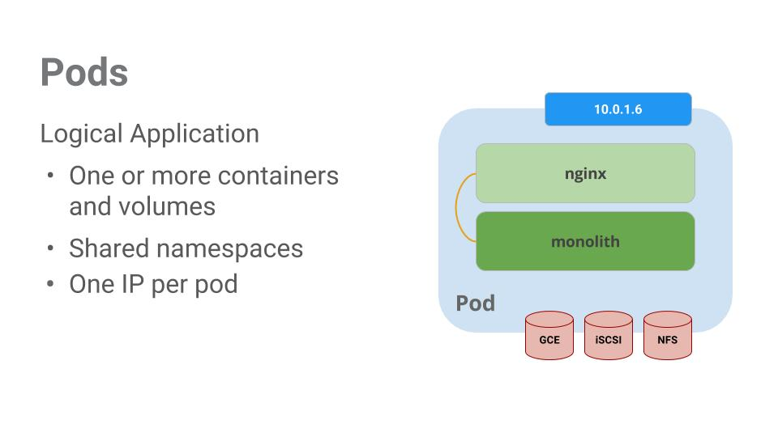
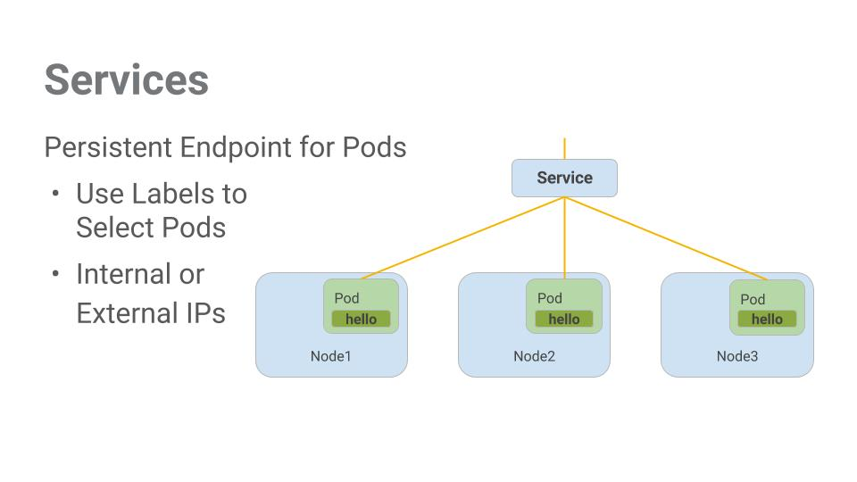
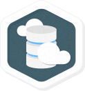

# Orchestrating the Cloud with Kubernetes

## GSP021


## Overview

In this lab you will learn how to:

- Provision a complete [Kubernetes](http://kubernetes.io/) cluster using [Kubernetes Engine.](https://cloud.google.com/container-engine)
- Deploy and manage Docker containers using kubectl.
- Break an application into microservices using Kubernetes' Deployments and Services.

Kubernetes is all about applications. In this part of the lab you will use an example application called "app" to complete the labs.

[App](https://github.com/kelseyhightower/app) is hosted on GitHub and provides an example 12-Factor application. During this lab you will be working with the following Docker images:

- [kelseyhightower/monolith](https://hub.docker.com/r/kelseyhightower/monolith) - Monolith includes auth and hello services.
- [kelseyhightower/auth](https://hub.docker.com/r/kelseyhightower/auth) - Auth microservice. Generates JWT tokens for authenticated users.
- [kelseyhightower/hello](https://hub.docker.com/r/kelseyhightower/hello) - Hello microservice. Greets authenticated users.
- [ngnix](https://hub.docker.com/_/nginx) - Frontend to the auth and hello services.


Kubernetes is an open source project (available on [kubernetes.io](http://kubernetes.io/)) which can run on many different environments, from laptops to high-availability multi-node clusters, from public clouds to on-premise deployments, from virtual machines to bare metal.

For this lab, using a managed environment such as Kubernetes Engine allows you to focus on experiencing Kubernetes rather than setting up the underlying infrastructure.

## Setup and Requirements

### **Qwiklabs setup**

#### Before you click the Start Lab button

Read these instructions. Labs are timed and you cannot pause them. The timer, which starts when you click Start Lab, shows how long Cloud resources will be made available to you.

This Qwiklabs hand-on lab lets you do the lab activities yourself in a real cloud environment, not in a simulation or demo environment. It does so by giving you new, temporary credentials that you use to sign in and access the Google Cloud Platform for the duration of the lab.

#### What you need

To complete this lab, you need:

- Access to a standard internet browser (Chrome browser recommended).
- Time to complete the lab.

**Note:** If you already have your own personal GCP account or project, do not use it for this lab.

#### How to start your lab and sign in to the Console

1. Click the **Start Lab** button. If you need to pay for the lab, a pop-up opens for you to select your payment method. On the left, the **Connection Details** panel becomes populated with the temporary credentials that you must use for this lab.

   

2. Copy the username, and then click **Open Google Console**. The lab spins up resources, and then opens another tab that shows the **Choose an account** page.

   **Tip:** Open the tabs in separate windows, side-by-side.

3. On the Choose an account page, click **Use Another Account**.

   

4. The Sign in page opens. Paste the username that you copied from the Connection Details panel. Then copy and paste the password.

   **Important:** You must use the credentials from the Connection Details panel. Do not use your Qwiklabs credentials. If you have your own GCP account, do not use it for this lab (avoids incurring charges).

5. Click through the subsequent pages:

   - Accept the terms and conditions.
   - Do not add recovery options or two-factor authentication (because this is a temporary account).
   - Do not sign up for free trials.

After a few moments, the GCP console opens in this tab.

**Note:** You can view the menu with a list of GCP Products and Services by clicking the **Navigation menu** at the top-left, next to “Google Cloud Platform”. 

### Activate Google Cloud Shell

Google Cloud Shell is a virtual machine that is loaded with development tools. It offers a persistent 5GB home directory and runs on the Google Cloud. Google Cloud Shell provides command-line access to your GCP resources.

1. In GCP console, on the top right toolbar, click the Open Cloud Shell button.

   

2. In the dialog box that opens, click **START CLOUD SHELL**:

   

   You can click "START CLOUD SHELL" immediately when the dialog box opens.

It takes a few moments to provision and connect to the environment. When you are connected, you are already authenticated, and the project is set to your *PROJECT_ID*. For example:


**gcloud** is the command-line tool for Google Cloud Platform. It comes pre-installed on Cloud Shell and supports tab-completion.

You can list the active account name with this command:

```
gcloud auth list
```

Output:

```output
Credentialed accounts:
 - <myaccount>@<mydomain>.com (active)
```

Example output:

```Output
Credentialed accounts:
 - google1623327_student@qwiklabs.net
```

You can list the project ID with this command:

```
gcloud config list project
```

Output:

```output
[core]
project = <project_ID>
```

Example output:

```Output
[core]
project = qwiklabs-gcp-44776a13dea667a6
```

Full documentation of **gcloud** is available on [Google Cloud gcloud Overview](https://cloud.google.com/sdk/gcloud).

### **Google Kubernetes Engine**

In the cloud shell environment type the following command to set the zone:

```
gcloud config set compute/zone us-central1-b
```

After you set the zone, start up a cluster for use in this lab:

```
gcloud container clusters create io
```

It will take a while to create a cluster - Kubernetes Engine is provisioning a few Virtual Machines behind the scenes for you to play with!

## Get the sample code

Clone the GitHub repository from the Cloud Shell command line:

```
git clone https://github.com/googlecodelabs/orchestrate-with-kubernetes.git
cd orchestrate-with-kubernetes/kubernetes
```

List the files to see what you're working with:

```
ls
```

The sample has the following layout:

```bash
deployments/  /* Deployment manifests */
  ...
nginx/        /* nginx config files */
  ...
pods/         /* Pod manifests */
  ...
services/     /* Services manifests */
  ...
tls/          /* TLS certificates */
  ...
cleanup.sh    /* Cleanup script */
```

Now that you have the code -- it's time to give Kubernetes a try!

## Quick Kubernetes Demo

The easiest way to get started with Kubernetes is to use the `kubectl run`command. Use it to launch a single instance of the nginx container:

```
kubectl run nginx --image=nginx:1.10.0
```

Kubernetes has created a deployment -- more about deployments later, but for now all you need to know is that deployments keep the pods up and running even when the nodes they run on fail.

In Kubernetes, all containers run in a pod. Use the `kubectl get pods` command to view the running nginx container:

```
kubectl get pods
```

Once the nginx container is running you can expose it outside of Kubernetes using the `kubectl expose` command:

```
kubectl expose deployment nginx --port 80 --type LoadBalancer
```

So what just happened? Behind the scenes Kubernetes created an external Load Balancer with a public IP address attached to it. Any client who hits that public IP address will be routed to the pods behind the service. In this case that would be the nginx pod.

List our services now using the `kubectl get` services command:

```
kubectl get services
```

It may take a few seconds before the `ExternalIP` field is populated for your service. This is normal -- just re-run the `kubectl get services` command every few seconds until the field populates.

Add the External IP to this command to hit the Nginx container remotely:

```
curl http://<External IP>:80
```

And there you go! Kubernetes supports an easy to use workflow out of the box using the `kubectl` run and expose commands.

Now that you've seen a quick tour of kubernetes, it's time to dive into each of the components and abstractions.

## Pods

At the core of Kubernetes is the [Pod](http://kubernetes.io/docs/user-guide/pods/).

Pods represent and hold a collection of one or more containers. Generally, if you have multiple containers with a hard dependency on each other, you package the containers inside a single pod.



In this example there is a pod that contains the monolith and nginx containers.

Pods also have [Volumes](http://kubernetes.io/docs/user-guide/volumes/). Volumes are data disks that live as long as the pods live, and can be used by the containers in that pod. Pods provide a shared namespace for their contents which means that the two containers inside of our example pod can communicate with each other, and they also share the attached volumes.

Pods also share a network namespace. This means that there is one IP Address per pod.

Now let's take a deeper dive into pods.

## Creating Pods

Pods can be created using pod configuration files. Let's take a moment to explore the monolith pod configuration file. Run the following:

```
cat pods/monolith.yaml
```

The output shows the open configuration file:

```bash
apiVersion: v1
kind: Pod
metadata:
  name: monolith
  labels:
    app: monolith
spec:
  containers:
    - name: monolith
      image: kelseyhightower/monolith:1.0.0
      args:
        - "-http=0.0.0.0:80"
        - "-health=0.0.0.0:81"
        - "-secret=secret"
      ports:
        - name: http
          containerPort: 80
        - name: health
          containerPort: 81
      resources:
        limits:
          cpu: 0.2
          memory: "10Mi"
```

There's a few things to notice here. You'll see that:

- your pod is made up of one container (the monolith).
- you're passing a few arguments to our container when it starts up.
- you're opening up port 80 for http traffic.

Create the monolith pod using `kubectl`:

```
kubectl create -f pods/monolith.yaml
```

Examine your pods. Use the `kubectl get pods` command to list all pods running in the default namespace:

```
kubectl get pods
```

It may take a few seconds before the monolith pod is up and running. The monolith container image needs to be pulled from the Docker Hub before we can run it.

Once the pod is running, use `kubectl` `describe` command to get more information about the monolith pod:

```
kubectl describe pods monolith
```

You'll see a lot of the information about the monolith pod including the Pod IP address and the event log. This information will come in handy when troubleshooting.

Kubernetes makes it easy to create pods by describing them in configuration files and easy to view information about them when they are running. At this point you have the ability to create all the pods your deployment requires!

## Interacting with Pods

By default, pods are allocated a private IP address and cannot be reached outside of the cluster. Use the `kubectl port-forward` command to map a local port to a port inside the monolith pod.

From this point on the lab will ask you to work in multiple cloud shell tabs to set up communication between the pods. Any commands that are executed in a second or third command shell will be denoted in the command's instructions.

Open two Cloud Shell terminals. One to run the `kubectl port-forward` command, and the other to issue `curl` commands.

In the **2nd terminal**, run this command to set up port-forwarding:

```
kubectl port-forward monolith 10080:80
```

Now in the **1st terminal** start talking to your pod using `curl`:

```
curl http://127.0.0.1:10080
```

Yes! You got a very friendly "hello" back from your container.

Now use the `curl` command to see what happens when you hit a secure endpoint:

```
curl http://127.0.0.1:10080/secure
```

Uh oh.

Try logging in to get an auth token back from the monolith:

```
curl -u user http://127.0.0.1:10080/login
```

At the login prompt, use the super-secret password "password" to login.

Logging in caused a JWT token to print out. Since cloud shell does not handle copying long strings well, create an environment variable for the token.

```
TOKEN=$(curl http://127.0.0.1:10080/login -u user|jq -r '.token')
```

Enter the super-secret password "password" again when prompted for the host password.

Use this command to copy and then use the token to hit the secure endpoint with `curl`:

```
curl -H "Authorization: Bearer $TOKEN" http://127.0.0.1:10080/secure
```

At this point you should get a response back from our application, letting us know everything is right in the world again.

Use the `kubectl logs` command to view the logs for the monolith Pod.

```
kubectl logs monolith
```

**Open a 3rd terminal** and use the `-f` flag to get a stream of the logs happening in real-time:

```
kubectl logs -f monolith
```

Now if you use `curl` in the **1st terminal** to interact with the monolith, you can see the logs updating (in the **3rd terminal**):

```
curl http://127.0.0.1:10080
```

Use the `kubectl exec` command to run an interactive shell inside the Monolith Pod. This can come in handy when you want to troubleshoot from within a container:

```
kubectl exec monolith --stdin --tty -c monolith /bin/sh
```

For example, once we have a shell into the monolith container we can test external connectivity using the `ping` command:

```
ping -c 3 google.com
```

Be sure to log out when you're done with this interactive shell.

```
exit
```

As you can see, interacting with pods is as easy as using the `kubectl` command. If you need to hit a container remotely, or get a login shell, Kubernetes provides everything you need to get up and going.

## Services

Pods aren't meant to be persistent. They can be stopped or started for many reasons - like failed liveness or readiness checks - and this leads to a problem:

What happens if you want to communicate with a set of Pods? When they get restarted they might have a different IP address.

That's where [Services](http://kubernetes.io/docs/user-guide/services/) come in. Services provide stable endpoints for Pods.



Services use labels to determine what Pods they operate on. If Pods have the correct labels, they are automatically picked up and exposed by our services.

The level of access a service provides to a set of pods depends on the Service's type. Currently there are three types:

- `ClusterIP` (internal) -- the default type means that this Service is only visible inside of the cluster,
- `NodePort` gives each node in the cluster an externally accessible IP and
- `LoadBalancer` adds a load balancer from the cloud provider which forwards traffic from the service to Nodes within it.

Now you'll learn how to:

- Create a service
- Use label selectors to expose a limited set of Pods externally

## Creating a Service

Before we can create our services -- let's first create a secure pod that can handle https traffic.

If you've changed directories, make sure you return to the `~/orchestrate-with-kubernetes/kubernetes` directory:

```
cd ~/orchestrate-with-kubernetes/kubernetes
```

Explore the monolith service configuration file:

```
cat pods/secure-monolith.yaml
```

Create the secure-monolith pods and their configuration data:

```
kubectl create secret generic tls-certs --from-file tls/
kubectl create configmap nginx-proxy-conf --from-file nginx/proxy.conf
kubectl create -f pods/secure-monolith.yaml
```

Now that you have a secure pod, it's time to expose the secure-monolith Pod externally.To do that, create a Kubernetes service.

Explore the monolith service configuration file:

```
cat services/monolith.yaml
```

(Output):

```bash
kind: Service
apiVersion: v1
metadata:
  name: "monolith"
spec:
  selector:
    app: "monolith"
    secure: "enabled"
  ports:
    - protocol: "TCP"
      port: 443
      targetPort: 443
      nodePort: 31000
  type: NodePort
```

Things to note:

1. There's a selector which is used to automatically find and expose any pods with the labels "app=monolith" and "secure=enabled"
2. Now you have to expose the nodeport here because this is how we'll forward external traffic from port 31000 to nginx (on port 443).

Use the `kubectl create` command to create the monolith service from the monolith service configuration file:

```
kubectl create -f services/monolith.yaml
```

(Output):

```bash
service "monolith" created
```

You're using a port to expose the service. This means that it's possible to have port collisions if another app tries to bind to port 31000 on one of your servers.

Normally, Kubernetes would handle this port assignment. In this lab you chose a port so that it's easier to configure health checks later on.

Use the `gcloud compute firewall-rules` command to allow traffic to the monolith service on the exposed nodeport:

```
gcloud compute firewall-rules create allow-monolith-nodeport \
  --allow=tcp:31000
```

Now that everything is setup you should be able to hit the secure-monolith service from outside the cluster without using port forwarding.

First, get an external IP address for one of the nodes.

```
gcloud compute instances list
```

Now try hitting the secure-monolith service using `curl`:

```
curl -k https://<EXTERNAL_IP>:31000
```

Uh oh! That timed out. What's going wrong?

It's time for a quick knowledge check.Use the following commands to answer the questions below.

```
kubectl get services monolith
kubectl describe services monolith
```

**Questions:**

- Why are you unable to get a response from the monolith service?
- How many endpoints does the monolith service have?
- What labels must a Pod have to be picked up by the monolith service?

Hint: it has to do with labels. You'll fix the issue in the next section.

## Adding Labels to Pods

Currently the monolith service does not have endpoints. One way to troubleshoot an issue like this is to use the `kubectl get pods` command with a label query.

We can see that we have quite a few pods running with the monolith label.

```
kubectl get pods -l "app=monolith"
```

But what about "app=monolith" and "secure=enabled"?

```
kubectl get pods -l "app=monolith,secure=enabled"
```

Notice this label query does not print any results. It seems like we need to add the "secure=enabled" label to them.

Use the `kubectl label` command to add the missing `secure=enabled` label to the secure-monolith Pod. Afterwards, you can check and see that your labels have been updated.

```
kubectl label pods secure-monolith 'secure=enabled'
kubectl get pods secure-monolith --show-labels
```

Now that our pods are correctly labeled, let's view the list of endpoints on the monolith service:

```
kubectl describe services monolith | grep Endpoints
```

And you have one!

Let's test this out by hitting one of our nodes again.

```
gcloud compute instances list
curl -k https://<EXTERNAL_IP>:31000
```

Bam! Houston, we have contact.

## Deploying Applications with Kubernetes

The goal of this lab is to get you ready for scaling and managing containers in production. That's where [Deployments](http://kubernetes.io/docs/user-guide/deployments/#what-is-a-deployment) come in. Deployments are a declarative way to ensure that the number of Pods running is equal to the desired number of Pods, specified by the user.

The main benefit of Deployments is in abstracting away the low level details of managing Pods. Behind the scenes Deployments use [Replica Sets](http://kubernetes.io/docs/user-guide/replicasets/) to manage starting and stopping the Pods. If Pods need to be updated or scaled, the Deployment will handle that. Deployment also handles restarting Pods if they happen to go down for some reason.

Let's look at a quick example:


Pods are tied to the lifetime of the Node they are created on. In the example above, Node3 went down (taking a Pod with it). Insteading of manually creating a new Pod and finding a Node for it, your Deployment created a new Pod and started it on Node2.

That's pretty cool!

It's time to combine everything you learned about Pods and Services to break up the monolith application into smaller Services using Deployments.

## Creating Deployments

We're going to break the monolith app into three separate pieces:

- **auth** - Generates JWT tokens for authenticated users.
- **hello** - Greet authenticated users.
- **frontend** - Routes traffic to the auth and hello services.

We are ready to create deployments, one for each service. Afterwards, we'll define internal services for the auth and hello deployments and an external service for the frontend deployment. Once finished you'll be able to interact with the microservices just like with Monolith only now each piece will be able to be scaled and deployed, independently!

Get started by examining the auth deployment configuration file.

```
cat deployments/auth.yaml
```

(Output)

```bash
apiVersion: extensions/v1beta1
kind: Deployment
metadata:
  name: auth
spec:
  replicas: 1
  template:
    metadata:
      labels:
        app: auth
        track: stable
    spec:
      containers:
        - name: auth
          image: "kelseyhightower/auth:1.0.0"
          ports:
            - name: http
              containerPort: 80
            - name: health
              containerPort: 81
...
```

The deployment is creating 1 replica, and we're using version 1.0.0 of the auth container.

When you run the `kubectl create` command to create the auth deployment it will make one pod that conforms to the data in the Deployment manifest. This means you can scale the number of Pods by changing the number specified in the Replicas field.

Anyway, go ahead and create your deployment object:

```
kubectl create -f deployments/auth.yaml
```

It's time to create a service for your auth deployment. Use the `kubectl create`command to create the auth service:

```
kubectl create -f services/auth.yaml
```

Now do the same thing to create and expose the hello deployment:

```
kubectl create -f deployments/hello.yaml
kubectl create -f services/hello.yaml
```

And one more time to create and expose the frontend Deployment.

```
kubectl create configmap nginx-frontend-conf --from-file=nginx/frontend.conf
kubectl create -f deployments/frontend.yaml
kubectl create -f services/frontend.yaml
```

There is one more step to creating the frontend because you need to store some configuration data with the container.

Interact with the frontend by grabbing it's External IP and then curling to it:

```
kubectl get services frontend
curl -k https://<EXTERNAL-IP>
```

And you get a hello response back!

## Conclusion

Congratulations! You've developed a multi-service application using Kubernetes. The skills you've learned here will allow you to deploy complex applications on Kubernetes using a collection of deployments and services.

 

### Finish Your Quest

This self-paced lab is part of the Qwiklabs [Cloud Architecture](https://google.qwiklabs.com/quests/24) and [Kubernetes in the Google Cloud](https://google.qwiklabs.com/quests/29) Quests. A Quest is a series of related labs that form a learning path. Completing this Quest earns you the badge above, to recognize your achievement. You can make your badge (or badges) public and link to them in your online resume or social media account. [Enroll in this Quest](http://google.qwiklabs.com/learning_paths/24/enroll) and get immediate completion credit if you've taken this lab. [See other available Qwiklabs Quests](http://google.qwiklabs.com/catalog).

### Take Your Next Lab

Continue your Quest with [Stackdriver: Qwik Start](https://google.qwiklabs.com/catalog_lab/906), or check out these suggestions:

- [Networking 101](https://google.qwiklabs.com/catalog_lab/311)
- [Application Performance Management (APM) with Stackdriver](https://google.qwiklabs.com/catalog_lab/742)

### Next Steps / Learn More

We've only scratched the surface of this technology and we encourage you to explore further with your own pods, replication controllers, and services but also to check out liveness probes (health checks) and consider using the Kubernetes API directly.

Here are some follow-up steps :

- You can follow the Kubernetes news on [Twitter](https://twitter.com/kubernetesio) and on the [community's blog](http://blog.kubernetes.io/).
- Remember, Kubernetes is an open source project ( <http://kubernetes.io/>) hosted on [GitHub](https://github.com/kubernetes/kubernetes). Your feedback and contributions are always welcome.

### Google Cloud Training & Certification

...helps you make the most of Google Cloud technologies. [Our classes](https://cloud.google.com/training/courses) include technical skills and best practices to help you get up to speed quickly and continue your learning journey. We offer fundamental to advanced level training, with on-demand, live, and virtual options to suit your busy schedule. [Certifications](https://cloud.google.com/certification/) help you validate and prove your skill and expertise in Google Cloud technologies.

##### Manual Last Updated September 4 2018

##### Lab Last Tested July 10, 2018

Copyright 2018 Google LLC All rights reserved. Google and the Google logo are trademarks of Google LLC. All other company and product names may be trademarks of the respective companies with which they are associated.