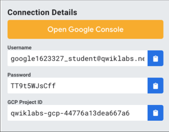
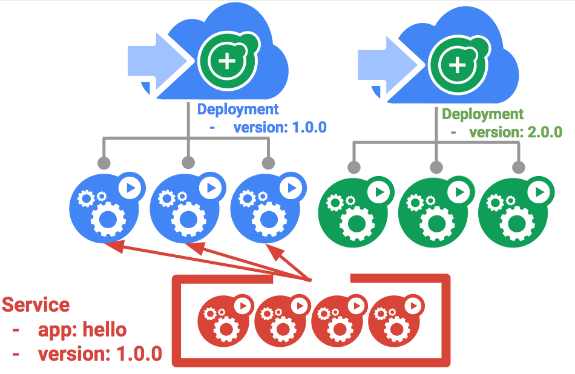
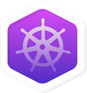

# Managing Deployments with Kubernetes Engine

## GSP053


## Overview

Dev Ops practices will regularly make use of multiple deployments to manage application deployment scenarios such as "Continuous Deployment", "Blue-Green Deployments," "Canary Deployments" and more. This lab is to provide practice in scaling and managing containers so you can accomplish these common scenarios where multiple heterogeneous deployments are being used.

### **What you'll do**

- Practice with kubectl tool
- Create deployment yaml files
- Launch, update, and scale deployments
- Practice with updating deployments and deployment styles

### Prerequisites

- Before taking this lab, you should have taken at least the labs [Introduction to Docker](https://google.qwiklabs.com/catalog_lab/944) and [Hello Node Kubernetes](https://google.qwiklabs.com/catalog_lab/468)
- Linux System Administration skills
- Dev Ops theory: concepts of continuous deployment

## Introduction to deployments

Heterogeneous deployments typically involve connecting two or more distinct infrastructure environments or regions to address a specific technical or operational need. Heterogeneous deployments are called "hybrid", "multi-cloud", or "public-private", depending upon the specifics of the deployment. For the purposes of this lab, heterogeneous deployments include those that span regions within a single cloud environment, multiple public cloud environments (multi-cloud), or a combination of on-premises and public cloud environments (hybrid or public-private).

Various business and technical challenges can arise in deployments that are limited to a single environment or region:

- **Maxed out resources**: In any single environment, particularly in on-premises environments, you might not have the compute, networking, and storage resources to meet your production needs.
- **Limited geographic reach**: Deployments in a single environment require people who are geographically distant from one another to access one deployment. Their traffic might travel around the world to a central location.
- **Limited availability**: Web-scale traffic patterns challenge applications to remain fault-tolerant and resilient.
- **Vendor lock-in**: Vendor-level platform and infrastructure abstractions can prevent you from porting applications.
- **Inflexible resources**: Your resources might be limited to a particular set of compute, storage, or networking offerings.

Heterogeneous deployments can help address these challenges, but they must be architected using programmatic and deterministic processes and procedures. One-off or ad-hoc deployment procedures can cause deployments or processes to be brittle and intolerant of failures. Ad-hoc processes can lose data or drop traffic. Good deployment processes must be repeatable and use proven approaches for managing provisioning, configuration, and maintenance.

Three common scenarios for heterogeneous deployment are multi-cloud deployments, fronting on-premises data, and continuous integration/continuous delivery (CI/CD) processes.

The following exercises practice some common use cases for heterogeneous deployments, along with well-architected approaches using Kubernetes and other infrastructure resources to accomplish them.

## Setup

#### Before you click the Start Lab button

Read these instructions. Labs are timed and you cannot pause them. The timer, which starts when you click Start Lab, shows how long Cloud resources will be made available to you.

This Qwiklabs hand-on lab lets you do the lab activities yourself in a real cloud environment, not in a simulation or demo environment. It does so by giving you new, temporary credentials that you use to sign in and access the Google Cloud Platform for the duration of the lab.

#### What you need

To complete this lab, you need:

- Access to a standard internet browser (Chrome browser recommended).
- Time to complete the lab.

**Note:** If you already have your own personal GCP account or project, do not use it for this lab.

#### How to start your lab and sign in to the Console

1. Click the **Start Lab** button. If you need to pay for the lab, a pop-up opens for you to select your payment method. On the left, the **Connection Details** panel becomes populated with the temporary credentials that you must use for this lab.

   

2. Copy the username, and then click **Open Google Console**. The lab spins up resources, and then opens another tab that shows the **Choose an account** page.

   **Tip:** Open the tabs in separate windows, side-by-side.

3. On the Choose an account page, click **Use Another Account**.

   

4. The Sign in page opens. Paste the username that you copied from the Connection Details panel. Then copy and paste the password.

   **Important:** You must use the credentials from the Connection Details panel. Do not use your Qwiklabs credentials. If you have your own GCP account, do not use it for this lab (avoids incurring charges).

5. Click through the subsequent pages:

   - Accept the terms and conditions.
   - Do not add recovery options or two-factor authentication (because this is a temporary account).
   - Do not sign up for free trials.

After a few moments, the GCP console opens in this tab.

**Note:** You can view the menu with a list of GCP Products and Services by clicking the **Navigation menu** at the top-left, next to “Google Cloud Platform”. 

### Activate Google Cloud Shell

Google Cloud Shell is a virtual machine that is loaded with development tools. It offers a persistent 5GB home directory and runs on the Google Cloud. Google Cloud Shell provides command-line access to your GCP resources.

1. In GCP console, on the top right toolbar, click the Open Cloud Shell button.

   

2. In the dialog box that opens, click **START CLOUD SHELL**:

   

   You can click "START CLOUD SHELL" immediately when the dialog box opens.

It takes a few moments to provision and connect to the environment. When you are connected, you are already authenticated, and the project is set to your *PROJECT_ID*. For example:


**gcloud** is the command-line tool for Google Cloud Platform. It comes pre-installed on Cloud Shell and supports tab-completion.

You can list the active account name with this command:

```
gcloud auth list
```

Output:

```output
Credentialed accounts:
 - <myaccount>@<mydomain>.com (active)
```

Example output:

```Output
Credentialed accounts:
 - google1623327_student@qwiklabs.net
```

You can list the project ID with this command:

```
gcloud config list project
```

Output:

```output
[core]
project = <project_ID>
```

Example output:

```Output
[core]
project = qwiklabs-gcp-44776a13dea667a6
```

Full documentation of **gcloud** is available on [Google Cloud gcloud Overview](https://cloud.google.com/sdk/gcloud).

### Set zone

Set your working GCP zone by running the following command, substituting the local zone as `us-central1-a`:

```
gcloud config set compute/zone us-central1-a
```

### Get sample code for this lab

Get the sample code for creating and running containers and deployments:

```
git clone https://github.com/googlecodelabs/orchestrate-with-kubernetes.git
cd orchestrate-with-kubernetes/kubernetes
```

Create a cluster with five `n1-standard-1` nodes (this will take a few minutes to complete):

```
gcloud container clusters create bootcamp --num-nodes 5 --scopes "https://www.googleapis.com/auth/projecthosting,storage-rw"
```

## Learn about the deployment object

Let's get started with Deployments. First let's take a look at the Deployment object. The `explain` command in `kubectl` can tell us about the Deployment object.

```
kubectl explain deployment
```

We can also see all of the fields using the `--recursive` option.

```
kubectl explain deployment --recursive
```

You can use the explain command as you go through the lab to help you understand the structure of a Deployment object and understand what the individual fields do.

```
kubectl explain deployment.metadata.name
```

## Create a deployment

Update the `deployments/auth.yaml` cs file:

```
vi deployments/auth.yaml
```

Start the editor:

```
i
```

Change the `image` in the containers section of the Deployment to the following:

```
...
containers:
- name: auth
  image: kelseyhightower/auth:1.0.0
...
```

Save the `auth.yaml` file: press `<Esc>` then:

```
:wq
```

Now let's create a simple deployment. Examine the deployment configuration file:

```
cat deployments/auth.yaml
```

(Output)

```
apiVersion: extensions/v1beta1
kind: Deployment
metadata:
  name: auth
spec:
  replicas: 1
  template:
    metadata:
      labels:
        app: auth
        track: stable
    spec:
      containers:
        - name: auth
          image: "kelseyhightower/auth:1.0.0"
          ports:
            - name: http
              containerPort: 80
            - name: health
              containerPort: 81
...
```

Notice how the Deployment is creating one replica and it's using version 1.0.0 of the auth container.

When you run the `kubectl create` command to create the auth deployment, it will make one pod that conforms to the data in the Deployment manifest. This means we can scale the number of Pods by changing the number specified in the `replicas`field.

Go ahead and create your deployment object using `kubectl create`:

```
kubectl create -f deployments/auth.yaml
```

Once you have created the Deployment, you can verify that it was created.

```
kubectl get deployments
```

Once the deployment is created, Kubernetes will create a ReplicaSet for the Deployment. We can verify that a ReplicaSet was created for our Deployment:

```
kubectl get replicasets
```

We should see a ReplicaSet with a name like `auth-xxxxxxx`

Finally, we can view the Pods that were created as part of our Deployment. The single Pod is created by the Kubernetes when the ReplicaSet is created.

```
kubectl get pods
```

It's time to create a service for our auth deployment. You've already seen service manifest files, so we won't go into the details here. Use the `kubectl create`command to create the auth service.

```
kubectl create -f services/auth.yaml
```

Now, do the same thing to create and expose the hello Deployment.

```
kubectl create -f deployments/hello.yaml
kubectl create -f services/hello.yaml
```

And one more time to create and expose the frontend Deployment.

```
kubectl create secret generic tls-certs --from-file tls/
kubectl create configmap nginx-frontend-conf --from-file=nginx/frontend.conf
kubectl create -f deployments/frontend.yaml
kubectl create -f services/frontend.yaml
```

**Note:** You created a ConfigMap for the frontend.

Interact with the frontend by grabbing its external IP and then curling to it.

```
kubectl get services frontend
curl -ks https://<EXTERNAL-IP>
```

And you get the hello response back.

You can also use the output templating feature of `kubectl` to use curl as a one-liner:

```
curl -ks https://`kubectl get svc frontend -o=jsonpath="{.status.loadBalancer.ingress[0].ip}"`
```

### Scale a Deployment

Now that we have a Deployment created, we can scale it. Do this by updating the `spec.replicas` field. You can look at an explanation of this field using the `kubectl explain` command again.

```
kubectl explain deployment.spec.replicas
```

The replicas field can be most easily updated using the `kubectl scale` command:

```
kubectl scale deployment hello --replicas=5
```

It may take a minute or so for all the new pods to start up.

After the Deployment is updated, Kubernetes will automatically update the associated ReplicaSet and start new Pods to make the total number of Pods equal 5.

Verify that there are now 5 `hello` Pods running:

```
kubectl get pods | grep hello- | wc -l
```

Now scale back the application:

```
kubectl scale deployment hello --replicas=3
```

Again, verify that you have the correct number of Pods.

```
kubectl get pods | grep hello- | wc -l
```

You learned about Kubernetes deployments and how to manage & scale a group of Pods.

## Rolling update

Deployments support updating images to a new version through a rolling update mechanism. When a Deployment is updated with a new version, it creates a new ReplicaSet and slowly increases the number of replicas in the new ReplicaSet as it decreases the replicas in the old ReplicaSet.


### Trigger a rolling update

To update your Deployment, run the following command:

```
kubectl edit deployment hello
```

Change the `image` in the containers section of the Deployment to the following:

```
...
containers:
- name: hello
  image: kelseyhightower/hello:2.0.0
...
```

Save and exit.

Once you save out of the editor, the updated Deployment will be saved to your cluster and Kubernetes will begin a rolling update.

See the new ReplicaSet that Kubernetes creates.:

```
kubectl get replicaset
```

You can also see a new entry in the rollout history:

```
kubectl rollout history deployment/hello
```

### Pause a rolling update

If you detect problems with a running rollout, pause it to stop the update. Give that a try now:

```
kubectl rollout pause deployment/hello
```

Verify the current state of the rollout:

```
kubectl rollout status deployment/hello
```

You can also verify this on the Pods directly:

```
kubectl get pods -o jsonpath --template='{range .items[*]}{.metadata.name}{"\t"}{"\t"}{.spec.containers[0].image}{"\n"}{end}'
```

### Resume a rolling update

The rollout is paused which means that some pods are at the new version and some pods are at the older version. We can continue the rollout using the `resume`command.

```
kubectl rollout resume deployment/hello
```

When the rollout is complete, you should see the following when running the `status`command.

```
kubectl rollout status deployment/hello
```

(Output)

```
deployment "hello" successfully rolled out
```

### Rollback an update

Assume that a bug was detected in your new version. Since the new version is presumed to have problems, any users connected to the new Pods will experience those issues.

You will want to roll back to the previous version so you can investigate and then release a version that is fixed properly.

Use the `rollout` command to roll back to the previous version:

```
kubectl rollout undo deployment/hello
```

Verify the roll back in the history:

```
kubectl rollout history deployment/hello
```

Finally, verify that all the Pods have rolled back to their previous versions:

```
kubectl get pods -o jsonpath --template='{range .items[*]}{.metadata.name}{"\t"}{"\t"}{.spec.containers[0].image}{"\n"}{end}'
```

Great! You learned about rolling updates for Kubernetes deployments and how to update applications without downtime.

## Canary deployments

When you want to test a new deployment in production with a subset of your users, use a canary deployment. Canary deployments allow you to release a change to a small subset of your users to mitigate risk associated with new releases.

### Create a canary deployment

A canary deployment consists of a separate deployment with your new version and a service that targets both your normal, stable deployment as well as your canary deployment.


First, create a new canary deployment for the new version:

```
cat deployments/hello-canary.yaml
```

(Output)

```
apiVersion: extensions/v1beta1
kind: Deployment
metadata:
  name: hello-canary
spec:
  replicas: 1
  template:
    metadata:
      labels:
        app: hello
        track: canary
        # Use ver 1.0.0 so it matches version on service selector
        version: 1.0.0
    spec:
      containers:
        - name: hello
          image: kelseyhightower/hello:2.0.0
          ports:
            - name: http
              containerPort: 80
            - name: health
              containerPort: 81
...
```

Make sure to update version to 1.0.0 (if your version is pointing to any other)

Now create the canary deployment:

```
kubectl create -f deployments/hello-canary.yaml
```

After the canary deployment is created, you should have two deployments, `hello`and `hello-canary`. Verify it with this `kubectl` command:

```
kubectl get deployments
```

On the `hello` service, the selector uses the `app:hello` selector which will match pods in **both** the prod deployment and canary deployment. However, because the canary deployment has a fewer number of pods, it will be visible to fewer users.

### Verify the canary deployment

You can verify the `hello` version being served by the request:

```
curl -ks https://`kubectl get svc frontend -o=jsonpath="{.status.loadBalancer.ingress[0].ip}"`/version
```

Run this several times and you should see that some of the requests are served by hello 1.0.0 and a small subset (1/4 = 25%) are served by 2.0.0.

### Canary deployments in production - session affinity

In this lab, each request sent to the Nginx service had a chance to be served by the canary deployment. But what if you wanted to ensure that a user didn't get served by the Canary deployment? A use case could be that the UI for an application changed, and you don't want to confuse the user. In a case like this, you want the user to "stick" to one deployment or the other.

You can do this by creating a service with session affinity. This way the same user will always be served from the same version. In the example below the service is the same as before, but a new `sessionAffinity` field has been added, and set to ClientIP. All clients with the same IP address will have their requests sent to the same version of the `hello` application.

```
kind: Service
apiVersion: v1
metadata:
  name: "hello"
spec:
  sessionAffinity: ClientIP
  selector:
    app: "hello"
  ports:
    - protocol: "TCP"
      port: 80
      targetPort: 80
```

Due to it being difficult to set up an environment to test this, you don't need to here, but you may want to use `sessionAffinity` for canary deployments in production.

## Blue-green deployments

Rolling updates are ideal because they allow you to deploy an application slowly with minimal overhead, minimal performance impact, and minimal downtime. There are instances where it is beneficial to modify the load balancers to point to that new version only after it has been fully deployed. In this case, blue-green deployments are the way to go.

Kubernetes achieves this by creating two separate deployments; one for the old "blue" version and one for the new "green" version. Use your existing `hello`deployment for the "blue" version. The deployments will be accessed via a Service which will act as the router. Once the new "green" version is up and running, you'll switch over to using that version by updating the Service.



A major downside of blue-green deployments is that you will need to have at least 2x the resources in your cluster necessary to host your application. Make sure you have enough resources in your cluster before deploying both versions of the application at once.

### The service

Use the existing hello service, but update it so that it has a selector `app:hello`, `version: 1.0.0.` The selector will match the existing "blue" deployment. But it will not match the "green" deployment because it will use a different version.

First update the service:

```
kubectl apply -f services/hello-blue.yaml
```

### Updating using Blue-Green Deployment

In order to support a blue-green deployment style, we will create a new "green" deployment for our new version. The green deployment updates the version label and the image path.

```
apiVersion: extensions/v1beta1
kind: Deployment
metadata:
  name: hello-green
spec:
  replicas: 3
  template:
    metadata:
      labels:
        app: hello
        track: stable
        version: 2.0.0
    spec:
      containers:
        - name: hello
          image: kelseyhightower/hello:2.0.0
          ports:
            - name: http
              containerPort: 80
            - name: health
              containerPort: 81
          resources:
            limits:
              cpu: 0.2
              memory: 10Mi
          livenessProbe:
            httpGet:
              path: /healthz
              port: 81
              scheme: HTTP
            initialDelaySeconds: 5
            periodSeconds: 15
            timeoutSeconds: 5
          readinessProbe:
            httpGet:
              path: /readiness
              port: 81
              scheme: HTTP
            initialDelaySeconds: 5
            timeoutSeconds: 1
```

Create the green deployment:

```
kubectl create -f deployments/hello-green.yaml
```

Once you have a green deployment and it has started up properly, verify that the current version of 1.0.0 is still being used:

```
curl -ks https://`kubectl get svc frontend -o=jsonpath="{.status.loadBalancer.ingress[0].ip}"`/version
```

Now, update the service to point to the new version:

```
kubectl apply -f services/hello-green.yaml
```

With the service is updated, the "green" deployment will be used immediately. You can now verify that the new version is always being used.

```
curl -ks https://`kubectl get svc frontend -o=jsonpath="{.status.loadBalancer.ingress[0].ip}"`/version
```

### Blue-Green Rollback

If necessary, you can roll back to the old version in the same way. While the "blue" deployment is still running, just update the service back to the old version.

```
kubectl apply -f services/hello-blue.yaml
```

Once you have updated the service, your rollback will have been successful. Again, verify that the right version is now being used:

```
curl -ks https://`kubectl get svc frontend -o=jsonpath="{.status.loadBalancer.ingress[0].ip}"`/version
```

You did it! You learned about blue-green deployments and how to deploy updates to applications that need to switch versions all at once.

## Congratulations!

This concludes this hands-on lab practicing deployment management with Kubernetes. In this lab you've had the opportunity to work more with the `kubectl`command-line tool, and many styles of deployment configurations set up in YAML files to launch, update, and scale your deployments. With this foundation of practice you should feel comfortable applying these skills to your own DevOps practice.

 

### Finish Your Quest

This self-paced lab is part of the Qwiklabs Quests [Kubernetes in the Google Cloud](https://google.qwiklabs.com/quests/29)and [Kubernetes Solutions](https://google.qwiklabs.com/quests/45) Quests. A Quest is a series of related labs that form a learning path. Completing this Quest earns you the badge above, to recognize your achievement. You can make your badge public and link to them in your online resume or social media account. Enroll in a Quest and get immediate completion credit if you've taken this lab. [See other available Qwiklabs Quests](https://google.qwiklabs.com/catalog).

### Take Your Next Lab

Continue your Quest with [Build a Slack Bot with Node.js on Kubernetes](https://google.qwiklabs.com/catalog_lab/498), or check out these suggestions:

- [Continuous Delivery with Jenkins in Kubernetes Engine](https://google.qwiklabs.com/catalog_lab/984)
- [Using Kubernetes Engine to Deploy Apps with Regional Persistent Disks](https://google.qwiklabs.com/catalog_lab/962)

### Next Steps / Learn More

- Read further on [Deployment Patterns with Kubernetes](https://cloud.google.com/solutions/heterogeneous-deployment-patterns-with-kubernetes).
- Read further on [DevOps Solutions and DevOps Guides](https://cloud.google.com/solutions/devops/) in the Google Cloud documentation
- Connect with the [Kubernetes Community](https://kubernetes.io/community/)!

### Google Cloud Training & Certification

...helps you make the most of Google Cloud technologies. [Our classes](https://cloud.google.com/training/courses) include technical skills and best practices to help you get up to speed quickly and continue your learning journey. We offer fundamental to advanced level training, with on-demand, live, and virtual options to suit your busy schedule. [Certifications](https://cloud.google.com/certification/) help you validate and prove your skill and expertise in Google Cloud technologies.

##### Manual Last Updated January 3.2019

##### Lab Last Tested July 11, 2018

Copyright 2018 Google LLC All rights reserved. Google and the Google logo are trademarks of Google LLC. All other company and product names may be trademarks of the respective companies with which they are associated.