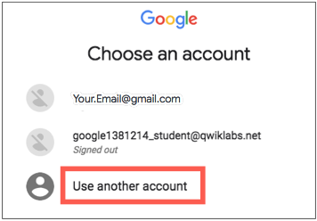
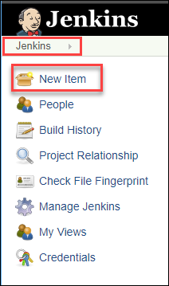
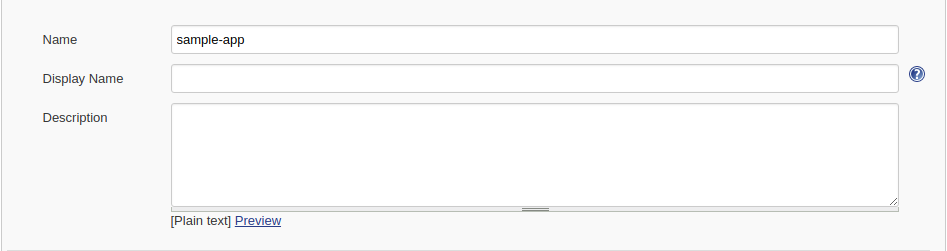

# Continuous Delivery with Jenkins in Kubernetes Engine

## GSP051


## Overview

In this lab, you will learn how to set up a continuous delivery pipeline with `Jenkins`on Kubernetes engine. Jenkins is the go-to automation server used by developers who frequently integrate their code in a shared repository. The solution you'll build in this lab will be similar to the following diagram:


You can find more details about running Jenkins on Kubernetes [here](https://cloud.google.com/solutions/jenkins-on-container-engine).

### **What you'll do**

In this lab, you will complete the following tasks:

- Provision a Jenkins application into a Kubernetes Engine Cluster
- Set up your Jenkins application using Helm Package Manager
- Explore the features of a Jenkins application
- Create and exercise a Jenkins pipeline

### Prerequisites

This is a **expert level** lab. Before taking it, you should be comfortable with at least the basics of shell programming, Kubernetes, and Jenkins. Here are some Qwiklabs that can get you up to speed:

- [Introduction to Docker](https://google.qwiklabs.com/focuses/7010)
- [Hello Node Kubernetes](https://google.qwiklabs.com/catalog_lab/468)
- [Managing Deployments Using Kubernetes Engine](https://google.qwiklabs.com/catalog_lab/572)
- [Setting up Jenkins on Kubernetes Engine](https://google.qwiklabs.com/catalog_lab/1093)

Once your prepared, scroll down to learn more about Kubernetes, Jenkins, and Continuous Delivery.

## What is Kubernetes Engine?

Kubernetes Engine is GCP's hosted version of `Kubernetes` - a powerful cluster manager and orchestration system for containers. Kubernetes is an open source project that can run on many different environments—from laptops to high-availability multi-node clusters; from virtual machines to bare metal. As mentioned before, Kubernetes apps are built on `containers` - these are lightweight applications bundled with all the necessary dependencies and libraries to run them. This underlying structure makes Kubernetes applications highly available, secure, and quick to deploy—an ideal framework for cloud developers.

## What is Jenkins?

[Jenkins](https://jenkins.io/) is an open-source automation server that lets you flexibly orchestrate your build, test, and deployment pipelines. Jenkins allows developers to iterate quickly on projects without worrying about overhead issues that can stem from continuous delivery.

## What is Continuous Delivery / Continuous Deployment?

When you need to set up a continuous delivery (CD) pipeline, deploying Jenkins on Kubernetes Engine provides important benefits over a standard VM-based deployment.

When your build process uses containers, one virtual host can run jobs on multiple operating systems. Kubernetes Engine provides `ephemeral build executors`—these are only utilized when builds are actively running, which leaves resources for other cluster tasks such as batch processing jobs. Another benefit of ephemeral build executors is *speed*—they launch in a matter of seconds.

Kubernetes Engine also comes pre-equipped with Google's global load balancer, which you can use to automate web traffic routing to your instance(s). The load balancer handles SSL termination and utilizes a global IP address that's configured with Google's backbone network—coupled with your web front, this load balancer will always set your users on the fastest possible path to an application instance.

Now that we've learned a little bit about Kubernetes, Jenkins, and how the two interact in a CD pipeline, let's go build one.

## Setup

#### Before you click the Start Lab button

Read these instructions. Labs are timed and you cannot pause them. The timer, which starts when you click Start Lab, shows how long Cloud resources will be made available to you.

This Qwiklabs hand-on lab lets you do the lab activities yourself in a real cloud environment, not in a simulation or demo environment. It does so by giving you new, temporary credentials that you use to sign in and access the Google Cloud Platform for the duration of the lab.

#### What you need

To complete this lab, you need:

- Access to a standard internet browser (Chrome browser recommended).
- Time to complete the lab.

**Note:** If you already have your own personal GCP account or project, do not use it for this lab.

#### How to start your lab and sign in to the Console

1. Click the **Start Lab** button. If you need to pay for the lab, a pop-up opens for you to select your payment method. On the left, the **Connection Details** panel becomes populated with the temporary credentials that you must use for this lab.

   

2. Copy the username, and then click **Open Google Console**. The lab spins up resources, and then opens another tab that shows the **Choose an account** page.

   **Tip:** Open the tabs in separate windows, side-by-side.

3. On the Choose an account page, click **Use Another Account**.

   

4. The Sign in page opens. Paste the username that you copied from the Connection Details panel. Then copy and paste the password.

   **Important:** You must use the credentials from the Connection Details panel. Do not use your Qwiklabs credentials. If you have your own GCP account, do not use it for this lab (avoids incurring charges).

5. Click through the subsequent pages:

   - Accept the terms and conditions.
   - Do not add recovery options or two-factor authentication (because this is a temporary account).
   - Do not sign up for free trials.

After a few moments, the GCP console opens in this tab.

**Note:** You can view the menu with a list of GCP Products and Services by clicking the **Navigation menu** at the top-left, next to “Google Cloud Platform”. 

### Activate Google Cloud Shell

Google Cloud Shell is a virtual machine that is loaded with development tools. It offers a persistent 5GB home directory and runs on the Google Cloud. Google Cloud Shell provides command-line access to your GCP resources.

1. In GCP console, on the top right toolbar, click the Open Cloud Shell button.

   

2. In the dialog box that opens, click **START CLOUD SHELL**:

   

   You can click "START CLOUD SHELL" immediately when the dialog box opens.

It takes a few moments to provision and connect to the environment. When you are connected, you are already authenticated, and the project is set to your *PROJECT_ID*. For example:


**gcloud** is the command-line tool for Google Cloud Platform. It comes pre-installed on Cloud Shell and supports tab-completion.

You can list the active account name with this command:

```
gcloud auth list
```

Output:

```output
Credentialed accounts:
 - <myaccount>@<mydomain>.com (active)
```

Example output:

```Output
Credentialed accounts:
 - google1623327_student@qwiklabs.net
```

You can list the project ID with this command:

```
gcloud config list project
```

Output:

```output
[core]
project = <project_ID>
```

Example output:

```Output
[core]
project = qwiklabs-gcp-44776a13dea667a6
```

Full documentation of **gcloud** is available on [Google Cloud gcloud Overview](https://cloud.google.com/sdk/gcloud).

## Clone Repository

Let's get set up. You'll first set your zone and then clone the lab's sample code into your Cloud Shell:

```
gcloud config set compute/zone us-central1-f
git clone https://github.com/GoogleCloudPlatform/continuous-deployment-on-kubernetes.git
cd continuous-deployment-on-kubernetes
```

## Provisioning Jenkins

### **Creating a Kubernetes cluster**

Now, run the following command to provision a Kubernetes cluster:

```
gcloud container clusters create jenkins-cd \
--num-nodes 2 \
--machine-type n1-standard-2 \
--scopes "https://www.googleapis.com/auth/projecthosting,cloud-platform"
```

This step can take up to several minutes to complete. The extra scopes enable Jenkins to access Cloud Source Repositories and Google Container Registry.

### Test Completed Task

Click **Check my progress** to verify your performed task. If you have completed the task successfully you will granted with an assessment score.


Create a Kubernetes cluster (zone: us-central1-f)

Check my progress


Before continuing, confirm that your cluster is running by running the following command:

```
gcloud container clusters list
```

Now, get the credentials for your cluster:

```
gcloud container clusters get-credentials jenkins-cd
```

Kubernetes Engine uses these credentials to access your newly provisioned cluster—confirm that you can connect to it by running the following command:

```
kubectl cluster-info
```

## Install Helm

In this lab, you will use Helm to install Jenkins from the Charts repository. Helm is a package manager that makes it easy to configure and deploy Kubernetes applications. Once you have Jenkins installed, you'll be able to set up your CI/CD pipeline.

1. Download and install the helm binary

```
wget https://storage.googleapis.com/kubernetes-helm/helm-v2.9.1-linux-amd64.tar.gz
```

1. Unzip the file in Cloud Shell:

```
tar zxfv helm-v2.9.1-linux-amd64.tar.gz
cp linux-amd64/helm .
```

1. Add yourself as a cluster administrator in the cluster's RBAC so that you can give Jenkins permissions in the cluster:

```
kubectl create clusterrolebinding cluster-admin-binding --clusterrole=cluster-admin --user=$(gcloud config get-value account)
```

1. Grant Tiller, the server side of Helm, the cluster-admin role in your cluster:

```
kubectl create serviceaccount tiller --namespace kube-system
kubectl create clusterrolebinding tiller-admin-binding --clusterrole=cluster-admin --serviceaccount=kube-system:tiller
```

### Test Completed Task

Click **Check my progress** to verify your performed task. If you have completed the task successfully you will granted with an assessment score.


Create a tiller Service Account

Check my progress


1. Initialize Helm. This ensures that the server side of Helm (Tiller) is properly installed in your cluster.

```
./helm init --service-account=tiller
./helm update
```

### Test Completed Task

Click **Check my progress** to verify your performed task. If you have completed the task successfully you will granted with an assessment score.


Initialize Helm and Install Tiller

Check my progress


1. Ensure Helm is properly installed by running the following command. You should see versions appear for both the server and the client of `v2.9.1`:

```
./helm version
```

**Example Output:**

```
Client: &version.Version{SemVer:"v2.9.1", GitCommit:"20adb27c7c5868466912eebdf6664e7390ebe710", GitTreeState:"clean"}
Server: &version.Version{SemVer:"v2.9.1", GitCommit:"20adb27c7c5868466912eebdf6664e7390ebe710", GitTreeState:"clean"}
```

## Configure and Install Jenkins

You will use a custom values file to add the GCP specific plugin necessary to use service account credentials to reach your Cloud Source Repository.

1. Use the Helm CLI to deploy the chart with your configuration settings.

```
./helm install -n cd stable/jenkins -f jenkins/values.yaml --version 0.16.6 --wait
```

### Test Completed Task

Click **Check my progress** to verify your performed task. If you have completed the task successfully you will granted with an assessment score.


Configure and Install Jenkins

Check my progress


1. Once that command completes ensure the Jenkins pod goes to the Running state and the container is in the READY state:

```
kubectl get pods
```

**Example Output:**

```
NAME                          READY     STATUS    RESTARTS   AGE
cd-jenkins-7c786475dd-vbhg4   1/1       Running   0          1m
```

1. Run the following command to setup port forwarding to the Jenkins UI from the Cloud Shell

```
export POD_NAME=$(kubectl get pods -l "component=cd-jenkins-master" -o jsonpath="{.items[0].metadata.name}")
kubectl port-forward $POD_NAME 8080:8080 >> /dev/null &
```

1. Now, check that the Jenkins Service was created properly:

```
kubectl get svc
```

**Example Output:**

```
NAME               CLUSTER-IP     EXTERNAL-IP   PORT(S)     AGE
cd-jenkins         10.35.249.67   <none>        8080/TCP    3h
cd-jenkins-agent   10.35.248.1    <none>        50000/TCP   3h
kubernetes         10.35.240.1    <none>        443/TCP     9h
```

We are using the [Kubernetes Plugin](https://wiki.jenkins-ci.org/display/JENKINS/Kubernetes+Plugin) so that our builder nodes will be automatically launched as necessary when the Jenkins master requests them. Upon completion of their work, they will automatically be turned down and their resources added back to the clusters resource pool.

Notice that this service exposes ports `8080` and `50000` for any pods that match the `selector`. This will expose the Jenkins web UI and builder/agent registration ports within the Kubernetes cluster. Additionally, the `jenkins-ui` services is exposed using a ClusterIP so that it is not accessible from outside the cluster.

## Connect to Jenkins

1. The Jenkins chart will automatically create an admin password for you. To retrieve it, run:

```
printf $(kubectl get secret cd-jenkins -o jsonpath="{.data.jenkins-admin-password}" | base64 --decode);echo
```

1. To get to the Jenkins user interface, click on the Web Preview button in cloud shell, then click “Preview on port 8080”:


1. You should now be able to log in with username admin and your auto-generated password.

You now have Jenkins set up in your Kubernetes cluster! Jenkins will drive your automated CI/CD pipelines in the next sections.

## Understanding the Application

You'll deploy the sample application, `gceme`, in your continuous deployment pipeline. The application is written in the Go language and is located in the repo's sample-app directory. When you run the gceme binary on a Compute Engine instance, the app displays the instance's metadata in an info card.


The application mimics a microservice by supporting two operation modes.

- In **backend mode**: gceme listens on port 8080 and returns Compute Engine instance metadata in JSON format.
- In **frontend mode**: gceme queries the backend gceme service and renders the resulting JSON in the user interface.


## Deploying the Application

You will deploy the application into two different environments:

- **Production**: The live site that your users access.
- **Canary**: A smaller-capacity site that receives only a percentage of your user traffic. Use this environment to validate your software with live traffic before it's released to all of your users.

In Google Cloud Shell, navigate to the sample application directory:

```
cd sample-app
```

Create the Kubernetes namespace to logically isolate the deployment:

```
kubectl create ns production
```

Create the production and canary deployments, and the services using the `kubectl apply` commands:

```
kubectl apply -f k8s/production -n production
kubectl apply -f k8s/canary -n production
kubectl apply -f k8s/services -n production
```

### Test Completed Task

Click **Check my progress** to verify your performed task. If you have completed the task successfully you will granted with an assessment score.


Create the production and canary deployments

Check my progress


By default, only one replica of the frontend is deployed. Use the `kubectl scale`command to ensure that there are at least 4 replicas running at all times.

Scale up the production environment frontends by running the following command:

```
kubectl scale deployment gceme-frontend-production -n production --replicas 4
```

Now confirm that you have 5 pods running for the frontend, 4 for production traffic and 1 for canary releases (changes to the canary release will only affect 1 out of 5 (20%) of users):

```
kubectl get pods -n production -l app=gceme -l role=frontend
```

Also confirm that you have 2 pods for the backend, 1 for production and 1 for canary:

```
kubectl get pods -n production -l app=gceme -l role=backend
```

Retrieve the external IP for the production services:

```
kubectl get service gceme-frontend -n production
```

**Note:** It can take several minutes before you see the load balancer external IP address.

**Example Output:**

```bash
NAME            TYPE          CLUSTER-IP     EXTERNAL-IP     PORT(S)  AGE
gceme-frontend  LoadBalancer  10.79.241.131  104.196.110.46  80/TCP   5h
```

Paste **External IP** into a browser to see the info card displayed on a card—you should get a similar page:


Now, store the *frontend service* load balancer IP in an environment variable for use later:

```
export FRONTEND_SERVICE_IP=$(kubectl get -o jsonpath="{.status.loadBalancer.ingress[0].ip}" --namespace=production services gceme-frontend)
```

Confirm that both services are working by opening the frontend external IP address in your browser. Check the version output of the service by running the following command (it should read 1.0.0):

```
curl http://$FRONTEND_SERVICE_IP/version
```

You have successfully deployed the sample application! Next, you will set up a pipeline for deploying your changes continuously and reliably.

## Creating the Jenkins Pipeline

### **Creating a repository to host the sample app source code**

Let's create a copy of the `gceme` sample app and push it to a [Cloud Source Repository](https://cloud.google.com/source-repositories/docs/):

```
gcloud alpha source repos create default
```

You can ignore the warning, you will not be billed for this repository.

### Test Completed Task

Click **Check my progress** to verify your performed task. If you have completed the task successfully you will granted with an assessment score.


Create a repository

Check my progress


```
git init
```

Initialize the sample-app directory as its own Git repository:

```
git config credential.helper gcloud.sh
```

Run the following command:

```
git remote add origin https://source.developers.google.com/p/$DEVSHELL_PROJECT_ID/r/default
```

Set the username and email address for your Git commits. Replace `[EMAIL_ADDRESS]` with your Git email address and `[USERNAME]` with your Git username:

```
git config --global user.email "[EMAIL_ADDRESS]"
git config --global user.name "[USERNAME]"
```

Add, commit, and push the files:

```
git add .
git commit -m "Initial commit"
git push origin master
```

### **Adding your service account credentials**

Configure your credentials to allow Jenkins to access the code repository. Jenkins will use your cluster's service account credentials in order to download code from the Cloud Source Repositories.

**Step 1**: In the Jenkins user interface, click **Credentials** in the left navigation.

**Step 2**: Click **Jenkins** 

**Step 3**: Click **Global credentials (unrestricted)**.

**Step 4**: Click **Add Credentials** in the left navigation.

**Step 5**: Select **Google Service Account from metadata** from the **Kind** drop-down and click **OK**.

The global credentials has been added. The name of the credential is the `GCP Project ID` found in the `CONNECTION DETAILS` section of the lab.


**Creating the Jenkins job**

Navigate to your Jenkins user interface and follow these steps to configure a Pipeline job.

**Step 1**: Click **Jenkins** > **New Item** in the left navigation:



**Step 2**: Name the project **sample-app**, then choose the **Multibranch Pipeline** option and click **OK**.

**Step 3**: On the next page, in the **Branch Sources** section, click **Add Source** and select **git**.

**Step 4**: Paste the **HTTPS clone URL** of your sample-app repo in Cloud Source Repositories into the **Project Repository** field. Replace `[PROJECT_ID]` with your **GCP Project ID**:

```
https://source.developers.google.com/p/[PROJECT_ID]/r/default
```

**Step 5**: From the **Credentials** drop-down, select the name of the credentials you created when adding your service account in the previous steps.

**Step 6**: Under **Scan Multibranch Pipeline Triggers** section, check the **Periodically if not otherwise run** box and set the **Interval** value to 1 minute.

**Step 7**: Your job configuration should look like this:




**Step 8**: Click **Save** leaving all other options with their defaults

After you complete these steps, a job named "Branch indexing" runs. This meta-job identifies the branches in your repository and ensures changes haven't occurred in existing branches. If you click sample-app in the top left, the master job should be seen.

**Note:** The first run of the master job might fail until you make a few code changes in the next step.

You have successfully created a Jenkins pipeline! Next, you'll create the development environment for continuous integration.

## Creating the Development Environment

Development branches are a set of environments your developers use to test their code changes before submitting them for integration into the live site. These environments are scaled-down versions of your application, but need to be deployed using the same mechanisms as the live environment.

### Creating a development branch

To create a development environment from a feature branch, you can push the branch to the Git server and let Jenkins deploy your environment.

Create a development branch and push it to the Git server:

```
git checkout -b new-feature
```

### Modifying the pipeline definition

The `Jenkinsfile` that defines that pipeline is written using the [Jenkins Pipeline Groovy syntax](https://jenkins.io/doc/book/pipeline/syntax/). Using a `Jenkinsfile` allows an entire build pipeline to be expressed in a single file that lives alongside your source code. Pipelines support powerful features like parallelization and require manual user approval.

In order for the pipeline to work as expected, you need to modify the `Jenkinsfile` to set your project ID.

Open the Jenkinsfile in your terminal editor, for example `vi`:

```
vi Jenkinsfile
```

Start the editor:

```
i
```

Add your `PROJECT_ID` to the `REPLACE_WITH_YOUR_PROJECT_ID` value. (Your `PROJECT_ID` is your GCP Project ID found in the `CONNECTION DETAILS` section of the lab—you can also run `gcloud config get-value project)` to find it:

```
def project = 'REPLACE_WITH_YOUR_PROJECT_ID'
def appName = 'gceme'
def feSvcName = "${appName}-frontend"
def imageTag = "gcr.io/${project}/${appName}:${env.BRANCH_NAME}.${env.BUILD_NUMBER}"
```

Save the `Jenkinsfile` file: hit **Esc** then (for `vi` users):

```
:wq
```

### Modify the site

To demonstrate changing the application, we will change the gceme cards from **blue**to **orange**.

Open `html.go:`

```
vi html.go
```

Start the editor:

```
i
```

Change the two instances of `<div class="card blue">` with following:

```
<div class="card orange">
```

Save the html.go file: hit **Esc** then:

```
:wq
```

Open `main.go:`

```
vi main.go
```

Start the editor:

```
i
```

The version is defined in this line:

```
const version string = "1.0.0"
```

Update it to the following:

```
const version string = "2.0.0"
```

Save the main.go file one more time: **Esc** then:

```
:wq
```

## Kick off Deployment

Commit and push your changes:

```
git add Jenkinsfile html.go main.go
git commit -m "Version 2.0.0"
git push origin new-feature
```

This will kick off a build of your development environment.

After the change is pushed to the Git repository, navigate to the Jenkins user interface where you can see that your build started for the new-feature branch. It can take up to a minute for the changes to be picked up.


After the build is running, click the down arrow next to the build in the left navigation and select **Console output**:


Track the output of the build for a few minutes and watch for the `kubectl --namespace=new-feature apply...` messages to begin. Your new-feature branch will now be deployed to your cluster.

**Note:** In a development scenario, you wouldn't use a public-facing load balancer. To help secure your application, you can use [kubectl proxy](http://kubernetes.io/docs/user-guide/connecting-to-applications-proxy/). The proxy authenticates itself with the Kubernetes API and proxies requests from your local machine to the service in the cluster without exposing your service to the Internet.

If you didn't see anything in `Bulid Executor`, not to worry. Just go to the Jenkins homepage --> sample app. Verify that the `new-feature` pipeline has been created.

Once that's all taken care of, start the proxy in the background:

```
kubectl proxy &
```

If it stalls, hit `ctrl + x` to exit out. Verify that your application is accessible by sending a request to `localhost` and letting `kubectl` proxy forward it to your service:

```
curl \
http://localhost:8001/api/v1/namespaces/new-feature/services/gceme-frontend:80/proxy/version
```

You should see it respond with 2.0.0, which is the version that is now running.

You have set up the development environment! Next, you will build on what you learned in the previous module by deploying a canary release to test out a new feature.

## Deploying a Canary Release

You have verified that your app is running the latest code in the development environment, so let's deploy that code to the canary environment.

Create a canary branch and push it to the Git server:

```
git checkout -b canary
git push origin canary
```

In Jenkins, you should see the canary pipeline has kicked off. Once complete, you can check the service URL to ensure that some of the traffic is being served by your new version. You should see about 1 in 5 requests (in no particular order) returning version 2.0.0.

```
export FRONTEND_SERVICE_IP=$(kubectl get -o \
jsonpath="{.status.loadBalancer.ingress[0].ip}" --namespace=production services gceme-frontend)
while true; do curl http://$FRONTEND_SERVICE_IP/version; sleep 1; done
```

If you keep seeing 1.0.0, try running the above commands again. Once you've verified that the above works, end the command with **Ctrl-c**.

That's it! You have deployed a canary release. Next you will deploy the new version to production.

## Deploying to production

Now that our canary release was successful and we haven't heard any customer complaints, deploy to the rest of your production fleet.

Create a canary branch and push it to the Git server:

```
git checkout master
git merge canary
git push origin master
```

In Jenkins, you should see the master pipeline has kicked off. Once complete, you can check the service URL to ensure that all of the traffic is being served by your new version, 2.0.0.

```
export FRONTEND_SERVICE_IP=$(kubectl get -o \
jsonpath="{.status.loadBalancer.ingress[0].ip}" --namespace=production services gceme-frontend)
while true; do curl http://$FRONTEND_SERVICE_IP/version; sleep 1; done
```

Once again, if you see instances of 1.0.0 try running the above commands again. You can stop this command by pressing **Ctrl-c**.

**Example Output:**

```bash
gcpstaging9854_student@qwiklabs-gcp-df93aba9e6ea114a:~/continuous-deployment-on-kubernetes/sample-app$ while true; do curl http://$FRONTEND_SERVICE_IP/version; sleep 1; done
2.0.0
2.0.0
2.0.0
2.0.0
2.0.0
2.0.0
^C
```

You can also navigate to site on which the gceme application displays the info cards. The card color changed from blue to orange. Here's the command again to get the external IP address so you can check it out:

```
kubectl get service gceme-frontend -n production
```

**Example Output:**


## Test your Understanding

Below are multiple-choice questions to reinforce your understanding of this lab's concepts. Answer them to the best of your abilities.


Which are the following Kubernetes namespaces used in the lab?

<svg class="mdc-checkbox__checkmark" viewBox="0 0 24 24"><path class="mdc-checkbox__checkmark-path" fill="none" d="M1.73,12.91 8.1,19.28 22.79,4.59"></path></svg>


jenkins

<svg class="mdc-checkbox__checkmark" viewBox="0 0 24 24"><path class="mdc-checkbox__checkmark-path" fill="none" d="M1.73,12.91 8.1,19.28 22.79,4.59"></path></svg>


kube-system

<svg class="mdc-checkbox__checkmark" viewBox="0 0 24 24"><path class="mdc-checkbox__checkmark-path" fill="none" d="M1.73,12.91 8.1,19.28 22.79,4.59"></path></svg>


default

<svg class="mdc-checkbox__checkmark" viewBox="0 0 24 24"><path class="mdc-checkbox__checkmark-path" fill="none" d="M1.73,12.91 8.1,19.28 22.79,4.59"></path></svg>


helm

<svg class="mdc-checkbox__checkmark" viewBox="0 0 24 24"><path class="mdc-checkbox__checkmark-path" fill="none" d="M1.73,12.91 8.1,19.28 22.79,4.59"></path></svg>


production

Submit


The Helm chart is a collection of files that describe a related set of Kubernetes resources.True False


**You're done!**

Awesome job, you have successfully deployed your application to production!

## Congratulations!

This concludes this hands-on lab deploying and working with Jenkins in Kubernetes Engine to enable a Continuous Delivery / Continuous Deployment pipeline. You've had the opportunity to deploy a **significant** DevOps tool in Kubernetes Engine and configure it for production use. You've worked with the kubectl command-line tool and deployment configurations in YAML files, and have learned a bit about setting up Jenkins pipelines for a development / deployment process. With this practical hands-on experience you should feel comfortable applying these tools in your own DevOps shop.


### Finish Your Quest

This self-paced lab is part of the Qwiklabs Quest [Kubernetes in the Google Cloud](https://google.qwiklabs.com/quests/29). A Quest is a series of related labs that form a learning path. Completing this Quest earns you the badge above, to recognize your achievement. You can make your badge (or badges) public and link to them in your online resume or social media account. [Enroll in this Quest](https://google.qwiklabs.com/quests/29) and get immediate completion credit if you've taken this lab. [See other available Qwiklabs Quests](https://google.qwiklabs.com/catalog).

### Take Your Next Lab

Continue your Quest with [Hello Node Kubernetes](https://google.qwiklabs.com/catalog_lab/468), or check out these suggestions:

- [Orchestrating the Cloud with Kubernetes](https://google.qwiklabs.com/catalog_lab/486)
- [Managing Deployments Using Kubernetes Engine](https://google.qwiklabs.com/catalog_lab/572)

### Next Steps / Learn More

- Read further on the [Jenkins in Kubernetes Engine](https://cloud.google.com/solutions/jenkins-on-container-engine) Solution.
- Learn how to [use Jenkins to enable Continuous Delivery to Kubernetes Engine](https://cloud.google.com/solutions/continuous-delivery-jenkins-container-engine)
- Read further on [DevOps Solutions and DevOps Guides](https://cloud.google.com/solutions/devops/) in the Google Cloud documentation
- Connect with the [Jenkins Community](https://jenkins.io/)!

### Google Cloud Training & Certification

...helps you make the most of Google Cloud technologies. [Our classes](https://cloud.google.com/training/courses) include technical skills and best practices to help you get up to speed quickly and continue your learning journey. We offer fundamental to advanced level training, with on-demand, live, and virtual options to suit your busy schedule. [Certifications](https://cloud.google.com/certification/) help you validate and prove your skill and expertise in Google Cloud technologies.

##### Manual Last Updated January 3, 2019

##### Lab Last Tested January 3, 2019

Copyright 2018 Google LLC All rights reserved. Google and the Google logo are trademarks of Google LLC. All other company and product names may be trademarks of the respective companies with which they are associated.