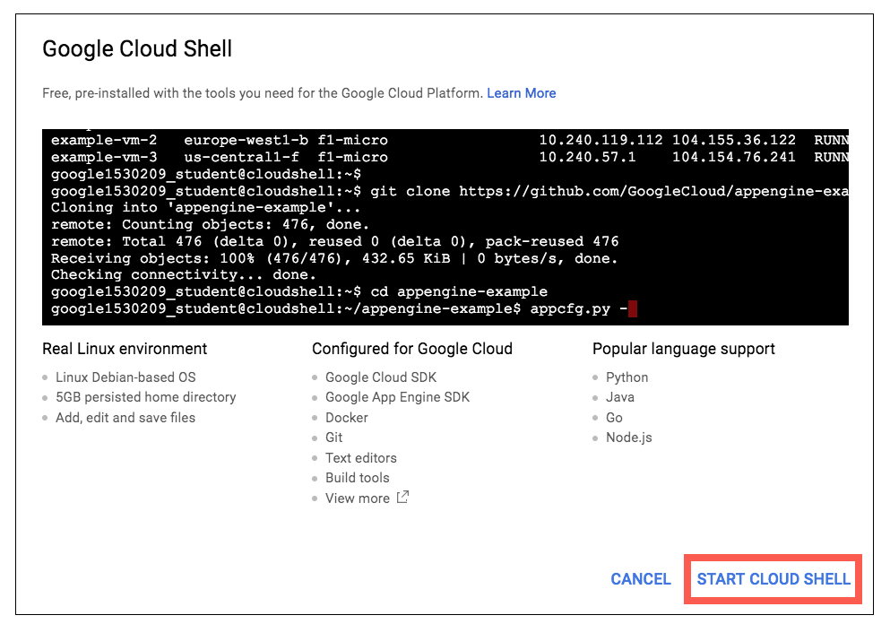
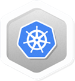

# Running a MongoDB Database in Kubernetes with StatefulSets

## GSP022


## Overview

[Kubernetes](http://kubernetes.io/) is an open source container orchestration tool that handles the complexities of running containerized applications. You can run Kubernetes applications with `Kubernetes Engine`—a GCP computing service that offers many different customizations and integrations. In this lab, you will get some practical experience with Kubernetes by learning how to set up a MongoDB database with a [StatefulSet](https://kubernetes.io/docs/concepts/workloads/controllers/statefulset/). Running a stateful application (a database) on a stateless service (container) may sound contradictory. However, after getting hands-on practice with this lab you will quickly see how that's not the case. In fact, by using a few open-source tools you will see how Kubernetes and stateless services can go hand-in-hand.

#### What you'll learn

In this lab, you will learn the following:

- How to deploy a Kubernetes cluster, a headless service, and a StatefulSet.
- How to connect a Kubernetes cluster to a MongoDB replica set.
- How to scale MongoDB replica set instances up and down.
- How to clean up your environment and shutdown the above services.

## Prerequisites

This is an **advanced level** lab. Familiarity with Kubernetes or containerized applications is suggested. Experience with the Google Cloud Shell/SDK and MongoDB is also recommended. If you are looking to get up to speed in these services, be sure to check out the following labs:

- [Kubernetes Engine: Qwik Start](https://google.qwiklabs.com/catalog_lab/911)
- [Managing Deployments Using Kubernetes Engine](https://google.qwiklabs.com/catalog_lab/572)
- [Datastore: Qwik Start](https://google.qwiklabs.com/catalog_lab/923)

Once you're ready, scroll down to get your lab environment set up.

## Setup and Requirements

### **Qwiklabs setup**

#### Before you click the Start Lab button

Read these instructions. Labs are timed and you cannot pause them. The timer, which starts when you click Start Lab, shows how long Cloud resources will be made available to you.

This Qwiklabs hand-on lab lets you do the lab activities yourself in a real cloud environment, not in a simulation or demo environment. It does so by giving you new, temporary credentials that you use to sign in and access the Google Cloud Platform for the duration of the lab.

#### What you need

To complete this lab, you need:

- Access to a standard internet browser (Chrome browser recommended).
- Time to complete the lab.

**Note:** If you already have your own personal GCP account or project, do not use it for this lab.

#### How to start your lab and sign in to the Console

1. Click the **Start Lab** button. If you need to pay for the lab, a pop-up opens for you to select your payment method. On the left, the **Connection Details** panel becomes populated with the temporary credentials that you must use for this lab.

   

2. Copy the username, and then click **Open Google Console**. The lab spins up resources, and then opens another tab that shows the **Choose an account** page.

   **Tip:** Open the tabs in separate windows, side-by-side.

3. On the Choose an account page, click **Use Another Account**.

   

4. The Sign in page opens. Paste the username that you copied from the Connection Details panel. Then copy and paste the password.

   **Important:** You must use the credentials from the Connection Details panel. Do not use your Qwiklabs credentials. If you have your own GCP account, do not use it for this lab (avoids incurring charges).

5. Click through the subsequent pages:

   - Accept the terms and conditions.
   - Do not add recovery options or two-factor authentication (because this is a temporary account).
   - Do not sign up for free trials.

After a few moments, the GCP console opens in this tab.

**Note:** You can view the menu with a list of GCP Products and Services by clicking the **Navigation menu** at the top-left, next to “Google Cloud Platform”. 

### Activate Google Cloud Shell

Google Cloud Shell is a virtual machine that is loaded with development tools. It offers a persistent 5GB home directory and runs on the Google Cloud. Google Cloud Shell provides command-line access to your GCP resources.

1. In GCP console, on the top right toolbar, click the Open Cloud Shell button.

   

2. In the dialog box that opens, click **START CLOUD SHELL**:

   

   You can click "START CLOUD SHELL" immediately when the dialog box opens.

It takes a few moments to provision and connect to the environment. When you are connected, you are already authenticated, and the project is set to your *PROJECT_ID*. For example:


**gcloud** is the command-line tool for Google Cloud Platform. It comes pre-installed on Cloud Shell and supports tab-completion.

You can list the active account name with this command:

```
gcloud auth list
```

Output:

```output
Credentialed accounts:
 - <myaccount>@<mydomain>.com (active)
```

Example output:

```Output
Credentialed accounts:
 - google1623327_student@qwiklabs.net
```

You can list the project ID with this command:

```
gcloud config list project
```

Output:

```output
[core]
project = <project_ID>
```

Example output:

```Output
[core]
project = qwiklabs-gcp-44776a13dea667a6
```

Full documentation of **gcloud** is available on [Google Cloud gcloud Overview](https://cloud.google.com/sdk/gcloud).

## Set a Compute Zone

Throughout this lab, we will be using the [gcloud command line tool](https://cloud.google.com/sdk/gcloud/) to provision our services. Before we can create our Kubernetes cluster, we will need to set a compute zone so that the virtual machines in our cluster are all created in the same region. We can do this using the `gcloud config set` command—run the following in your cloud shell to set your zone to `us-central1-f`:

```
gcloud config set compute/zone us-central1-f
```

**Note**: More information about regions and zones is available [here](https://cloud.google.com/compute/docs/zones)

## Create a new Cluster

Now that our zone is set, we will create a new cluster of containers. Run the following command to instantiate a cluster named `hello-world`:

```
gcloud container clusters create hello-world
```

This command creates a new cluster with three nodes, or virtual machines (the default). You can configure this command with additional flags to change the number of nodes, the default permissions, and other variables. See the [documentation](https://cloud.google.com/sdk/gcloud/reference/container/clusters/create) for more details.

Launching the cluster may take a few minutes. Once it's up, you should receive a similar output:

```
NAME         Location       MATER_VERSION   MASTER_IP       ...
hello-world  us-central1-f  1.9.7-gke.3     35.184.131.251  ...
```

## Setting up

Now that we have our cluster up and running, it's time to integrate it with MongoDB. We will be using a [replica set](https://docs.mongodb.com/manual/replication/) so that our data is highly available and redundant—a must for running production applications. To get set up, we need to do the following:

- Download the MongoDB [replica set/sidecar](https://github.com/thesandlord/mongo-k8s-sidecar.git) (or utility container in our cluster).
- Instantiate a [StorageClass](https://kubernetes.io/docs/concepts/storage/storage-classes/).
- Instantiate a [headless service](https://kubernetes.io/docs/concepts/services-networking/service/#headless-services).
- Instantiate a [StatefulSet](http://kubernetes.io/docs/concepts/abstractions/controllers/statefulsets/).

Run the following command to clone the MongoDB/Kubernetes replica set from the Github repository:

```
git clone https://github.com/thesandlord/mongo-k8s-sidecar.git
```

Once it's cloned, navigate to the `StatefulSet` directory with the following command:

```
cd ./mongo-k8s-sidecar/example/StatefulSet/
```

Once you have verified that the files have been downloaded and that you're in the right directory, let's go ahead and create a Kubernetes `StorageClass`.

### Create the StorageClass

A `StorageClass` tells Kubernetes what kind of storage you want to use for database nodes. On the Google Cloud Platform, you have a couple of [storage choices](https://cloud.google.com/compute/docs/disks/): SSDs and hard disks.

If you take a look inside the `StatefulSet` directory (you can do this by running the `ls` command), you will see SSD and HDD configuration files for both Azure and GCP. Run the following command to take a look at the `googlecloud_ssd.yaml` file:

```
cat googlecloud_ssd.yaml
```

Output:

```bash
kind: StorageClass
apiVersion: storage.k8s.io/v1beta1
metadata:
  name: fast
provisioner: kubernetes.io/gce-pd
parameters:
  type: pd-ssd
```

This configuration creates a new StorageClass called "fast" that is backed by SSD volumes. Run the following command to deploy the StorageClass:

```
kubectl apply -f googlecloud_ssd.yaml
```

Now that our StorageClass is configured, our StatefulSet can now request a volume that will automatically be created.

## Deploying the Headless Service and StatefulSet

### Find and inspect the files

Before we dive into what headless service and StatefulSets are, let's open up the configuration file (`mongo-statefulset.yaml`) where they are both housed in.

```
cat mongo-statefulset.yaml
```

You should receive the following output (without the pointers to the Headless Service and StatefulSet content):

```bash
apiVersion: v1   <-----------   Headless Service configuration
kind: Service
metadata:
  name: mongo
  labels:
    name: mongo
spec:
  ports:
  - port: 27017
    targetPort: 27017
  clusterIP: None
  selector:
    role: mongo
---
apiVersion: apps/v1beta1    <------- StatefulSet configuration
kind: StatefulSet
metadata:
  name: mongo
spec:
  serviceName: "mongo"
  replicas: 3
  template:
    metadata:
      labels:
        role: mongo
        environment: test
    spec:
      terminationGracePeriodSeconds: 10
      containers:
        - name: mongo
          image: mongo
          command:
            - mongod
            - "--replSet"
            - rs0
            - "--smallfiles"
            - "--noprealloc"
          ports:
            - containerPort: 27017
          volumeMounts:
            - name: mongo-persistent-storage
              mountPath: /data/db
        - name: mongo-sidecar
          image: cvallance/mongo-k8s-sidecar
          env:
            - name: MONGO_SIDECAR_POD_LABELS
              value: "role=mongo,environment=test"
  volumeClaimTemplates:
  - metadata:
      name: mongo-persistent-storage
      annotations:
        volume.beta.kubernetes.io/storage-class: "fast"
    spec:
      accessModes: [ "ReadWriteOnce" ]
      resources:
        requests:
          storage: 100Gi
```

#### **Headless service: overview**

The first section of `mongo-statefulset.yaml` refers to a `headless service`. In Kubernetes terms, a service describes policies or rules for accessing specific pods. In brief, a headless service is one that doesn't prescribe load balancing. When combined with StatefulSets, this will give us individual DNSs to access our pods, and in turn a way to connect to all of our MongoDB nodes individually. In the `yaml` file, you can make sure that the service is headless by verifying that the `clusterIP` field is set to `None`.

#### **StatefulSet: overview**

The StatefulSet configuration is the second section of `mongo-statefulset.yaml.`This is the bread and butter of the application: it's the workload that runs MongoDB and what orchestrates your Kubernetes resources. Referencing the `yaml` file, we see that the first section describes the StatefulSet object. Then, we move into the Metadata section, where labels and the number of replicas are specified.

Next comes the pod spec. The `terminationGracePeriodSeconds` is used to gracefully shutdown the pod when you scale down the number of replicas. Then the configurations for the two containers are shown. The first one runs MongoDB with command line flags that configure the replica set name. It also mounts the persistent storage volume to `/data/db`: the location where MongoDB saves its data. The second container runs the sidecar. This [sidecar container](https://github.com/cvallance/mongo-k8s-sidecar) will configure the MongoDB replica set automatically. As mentioned earlier, a "sidecar" is a helper container that helps the main container run its jobs and tasks.

Finally, there is the `volumeClaimTemplates`. This is what talks to the StorageClass we created before to provision the volume. It provisions a 100 GB disk for each MongoDB replica.

#### **Deploy Headless Service and the StatefulSet**

Now that we have a basic understanding of what a headless service and StatefulSet are, let's go ahead and deploy them. Since the two are packaged in `mongo-statefulset.yaml`, we can run the following comand to run both of them:

```
kubectl apply -f mongo-statefulset.yaml
```

You should receive the following output:

```
service "mongo" created
statefulset "mongo" created
```

## Connect to the MongoDB Replica Set

Now that we have a cluster running and our replica set deployed, let's go ahead and connect to it.

### Wait for the MongoDB replica set to be fully deployed

Kubernetes StatefulSets deploys each pod sequentially. It waits for the MongoDB replica set member to fully boot up and create the backing disk before starting the next member. Run the following command to view and confirm that all three members are up:

```
kubectl get statefulset
```

Output - all three members are up.

```bash
NAME      DESIRED   CURRENT   AGE
mongo     3         3         3m
```

### Initiating and **Viewing the MongoDB replica set**

At this point, you should have three pods created in your cluster. These correspond to the three nodes in your MongoDB replica set. Run this command to view:

```
kubectl get pods
```

(Output):

```bash
NAME        READY     STATUS    RESTARTS   AGE
mongo-0     2/2       Running   0          3m
mongo-1     2/2       Running   0          3m
mongo-2     2/2       Running   0          3m
```

Wait for all three members to be created before moving on.

Connect to the first replica set member:

```
kubectl exec -ti mongo-0 mongo
```

You now have a `REPL` environment connected to the MongoDB .

Let's instantiate the replica set with a default configuration by running the `rs.initiate()` command:

```
rs.initiate()
```

Print the replica set configuration; run the `rs.conf()` command:

```
rs.conf()
```

This outputs the details for the current member of replica set `rs0`. In this lab you see only one member. To get details of all members you need to expose the replica set through additional services like [nodeport ](https://kubernetes.io/docs/concepts/services-networking/service/#type-nodeport)or [load balancer](https://cloud.google.com/compute/docs/load-balancing/http/).

```
rs0:PRIMARY> rs.conf()
{
    "_id": "rs0",
    "version": 1,
    "protocolVersion": NumberLong(1),
    "members": [
        {
            "_id": 0,
            "host": "10.160.2.5:27017",
            "arbiterOnly": false,
            "buildIndexes": true,
            "hidden": false,
            "priority": 1,
            "tags": {

            },
            "slaveDelay": NumberLong(0),
            "votes": 1
        },
           "settings": {
        "chainingAllowed": true,
        "heartbeatIntervalMillis": 2000,
        "heartbeatTimeoutSecs": 10,
        "electionTimeoutMillis": 10000,
        "catchUpTimeoutMillis": 2000,
        "getLastErrorModes": {

        },
        "getLastErrorDefaults": {
            "w": 1,
            "wtimeout": 0
        },
        "replicaSetId": ObjectId("58ace74774ebb9712eb31d3f")
    }
}
```

Type "exit" and press enter to quit the `REPL`.

## Scaling the MongoDB replica set

A big advantage of Kubernetes and StatefulSets is that you can scale the number of MongoDB Replicas up and down with a single command!

To scale up the number of replica set members from 3 to 5, run this command:

```
kubectl scale --replicas=5 statefulset mongo
```

In a few minutes, there will be 5 MongoDB pods. Run this command to view them:

```
kubectl get pods
```

Your output should look like this:

```bash
NAME      READY     STATUS    RESTARTS   AGE
mongo-0   2/2       Running   0          41m
mongo-1   2/2       Running   0          39m
mongo-2   2/2       Running   0          37m
mongo-3   2/2       Running   0          4m
mongo-4   2/2       Running   0          2m
```

To scale down the number of replica set members from 5 back to 3, run this command:

```
kubectl scale --replicas=3 statefulset mongo
```

In a few seconds, there are 3 MongoDB pods. Run this command to view:

```
kubectl get pods
```

Your output should look like this:

```bash
NAME      READY     STATUS    RESTARTS   AGE
mongo-0   2/2       Running   0          41m
mongo-1   2/2       Running   0          39m
mongo-2   2/2       Running   0          37m
```

## Using the MongoDB replica set

Each pod in a StatefulSet backed by a Headless Service will have a stable DNS name. The template follows this format: `<pod-name>.<service-name>`

This means the DNS names for the MongoDB replica set are:

```bash
mongo-0.mongo
mongo-1.mongo
mongo-2.mongo
```

You can use these names directly in the [connection string URI](http://docs.mongodb.com/manual/reference/connection-string) of your app.

Using a database is outside the scope of this lab, however for this case, the connection string URI would be:

```bash
"mongodb://mongo-0.mongo,mongo-1.mongo,mongo-2.mongo:27017/dbname_?"
```

## Clean up

Because you are working in Qwiklabs, when you end the lab all your resources and your project will be cleaned up and discarded on your behalf. But we want to show you how to clean up resources yourself to save on cost and to be a good cloud citizen when you are in your own environment.

To clean up the deployed resources, run the following commands to delete the StatefulSet, Headless Service, and the provisioned volumes.

Delete the StatefulSet:

```
kubectl delete statefulset mongo
```

Delete the service:

```
kubectl delete svc mongo
```

Delete the volumes:

```
kubectl delete pvc -l role=mongo
```

Finally, you can delete the test cluster:

```
gcloud container clusters delete "hello-world"
```

Press **Y** then **Enter** to continue deleting the test cluster.

## Congratulations!

Kubernetes Engine provides a powerful and flexible way to run containers on Google Cloud Platform. StatefulSets let you run stateful workloads like databases on Kubernetes.

#### **What we've covered**

- Creating a MongoDB replica set with Kubernetes StatefulSets
- Connecting to the MongoDB replica set
- Scaling the replica set

  

### Finish Your Quest

This self-paced lab is part of the Qwiklabs [Cloud Architecture](https://google.qwiklabs.com/quests/24), [Kubernetes in the Google Cloud](https://google.qwiklabs.com/quests/29), and [Kubernetes Solutions](https://google.qwiklabs.com/quests/45) Quests. A Quest is a series of related labs that form a learning path. Completing this Quest earns you the badge above, to recognize your achievement. You can make your badge (or badges) public and link to them in your online resume or social media account. Enroll in a Quest and get immediate completion credit if you've taken this lab. [See other available Qwiklabs Quests](http://google.qwiklabs.com/catalog).

### Take Your Next Lab

Continue your Quest with the next lab, or check out these suggestions:

- [Application Performance Management (APM) with Stackdriver](https://google.qwiklabs.com/catalog_lab/742)
- [Orchestrating the Cloud with Kubernetes](https://google.qwiklabs.com/catalog_lab/486)
- [Web App to Perform Real-time Data Analysis with Kubernetes, Redis, and BigQuery](https://google.qwiklabs.com/catalog_lab/1040)

### Next Steps / Learn More

- Learn more about [Kubernetes Engine](https://cloud.google.com/container-engine/).
- Read the blog post on [Running MongoDB on Kubernetes with StatefulSets](http://blog.kubernetes.io/2017/01/running-mongodb-on-kubernetes-with-statefulsets.html).
- Wondering how much it'll cost to run your workloads? Check the [Pricing Calculator](https://cloud.google.com/products/calculator/) - you can enter the number of instances, vCPU, and memory needs.

### Google Cloud Training & Certification

...helps you make the most of Google Cloud technologies. [Our classes](https://cloud.google.com/training/courses) include technical skills and best practices to help you get up to speed quickly and continue your learning journey. We offer fundamental to advanced level training, with on-demand, live, and virtual options to suit your busy schedule. [Certifications](https://cloud.google.com/certification/) help you validate and prove your skill and expertise in Google Cloud technologies.

##### Manual Last Updated September 4, 2018

##### Lab Last Tested July 9, 2018

Copyright 2018 Google LLC All rights reserved. Google and the Google logo are trademarks of Google LLC. All other company and product names may be trademarks of the respective companies with which they are associated.