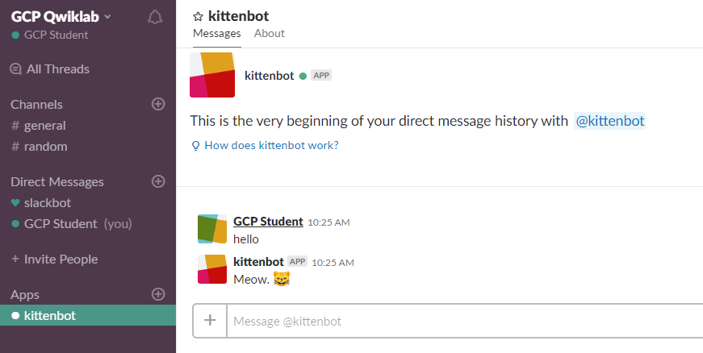
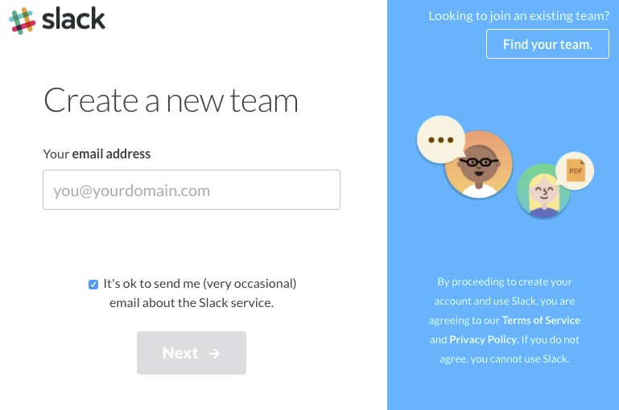
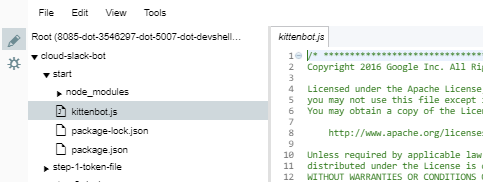

# Build a Slack Bot with Node.js on Kubernetes

## GSP024


## Overview

In this lab you'll learn how to build a [Slack bot](https://api.slack.com/bot-users) using the [Botkit toolkit](https://howdy.ai/botkit/) and run it on[Google Cloud Platform](https://cloud.google.com/). You'll be able to interact with the bot in a live Slack channel.



#### What you'll learn

- Creating a bot custom integration in Slack.
- Building a Node.js image in Docker.
- Uploading a Docker image to a private [Google Container Registry](https://cloud.google.com/container-registry/).
- Running a Slack bot on [Kubernetes Engine](https://cloud.google.com/container-engine/), a managed [Kubernetes](http://kubernetes.io/) service.

## Setup and Requirements

### **Qwiklabs setup**

#### Before you click the Start Lab button

Read these instructions. Labs are timed and you cannot pause them. The timer, which starts when you click Start Lab, shows how long Cloud resources will be made available to you.

This Qwiklabs hand-on lab lets you do the lab activities yourself in a real cloud environment, not in a simulation or demo environment. It does so by giving you new, temporary credentials that you use to sign in and access the Google Cloud Platform for the duration of the lab.

#### What you need

To complete this lab, you need:

- Access to a standard internet browser (Chrome browser recommended).
- Time to complete the lab.

**Note:** If you already have your own personal GCP account or project, do not use it for this lab.

#### How to start your lab and sign in to the Console

1. Click the **Start Lab** button. If you need to pay for the lab, a pop-up opens for you to select your payment method. On the left, the **Connection Details** panel becomes populated with the temporary credentials that you must use for this lab.

   

2. Copy the username, and then click **Open Google Console**. The lab spins up resources, and then opens another tab that shows the **Choose an account** page.

   **Tip:** Open the tabs in separate windows, side-by-side.

3. On the Choose an account page, click **Use Another Account**.

   

4. The Sign in page opens. Paste the username that you copied from the Connection Details panel. Then copy and paste the password.

   **Important:** You must use the credentials from the Connection Details panel. Do not use your Qwiklabs credentials. If you have your own GCP account, do not use it for this lab (avoids incurring charges).

5. Click through the subsequent pages:

   - Accept the terms and conditions.
   - Do not add recovery options or two-factor authentication (because this is a temporary account).
   - Do not sign up for free trials.

After a few moments, the GCP console opens in this tab.

**Note:** You can view the menu with a list of GCP Products and Services by clicking the **Navigation menu** at the top-left, next to “Google Cloud Platform”. 

### Activate Google Cloud Shell

Google Cloud Shell is a virtual machine that is loaded with development tools. It offers a persistent 5GB home directory and runs on the Google Cloud. Google Cloud Shell provides command-line access to your GCP resources.

1. In GCP console, on the top right toolbar, click the Open Cloud Shell button.

   

2. In the dialog box that opens, click **START CLOUD SHELL**:

   

   You can click "START CLOUD SHELL" immediately when the dialog box opens.

It takes a few moments to provision and connect to the environment. When you are connected, you are already authenticated, and the project is set to your *PROJECT_ID*. For example:


**gcloud** is the command-line tool for Google Cloud Platform. It comes pre-installed on Cloud Shell and supports tab-completion.

You can list the active account name with this command:

```
gcloud auth list
```

Output:

```output
Credentialed accounts:
 - <myaccount>@<mydomain>.com (active)
```

Example output:

```Output
Credentialed accounts:
 - google1623327_student@qwiklabs.net
```

You can list the project ID with this command:

```
gcloud config list project
```

Output:

```output
[core]
project = <project_ID>
```

Example output:

```Output
[core]
project = qwiklabs-gcp-44776a13dea667a6
```

Full documentation of **gcloud** is available on [Google Cloud gcloud Overview](https://cloud.google.com/sdk/gcloud).

## Create a Slack Team

For this lab you'll need a Slack team where you are allowed to create custom integrations. [Create a team](https://slack.com/create) for free if you don't already have one.



**Note:** The Slack platform is also available in French, German, Japanese and Spanish. To set your language preference go to the language dropdown on the bottom of the [Slack homepage](https://slack.com/).

## Get the sample code

In Cloud Shell on the command-line, run the following command to clone the [GitHub repository](https://github.com/googlecodelabs/cloud-slack-bot):

```bash
git clone https://github.com/googlecodelabs/cloud-slack-bot.git
```

Change directory into `cloud-slack-bot/start`:

```bash
cd cloud-slack-bot/start
```

Install the Node.js dependencies, including [Botkit](https://howdy.ai/botkit/):

```bash
npm install
```

## Create a Slack bot user

Now you'll work directly in the Slack app.

A [bot user](https://api.slack.com/bot-users) can listen to messages on Slack, post messages, and upload files. You will create a bot post message - a simple greeting.

### **Create a new Slack app**

- Go to the [Slack apps management page](https://api.slack.com/apps).
- Click the **Create New App** button in the upper-right corner.
- Name the app "Kittenbot".
- Choose the Slack team where you want it installed.
- Click **Create App**.

### **Add a new bot user to the app**

- Under Features in the left menu, select **Bot Users**.
- Click the **Add a bot user** button.
- Your default name will be "kittenbot", use this.
- This lab uses the Realtime Messaging (RTM) API, so keep the **Always Show My Bot as Online** option **Off**. The bot user will show as online only when there is a connection from the bot.
- Click the **Add Bot User** button.

### **Get the bot user OAuth access token**

- Select **OAuth & Permissions** in the left-hand menu.
- Click **Install App to Workplace**. Click **Authorize** to confirm.
- Click the **Copy** button to copy the **Bot user OAuth access token** text into your clipboard. You'll use the token in the next step. Don't worry. You can come back this configuration page from the [apps management page](https://api.slack.com/apps) if you need to get this token again.

Be careful with your [bot user OAuth access token](https://api.slack.com/docs/oauth-safety). Treat it like you would any other secret token. Do not store tokens in version control or share them publicly.

## Run the sample app

Edit the `kittenbot.js` file and enter your Slack bot token. If it is no longer in your clipboard, you can get it from the [bot custom integration configuration page](https://my.slack.com/apps/manage/custom-integrations). You can use any editor you like, such as `emacs` or `vim`. This lab uses the [code editor feature of Cloud Shell](https://cloud.google.com/shell/docs/features#code_editor) for simplicity.

Click the **navigation menu** (hamburger) icon to close the left menu.

Open the code editor: 

Open the `kittenbot.js` file by going to `cloud-slack-bot/start/kittenbot.js`: 

Replace `your-slack-token` with the Slack token you copied:

```
var Botkit = require('botkit')

var controller = Botkit.slackbot({debug: false})
controller
  .spawn({
    token: 'your-slack-token' // Edit this line!
  })
  .startRTM(function (err) {
    if (err) {
      throw new Error(err)
    }
  })

controller.hears(
  ['hello', 'hi'], ['direct_message', 'direct_mention', 'mention'],
  function (bot, message) { bot.reply(message, 'Meow. :smile_cat:') })
```

Then save the file with **Ctrl-s** or **File > Save**.

**Note:** As you can see in the file, kittenbot will only respond to "hi" and "hello" greetings. Make sure you enter one of those greetings to see it respond.

Switch back to Cloud Shell and run your bot:

```bash
node kittenbot.js
```

You may see errors in Cloud Shell, but they won't affect the lab. It's OK to keep going.

You should now see that kittenbot is online in your Slack team. You may need to refresh your browser. Do the following to interact with it:

- Click on the **+** next to Direct Messages:


- Choose **kittenbot**, then click **Go**.


- Type "hi" or "hello" to kittenbot! Kittenbot should meow back at you:


Run **Ctrl-c** in Cloud Shell to stop the bot server.

## Load Slack token from a file

Hard-coding the Slack token in the source code makes it likely to accidentally expose your token by publishing it to version control or embedding it in a docker image. Instead, use [Kubernetes Secrets](http://kubernetes.io/docs/user-guide/secrets/) to store tokens.

You will now write your token to a file called `slack-token`. This filename is in the `.gitignore` to prevent accidentally checking it in to version control.

Create a new file in the `start` directory called `slack-token` file. (To right-click on a Chromebook: press the touchpad with two fingers, or press **Alt** while clicking with one finger.)


Copy your token from `kittenbot.js` or the bot configuration page, paste it into the `slack-token` file, then **Save**.


Edit the `kittenbot.js` file to load the Slack token specified by the `slack_token_path` environment variable:

```
var Botkit = require('botkit')
var fs = require('fs') // NEW: Add this require (for loading from files).

var controller = Botkit.slackbot({debug: false})

// START: Load Slack token from file.
if (!process.env.slack_token_path) {
  console.log('Error: Specify slack_token_path in environment')
  process.exit(1)
}

fs.readFile(process.env.slack_token_path, function (err, data) {
  if (err) {
    console.log('Error: Specify token in slack_token_path file')
    process.exit(1)
  }
  data = String(data)
  data = data.replace(/\s/g, '')
  controller
    .spawn({token: data})
    .startRTM(function (err) {
      if (err) {
        throw new Error(err)
      }
    })
})
// END: Load Slack token from file.

controller.hears(
  ['hello', 'hi'], ['direct_message', 'direct_mention', 'mention'],
  function (bot, message) { bot.reply(message, 'Meow. :smile_cat:') })
```

Go back to the Cloud Console and run your bot:

```bash
slack_token_path=./slack-token node kittenbot.js
```

You should see the bot online again in Slack and be able to chat with it. After testing it out, press **Ctrl-c** to shut down the bot.

## Create a Docker container image

Docker provides a way to containerize your bot. A Docker image bundles all of your dependencies (even the compiled ones) so that it can run in a lightweight sandbox.

### Building a Docker image

First, create a file called `Dockerfile`.

Then add the following definition, which describes how to build your Docker image.

```
FROM node:5.4
COPY package.json /src/package.json
WORKDIR /src
RUN npm install
COPY kittenbot.js /src
CMD ["node", "/src/kittenbot.js"]
```

**Save** this file.

A `Dockerfile` is a recipe for a Docker image. This one layers on top of the [Node.js base image](https://hub.docker.com/_/node/) found on the Docker hub, copies `package.json` to the image and installs the dependencies listed in it, copies the `kittenbot.js` file to the image, and tells Docker that it should run the Node.js server when the image starts.

Go back to the Cloud Shell and run this command to save your project ID to the environment variable `PROJECT_ID`. Commands in this lab will use this variable as `$PROJECT_ID`.

```bash
export PROJECT_ID=$(gcloud config list --format 'value(core.project)')
```

Build the image by running the `docker build` command. (This command takes about 4 minutes to complete. It has to download the base image and Node.js dependencies.)

```bash
docker build -t gcr.io/${PROJECT_ID}/slack-codelab:v1 .
```

While the Docker image is building, try this out this Extra Credit exercise to get a webhook to use later in the lab.

## Extra Credit: Create an incoming webhook to Slack

An [incoming webhook](https://api.slack.com/incoming-webhooks) is an easy way to send Slack notifications from another service or app without having to worry about a persistent connection for two-way communication like with a bot user. Create one now:

- Go to the [Incoming WebHooks](https://my.slack.com/apps/A0F7XDUAZ-incoming-webhooks) page IN Slack and click **Add configuration**.
- Click on the "Choose a channel..." dropdown and select a Slack channel for messages to post to (like #general) or have them go privately to your Slack user.
- Click the **Add Incoming WebHooks integration** button.
- Copy the webhook URL and save it to your computer. You'll come back to this in a later step.

## Testing a Docker image locally

Go back to Cloud Shell to test the image locally with the following command. It will run a Docker container as a daemon from the newly-created container image:

```
docker run -d \
    -v $(pwd)/:/config \
    -e slack_token_path=/config/slack-token \
    gcr.io/${PROJECT_ID}/slack-codelab:v1
```

This command also mounts the current directory as a volume inside the container to give it access to the `slack-token` file. You should see that kittenbot is online again.

Here's the full documentation for the `docker run` command: <https://docs.docker.com/engine/reference/run/>

Here's how to stop the running container.

Get the ID of the running container with the `docker ps` command:

```
docker ps
```

(Output)

```bash
CONTAINER ID   IMAGE                               COMMAND
fab8b7a0d6ee   gcr.io/your-proj/slack-codelab:v1   "node /src/kittenbot."
```

To stop the container, replace the docker container ID (`fab8b7a0d6ee` in the example) with the ID of your container:

```
docker stop fab8b7a0d6ee
```

**Frequently asked question:** [How do I get the project ID from the gcloud command-line tool?](http://stackoverflow.com/q/35599414)

## Pushing a Docker image to Google Container Registry

Now that the image works as intended, push it to the [Google Container Registry](https://cloud.google.com/container-registry/), a private repository for your Docker images accessible from every Google Cloud project (but also from outside Google Cloud Platform).

Push the Docker image to Google Container Registry from Cloud Shell:

```
gcloud docker -- push gcr.io/${PROJECT_ID}/slack-codelab:v1
```

(This command takes about 5 minutes to complete.)

### **Extra Credit: Testing an incoming webhook**

While waiting for the image to upload, use the incoming webhook to send a notification to Slack.

In Cloud Shell, click the **+** button tab to add a new Cloud Shell session: 

Go back to the incoming webhook you created. (If you closed that browser tab you can get back to there from the [Slack Custom Integrations management console](https://my.slack.com/apps/manage/custom-integrations)) and copy the webhook URL from the configuration page.

In the new Cloud Shell session, run `curl` to send an HTTP request with your message to Slack. Replace the URL with your webhook URL:

```bash
curl -X POST --data-urlencode \
    'payload={"text": "Hello from Cloud Shell."}' \
    https://hooks.slack.com/services/YOUR/WEBHOOK/URL
```

This demonstrates that anywhere that you can send an HTTP request, you can send a message to Slack. This is a really easy way to integrate your own apps and services with Slack notifications.

For more complicated messages, test out the JSON request first in the [Slack message builder](https://api.slack.com/docs/messages/builder).

### **Viewing images in Google Container Registry**

When the image upload completes, you can see it listed in the Google Cloud Console: Under the Tools section, click on **Container Registry**.


You now have a project-wide Docker image available which Kubernetes can access and orchestrate.

Notice we used a generic domain for the registry (`gcr.io`). You can also be more specific about which zone and bucket to use. Details are documented here: <https://cloud.google.com/container-registry/#pushing_to_the_registry>

If you're curious, you can navigate through the container images as they are stored in Google Cloud Storage by following this link:<https://console.cloud.google.com/storage/browser/>.

**Frequently Asked Questions:**

[Troubleshooting Google Container Registry (Unable to ping registry endpoint).](https://cloud.google.com/container-registry/docs/troubleshooting)

["Repository does not exist" error when doing gcloud docker push command.](http://stackoverflow.com/a/37036348/101923)

## Create a Kubernetes cluster on Kubernetes Engine

Now that the Docker image is in Google Container Registry, you can run the [gcloud docker -- pull command](https://cloud.google.com/container-registry/docs/pulling) to save this image on any machine and run it with the Docker command-line tool.

If you want to make sure your bot keeps running after it is started, you'll have to run another service to monitor your Docker container to restart it if it stops. This gets harder if you want to make sure the bot keeps running even if the machine it is running on fails.

[Kubernetes](https://kubernetes.io/) solves these problems. You tell it that you want there to always be a replica of your bot running, and the Kubernetes master will keep that target state. It starts the bot up when there aren't enough running, and shuts bot replicas down when there are too many.

A Kubernetes Engine cluster is a managed Kubernetes cluster. It consists of a Kubernetes master API server hosted by Google and a set of worker nodes. The worker nodes are Compute Engine virtual machines.

Return to the firtst Cloud Shell if you tried the extra credit.

Create a cluster with two [n1-standard-1](https://cloud.google.com/compute/docs/machine-types) nodes (this will take a few minutes to complete):

```
gcloud container clusters create my-cluster \
      --num-nodes=2 \
      --zone=us-central1-f \
      --machine-type n1-standard-1
```

(Output)

```bash
Creating cluster my-cluster...done.
Created [https://container.googleapis.com/v1/projects/PROJECT_ID/zones/us-central1-f/clusters/my-cluster].
kubeconfig entry generated for my-cluster.
NAME        ZONE           MACHINE_TYPE   NUM_NODES  STATUS
my-cluster  us-central1-f  n1-standard-1  2          RUNNING
```

Alternatively, you could create this cluster via the Cloud Console:

**Kubernetes Engine** > **Kubernetes clusters** > **Create cluster**.

If you use the Cloud Console to create the cluster, run `gcloud container clusters get-credentials my-cluster --zone=us-central1-f` to authenticate Cloud Shell with the cluster credentials.

This command creates the cluster and authenticates the Kubernetes command-line tool, `kubectl`, with the new cluster's credentials.

You should now have a fully-functioning Kubernetes cluster powered by Kubernetes Engine. You'll see it in the Cloud Console in **Kubernetes Engine** > **Kubernetes clusters**.


Each node in the cluster is a Compute Engine instance provisioned with Kubernetes and Docker binaries. If you are curious, you can list all Compute Engine instances in the project:

```bash
gcloud compute instances list
```

(Output)

```bash
NAME           ZONE          MACHINE_TYPE  INTERNAL_IP EXTERNAL_IP     STATUS
gke-my-cl...16 us-central1-f n1-standard-1 10.240.0.2  146.148.100.240 RUNNING
gke-my-cl...34 us-central1-f n1-standard-1 10.240.0.3  104.154.36.108  RUNNING
```

For the rest of this lab you'll use `kubectl`, the Kubernetes command-line tool, to configure and run your bot.

## Create a Deployment

First, create a [Secret](http://kubernetes.io/docs/user-guide/secrets/#creating-a-secret-using-kubectl-create-secret) in Kubernetes to store the Slack token and make it available to the container:

```
kubectl create secret generic slack-token --from-file=./slack-token
```

(Output)

```bash
secret "slack-token" created
```

To deploy your own containerized application to the Kubernetes cluster you need to configure a [Deployment](http://kubernetes.io/docs/user-guide/deployments/), which describes how to configure the container and provide a replication controller to keep the bot running.

In the Cloud Shell Code Editor, create a file called `slack-codelab-deployment.yaml`.


Enter the following deployment definition:

```
apiVersion: extensions/v1beta1
kind: Deployment
metadata:
  name: slack-codelab
spec:
  replicas: 1
  strategy:
    type: Recreate
  template:
    metadata:
      labels:
        app: slack-codelab
    spec:
      containers:
      - name: master
        image: gcr.io/PROJECT_ID/slack-codelab:v1  # Replace PROJECT_ID
                                                   # with your project ID.
        volumeMounts:
        - name: slack-token
          mountPath: /etc/slack-token
        env:
        - name: slack_token_path
          value: /etc/slack-token/slack-token
      volumes:
      - name: slack-token
        secret:
          secretName: slack-token
```

Save the file, **File** > **Save**.

Now you can create the Deployment by running `kubectl create` in the Cloud Shell

```
kubectl create -f slack-codelab-deployment.yaml --record
```

(Output)

```bash
deployment "slack-codelab" created
```

Since you used the `--record` option, you can view the commands applied to this deployment as the "change-cause" in the rollout history:

```
kubectl rollout history deployment/slack-codelab
```

(Output)

```bash
deployments "slack-codelab":
REVISION        CHANGE-CAUSE
1               kubectl create -f slack-codelab-deployment.yaml --record
```

See what the `kubectl create` command made. Re-run this command until the status shows Running.

```
kubectl get pods
```

This should take about 30 seconds to 1 minute

(Output)

```bash
NAME                             READY     STATUS    RESTARTS   AGE
slack-codelab-2890463383-1ss4a   1/1       Running   0          3m
```

The last things you need to do:

- Re-run `kubectl get pods` until the status for the pod shows `Running`.
- Go to Slack, and see that kittenbot is back online.
- Say hello to kittenbot one last time.

**Frequently asked questions:**

[kubectl gives an i/o timeout error](http://stackoverflow.com/a/31561165/101923).

[How do I debug a pod that is stuck ContainerCreating / Pending?](http://kubernetes.io/docs/user-guide/debugging-pods-and-replication-controllers/)

**Want a more conversational bot?** Continue with the "extra credit" steps to see how to make updates to the bot.

### **Extra Credit: Update your bot to a new version**

This extra credit section should take you about 10 minutes to complete.

So you'd like the bot to do more than just say "meow". How do you deploy a new version of something that is already running on Kubernetes?

First, you need to modify the application. Botkit can [handle conversations](https://github.com/howdyai/botkit/blob/master/readme.md#start-a-conversation). With these, the bot can request more information and react to messages beyond a one word reply.

Edit the `kittenbot.js` file in the web editor. Add this new kitten emoji delivery code to the bottom of the file:

```
// ...

// START: listen for cat emoji delivery
var maxCats = 20
var catEmojis = [
  ':smile_cat:',
  ':smiley_cat:',
  ':joy_cat:',
  ':heart_eyes_cat:',
  ':smirk_cat:',
  ':kissing_cat:',
  ':scream_cat:',
  ':crying_cat_face:',
  ':pouting_cat:',
  ':cat:',
  ':cat2:',
  ':leopard:',
  ':lion_face:',
  ':tiger:',
  ':tiger2:'
]

controller.hears(
  ['cat', 'cats', 'kitten', 'kittens'],
  ['ambient', 'direct_message', 'direct_mention', 'mention'],
  function (bot, message) {
    bot.startConversation(message, function (err, convo) {
      if (err) {
        console.log(err)
        return
      }
      convo.ask('Does someone need a kitten delivery? Say YES or NO.', [
        {
          pattern: bot.utterances.yes,
          callback: function (response, convo) {
            convo.say('Great!')
            convo.ask('How many?', [
              {
                pattern: '[0-9]+',
                callback: function (response, convo) {
                  var numCats =
                  parseInt(response.text.replace(/[^0-9]/g, ''), 10)
                  if (numCats === 0) {
                    convo.say({
                      'text': 'Sorry to hear you want zero kittens. ' +
                        'Here is a dog, instead. :dog:',
                      'attachments': [
                        {
                          'fallback': 'Chihuahua Bubbles - https://youtu.be/s84dBopsIe4',
                          'text': '<https://youtu.be/s84dBopsIe4|' +
                            'Chihuahua Bubbles>!'
                        }
                      ]
                    })
                  } else if (numCats > maxCats) {
                    convo.say('Sorry, ' + numCats + ' is too many cats.')
                  } else {
                    var catMessage = ''
                    for (var i = 0; i < numCats; i++) {
                      catMessage = catMessage +
                      catEmojis[Math.floor(Math.random() * catEmojis.length)]
                    }
                    convo.say(catMessage)
                  }
                  convo.next()
                }
              },
              {
                default: true,
                callback: function (response, convo) {
                  convo.say(
                    "Sorry, I didn't understand that. Enter a number, please.")
                  convo.repeat()
                  convo.next()
                }
              }
            ])
            convo.next()
          }
        },
        {
          pattern: bot.utterances.no,
          callback: function (response, convo) {
            convo.say('Perhaps later.')
            convo.next()
          }
        },
        {
          default: true,
          callback: function (response, convo) {
            // Repeat the question.
            convo.repeat()
            convo.next()
          }
        }
      ])
    })
  })
  // END: listen for cat emoji delivery
```

Then **Save** the file.

You can test this out in Cloud Shell using the same command as before, but you'll see two responses since the bot is still running in your Kubernetes cluster.

Next, build a new container image with an incremented tag (v2 in this case):

```bash
docker build -t gcr.io/${PROJECT_ID}/slack-codelab:v2 .
```

Push the image to Google Container Registry:

```bash
gcloud docker -- push gcr.io/${PROJECT_ID}/slack-codelab:v2
```

Building and pushing this updated image should be much quicker, taking full advantage of caching.

As you did with the first version of the kitten bot, you can test locally using the `node`command and the `docker` command. Here we'll skip those steps and push the new version to the cluster.

Now you're ready for Kubernetes to update the deployment to the new version of the application.

Edit the line in the `slack-codelab-deployment.yaml` file defining which image to use:

```bash
apiVersion: extensions/v1beta1
kind: Deployment
metadata:
  name: slack-codelab
spec:
  replicas: 1
  strategy:
    type: Recreate
  template:
    metadata:
      labels:
        app: slack-codelab
    spec:
      containers:
      - name: master
        image: gcr.io/PROJECT_ID/slack-codelab:v2  # Update this to v2.
                                                   # Replace PROJECT_ID
                                                   # with your project ID.
        volumeMounts:
        - name: slack-token
          mountPath: /etc/slack-token
        env:
        - name: slack_token_path
          value: /etc/slack-token/slack-token
      volumes:
      - name: slack-token
        secret:
          secretName: slack-token
```

**Save** the file.

Now, to apply this change to the running Deployment, run this command to update the deployment to use the v2 image:

```
kubectl apply -f slack-codelab-deployment.yaml
```

(Output)

```bash
deployment "slack-codelab" configured
```

Use this code to see that Kubernetes has shut down the pod running the previous version and started a new pod that is running the new image:

```
kubectl get pods
```

(Output)

```bash
NAME                             READY     STATUS        RESTARTS   AGE
slack-codelab-2890463383-mqy5l   1/1       Terminating   0          17m
slack-codelab-3059677337-b41r0   1/1       Running       0          7s
```

**Deployment Strategies:** Since the [deployment strategy](http://kubernetes.io/docs/user-guide/deployments/#strategy) was specified to "recreate" when we created the deployment, Kubernetes makes sure the old instances are shut down before creating a new one.

This strategy is used because:

- we don't mind a few seconds of downtime and
- we don't want two custom integration bots running at the same time.

Alternatively, a rolling update strategy could have been used, which ensures that new versions are running before shutting down the old versions. This would be ideal if creating a Slack App used by multiple teams.

See the changed the deployment:

```
kubectl rollout history deployment/slack-codelab
```

(Output)

```bash
deployments "slack-codelab":
REVISION        CHANGE-CAUSE
1               kubectl create -f slack-codelab-deployment.yaml --record
2               kubectl apply -f slack-codelab-deployment.yaml
```

Go back to Slack and type a message to kittenbot that mentions "kitten" and see it join the conversation.


Congratulations! You just created a Slack bot running on Kubernetes then, updated it to a new version.

## Congratulations!

You now know how to run a Slack bot on Kubernetes Engine!


You have just written a Slack bot, tested locally, deployed it, made some changes, and deployed an update with minimal downtime.

## Congratulations!

We've only scratched the surface of this technology and we encourage you to explore further with your own Kubernetes deployments. When developing a bot to become a Slack app, the bot will likely have multiple replicas. With a replicated bot, check out liveness probes (health checks) and consider using the Kubernetes API directly.

#### **What we've covered**

- Building a Node.js Slack bot Docker image.
- Running a Docker image on Kubernetes Engine.
- Used webhooks.
- Updating a Slack bot running on Kubernetes

  

### Finish Your Quest

This self-paced lab is part of the Qwiklabs [Deploying Applications](https://google.qwiklabs.com/quests/26), [Kubernetes in the Google Cloud](https://google.qwiklabs.com/quests/29), and [Kubernetes Solutions](https://google.qwiklabs.com/quests/45) Quests. A Quest is a series of related labs that form a learning path. Completing this Quest earns you the badge above, to recognize your achievement. You can make your badge (or badges) public and link to them in your online resume or social media account. Enroll in a Quest and get immediate completion credit if you've taken this lab. [See other available Qwiklabs Quests](http://google.qwiklabs.com/catalog).

### Take Your Next Lab

Continue your Quest with [Deploying a Python Flask web Application to App Engine Flexible](https://google.qwiklabs.com/catalog_lab/319), or check out these suggestions:

- [Deploy a Ruby on Rails app with Google App Engine Flexible Environment](https://google.qwiklabs.com/catalog_lab/334)
- [Running WordPress on App Engine Flexible Environment](https://google.qwiklabs.com/catalog_lab/985)

#### Next Steps

- Develop a bot of your own.
- Try [Dialogflow for Slack](https://dialogflow.com/docs/integrations/slack) as a way to build conversational bots without code.
- Check out [Beep Boop](https://beepboophq.com/): a third-party offering an even easier way to host Slack bots, powered by Google Cloud Platform.

#### **Learn More**

- Check out the other Google Cloud Platform [Slack integration examples](https://github.com/GoogleCloudPlatform/slack-samples) on GitHub.
- Try out other Google Cloud Platform features for yourself. Have a look at our[tutorials](https://cloud.google.com/docs/tutorials).
- Remember, Kubernetes is an open source project ( <http://kubernetes.io/>) hosted on [GitHub](https://github.com/kubernetes/kubernetes). Your feedback and contributions are always welcome.
- You can follow the Kubernetes news on [Twitter](https://twitter.com/kubernetesio) and on the [community's blog](http://blog.kubernetes.io/).

### Google Cloud Training & Certification

...helps you make the most of Google Cloud technologies. [Our classes](https://cloud.google.com/training/courses) include technical skills and best practices to help you get up to speed quickly and continue your learning journey. We offer fundamental to advanced level training, with on-demand, live, and virtual options to suit your busy schedule. [Certifications](https://cloud.google.com/certification/) help you validate and prove your skill and expertise in Google Cloud technologies.

##### Manual Last Updated December 6, 2018

##### Lab Last Tested April 24, 2018

Copyright 2018 Google LLC All rights reserved. Google and the Google logo are trademarks of Google LLC. All other company and product names may be trademarks of the respective companies with which they are associated.