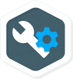

# Kubernetes에 Node.js가있는 여유 봇 만들기

## GSP024


## 개요

이 실습에서는 [Botkit 툴킷을](https://howdy.ai/botkit/) 사용하여 [Slack 봇](https://api.slack.com/bot-users) 을 만들고 [Google Cloud Platform](https://cloud.google.com/) 에서 실행 하는 방법을 배우게 됩니다. 라이브 Slack 채널에서 봇과 상호 작용할 수 있습니다.


#### 배우게 될 것

- 슬랙에서 봇 사용자 정의 통합 만들기.
- Docker에서 Node.js 이미지 만들기.
- Docker 이미지를 비공개 [Google 컨테이너 레지스트리에](https://cloud.google.com/container-registry/) 업로드하는 중 입니다.
- 에 여유 봇 실행 [는 Kubernetes 엔진](https://cloud.google.com/container-engine/) , 관리 [는 Kubernetes의](http://kubernetes.io/) 서비스를.

## 설치 및 요구 사항

### **Qwiklabs 설정**

#### 실험 시작 버튼을 클릭하기 전에

이 지침을 읽으십시오. 실험실 시간이 초과되어 일시 중지 할 수 없습니다. 실습 시작을 클릭하면 시작되는 타이머는 Cloud 리소스를 얼마나 오래 사용할 수 있는지 보여줍니다.

이 Qwiklabs 실습 랩을 사용하면 시뮬레이션이나 데모 환경이 아닌 실제 클라우드 환경에서 직접 랩 활동을 수행 할 수 있습니다. 실험실 기간 동안 로그인하고 Google Cloud Platform에 액세스하는 데 사용하는 새로운 임시 자격 증명을 제공하여 사용자에게 제공합니다.

#### 필요한 것

이 랩을 완료하려면 다음이 필요합니다.

- 표준 인터넷 브라우저에 액세스 (Chrome 브라우저 권장).
- 실험실 완료 시간.

**참고 :** 이미 개인 GCP 계정이나 프로젝트가있는 경우이 실험실에서 사용하지 마십시오.

#### 실험실을 시작하고 콘솔에 로그인하는 방법

1. **실습 시작** 버튼을 클릭하십시오 . 실험실 비용을 지불해야하는 경우 지불 방법을 선택할 수있는 팝업 창이 열립니다. 왼쪽에는 **연결 세부 정보** 패널에이 실습에 사용해야하는 임시 자격 증명이 채워집니다.

   

2. 사용자 이름을 복사 한 다음 **Google Console 열기** 를 클릭하십시오 . 실험실에서는 리소스를 가동 한 다음 **계정 선택** 페이지 가 표시된 다른 탭을 엽니 다 .

   **팁 :** 별도의 창에서 나란히 탭을 엽니 다.

3. 계정 선택 페이지에서 **다른 계정 사용을** 클릭 합니다.

   

4. 로그인 페이지가 열립니다. 연결 정보 패널에서 복사 한 사용자 이름을 붙여 넣으십시오. 그런 다음 암호를 복사하여 붙여 넣으십시오.

   **중요 사 W :** 연결 세부 사항 패널에서 신임을 사용해야합니다. Qwiklabs 자격 증명을 사용하지 마십시오. 자신의 GCP 계정을 가지고 있다면이 실험실에서 사용하지 마십시오 (요금 부과 방지).

5. 다음 페이지를 클릭하십시오.

   - 이용 약관에 동의하십시오.
   - 복구 옵션 또는 2 단계 인증 (임시 계정이기 때문에)을 추가하지 마십시오.
   - 무료 평가판에 가입하지 마십시오.

잠시 후 GCP 콘솔이이 탭에서 열립니다.

**참고 :** 왼쪽 상단의 'Google Cloud Platform'옆에 있는 **탐색 메뉴** 를 클릭하여 GCP 제품 및 서비스 목록으로 메뉴를 볼 수 있습니다 . 

### Google Cloud Shell 활성화

Google Cloud Shell은 개발 도구가로드 된 가상 시스템입니다. 영구 5GB 홈 디렉토리를 제공하며 Google Cloud에서 실행됩니다. Google Cloud Shell은 GCP 리소스에 대한 명령 줄 액세스를 제공합니다.

1. GCP 콘솔의 오른쪽 상단 툴바에서 Open Cloud Shell 버튼을 클릭하십시오.

   

2. 열리는 대화 상자에서 **START CLOUD SHELL을** 클릭하십시오 :

   

   대화 상자가 열리면 즉시 "START CLOUD SHELL"을 클릭하십시오.

It takes a few moments to provision and connect to the environment. When you are connected, you are already authenticated, and the project is set to your *PROJECT_ID*. For example:


**gcloud** is the command-line tool for Google Cloud Platform. It comes pre-installed on Cloud Shell and supports tab-completion.

You can list the active account name with this command:

```
gcloud auth list
```

Output:

```output
Credentialed accounts:
 - <myaccount>@<mydomain>.com (active)
```

Example output:

```Output
Credentialed accounts:
 - google1623327_student@qwiklabs.net
```

You can list the project ID with this command:

```
gcloud config list project
```

Output:

```output
[core]
project = <project_ID>
```

Example output:

```Output
[core]
project = qwiklabs-gcp-44776a13dea667a6
```

Full documentation of **gcloud** is available on [Google Cloud gcloud Overview](https://cloud.google.com/sdk/gcloud).

## Create a Slack Team

For this lab you'll need a Slack team where you are allowed to create custom integrations. [Create a team](https://slack.com/create) for free if you don't already have one.


**Note:** The Slack platform is also available in French, German, Japanese and Spanish. To set your language preference go to the language dropdown on the bottom of the [Slack homepage](https://slack.com/).

## Get the sample code

In Cloud Shell on the command-line, run the following command to clone the [GitHub repository](https://github.com/googlecodelabs/cloud-slack-bot):

```bash
git clone https://github.com/googlecodelabs/cloud-slack-bot.git
```

Change directory into `cloud-slack-bot/start`:

```bash
cd cloud-slack-bot/start
```

Install the Node.js dependencies, including [Botkit](https://howdy.ai/botkit/):

```bash
npm install
```

## Create a Slack bot user

Now you'll work directly in the Slack app.

A [bot user](https://api.slack.com/bot-users) can listen to messages on Slack, post messages, and upload files. You will create a bot post message - a simple greeting.

### **Create a new Slack app**

- Go to the [Slack apps management page](https://api.slack.com/apps).
- Click the **Create New App** button in the upper-right corner.
- Name the app "Kittenbot".
- Choose the Slack team where you want it installed.
- Click **Create App**.

### **Add a new bot user to the app**

- Under Features in the left menu, select **Bot Users**.
- Click the **Add a bot user** button.
- Your default name will be "kittenbot", use this.
- This lab uses the Realtime Messaging (RTM) API, so keep the **Always Show My Bot as Online** option **Off**. The bot user will show as online only when there is a connection from the bot.
- Click the **Add Bot User** button.

### **Get the bot user OAuth access token**

- Select **OAuth & Permissions** in the left-hand menu.
- Click **Install App to Workplace**. Click **Authorize** to confirm.
- Click the **Copy** button to copy the **Bot user OAuth access token** text into your clipboard. You'll use the token in the next step. Don't worry. You can come back this configuration page from the [apps management page](https://api.slack.com/apps) if you need to get this token again.

Be careful with your [bot user OAuth access token](https://api.slack.com/docs/oauth-safety). Treat it like you would any other secret token. Do not store tokens in version control or share them publicly.

## Run the sample app

Edit the `kittenbot.js` file and enter your Slack bot token. If it is no longer in your clipboard, you can get it from the [bot custom integration configuration page](https://my.slack.com/apps/manage/custom-integrations). You can use any editor you like, such as `emacs` or `vim`. This lab uses the [code editor feature of Cloud Shell](https://cloud.google.com/shell/docs/features#code_editor) for simplicity.

Click the **navigation menu** (hamburger) icon to close the left menu.

Open the code editor: 

Open the `kittenbot.js` file by going to `cloud-slack-bot/start/kittenbot.js`: 

Replace `your-slack-token` with the Slack token you copied:

```
var Botkit = require('botkit')

var controller = Botkit.slackbot({debug: false})
controller
  .spawn({
    token: 'your-slack-token' // Edit this line!
  })
  .startRTM(function (err) {
    if (err) {
      throw new Error(err)
    }
  })

controller.hears(
  ['hello', 'hi'], ['direct_message', 'direct_mention', 'mention'],
  function (bot, message) { bot.reply(message, 'Meow. :smile_cat:') })
```

Then save the file with **Ctrl-s** or **File > Save**.

**참고 :** 파일에서 볼 수 있듯이 kittenbot은 "인사"및 "인사"인사말에만 응답합니다. 응답하는 인사말 중 하나를 입력해야합니다.

Cloud Shell으로 다시 전환하고 봇을 실행하십시오.

```bash
node kittenbot.js
```

Cloud Shell에서 오류가 표시 될 수 있지만 실험실에는 영향을 미치지 않습니다. 계속 가도 괜찮습니다.

이제 슬랙 팀에서 kittenbot이 온라인 상태임을 알 수 있습니다. 브라우저를 새로 고침해야 할 수도 있습니다. 상호 작용하려면 다음을 수행하십시오.

- 직접 메시지 옆 에있는 **+ 기호를** 클릭하십시오 .


- 선택 **kittenbot를** , 다음을 클릭 **이동합니다** .


- kittenbot에 "hi"또는 "hello"를 입력하십시오! Kittenbot은 당신에게 가련해야합니다 :


Cloud Shell에서 **Ctrl-c** 를 실행 하여 봇 서버를 중지합니다.

## 파일에서 슬랙 토큰로드

소스 코드에서 Slack 토큰을 하드 코딩하면 실수로 토큰을 버전 제어에 공개하거나 도커 이미지에 포함하여 토큰을 노출 할 수 있습니다. 대신 [Kubernetes Secrets](http://kubernetes.io/docs/user-guide/secrets/) 를 사용하여 토큰을 저장하십시오.

이제 토큰을라는 파일에 씁니다 `slack-token`. 이 파일 이름은 `.gitignore`실수로 버전 컨트롤에 체크인하는 것을 방지하기위한 것입니다.

file `start`이라는 디렉토리에 새 파일을 만듭니다 `slack-token`. (크롬 북을 마우스 오른쪽 버튼으로 클릭하려면 두 손가락으로 터치 패드를 누르거나 한 손가락으로 클릭하면서 **Alt 키** 를 누릅니다 .)


토큰을 복사 `kittenbot.js`하거나 봇 구성 페이지에서 `slack-token`파일에 붙여 넣은 다음 **저장하십시오** .


`kittenbot.js`파일을 편집하여 `slack_token_path`환경 변수에 지정된 슬랙 토큰을로드하십시오 .

```
var Botkit = require('botkit')
var fs = require('fs') // NEW: Add this require (for loading from files).

var controller = Botkit.slackbot({debug: false})

// START: Load Slack token from file.
if (!process.env.slack_token_path) {
  console.log('Error: Specify slack_token_path in environment')
  process.exit(1)
}

fs.readFile(process.env.slack_token_path, function (err, data) {
  if (err) {
    console.log('Error: Specify token in slack_token_path file')
    process.exit(1)
  }
  data = String(data)
  data = data.replace(/\s/g, '')
  controller
    .spawn({token: data})
    .startRTM(function (err) {
      if (err) {
        throw new Error(err)
      }
    })
})
// END: Load Slack token from file.

controller.hears(
  ['hello', 'hi'], ['direct_message', 'direct_mention', 'mention'],
  function (bot, message) { bot.reply(message, 'Meow. :smile_cat:') })
```

클라우드 콘솔로 돌아가서 봇을 실행하십시오.

```bash
slack_token_path=./slack-token node kittenbot.js
```

슬랙에서 봇을 다시 온라인으로보고 채팅 할 수 있어야합니다. 테스트가 끝나면 **Ctrl-c**를 눌러 봇을 종료하십시오.

## Docker 컨테이너 이미지 만들기

Docker는 봇을 컨테이너화할 수있는 방법을 제공합니다. Docker 이미지는 모든 종속 항목 (컴파일 된 항목 포함)을 번들로 묶어 가벼운 샌드 박스에서 실행할 수 있도록합니다.

### 도커 이미지 만들기

먼저,라는 파일을 만듭니다 `Dockerfile`.

그런 다음 Docker 이미지를 작성하는 방법을 설명하는 다음 정의를 추가하십시오.

```
FROM node:5.4
COPY package.json /src/package.json
WORKDIR /src
RUN npm install
COPY kittenbot.js /src
CMD ["node", "/src/kittenbot.js"]
```

이 파일을 **저장하십시오** .

A `Dockerfile` is a recipe for a Docker image. This one layers on top of the [Node.js base image](https://hub.docker.com/_/node/) found on the Docker hub, copies `package.json` to the image and installs the dependencies listed in it, copies the `kittenbot.js` file to the image, and tells Docker that it should run the Node.js server when the image starts.

Go back to the Cloud Shell and run this command to save your project ID to the environment variable `PROJECT_ID`. Commands in this lab will use this variable as `$PROJECT_ID`.

```bash
export PROJECT_ID=$(gcloud config list --format 'value(core.project)')
```

Build the image by running the `docker build` command. (This command takes about 4 minutes to complete. It has to download the base image and Node.js dependencies.)

```bash
docker build -t gcr.io/${PROJECT_ID}/slack-codelab:v1 .
```

While the Docker image is building, try this out this Extra Credit exercise to get a webhook to use later in the lab.

## Extra Credit: Create an incoming webhook to Slack

An [incoming webhook](https://api.slack.com/incoming-webhooks) is an easy way to send Slack notifications from another service or app without having to worry about a persistent connection for two-way communication like with a bot user. Create one now:

- Go to the [Incoming WebHooks](https://my.slack.com/apps/A0F7XDUAZ-incoming-webhooks) page IN Slack and click **Add configuration**.
- Click on the "Choose a channel..." dropdown and select a Slack channel for messages to post to (like #general) or have them go privately to your Slack user.
- Click the **Add Incoming WebHooks integration** button.
- Copy the webhook URL and save it to your computer. You'll come back to this in a later step.

## Testing a Docker image locally

Go back to Cloud Shell to test the image locally with the following command. It will run a Docker container as a daemon from the newly-created container image:

```
docker run -d \
    -v $(pwd)/:/config \
    -e slack_token_path=/config/slack-token \
    gcr.io/${PROJECT_ID}/slack-codelab:v1
```

This command also mounts the current directory as a volume inside the container to give it access to the `slack-token` file. You should see that kittenbot is online again.

Here's the full documentation for the `docker run` command: <https://docs.docker.com/engine/reference/run/>

Here's how to stop the running container.

Get the ID of the running container with the `docker ps` command:

```
docker ps
```

(Output)

```bash
CONTAINER ID   IMAGE                               COMMAND
fab8b7a0d6ee   gcr.io/your-proj/slack-codelab:v1   "node /src/kittenbot."
```

To stop the container, replace the docker container ID (`fab8b7a0d6ee` in the example) with the ID of your container:

```
docker stop fab8b7a0d6ee
```

**Frequently asked question:** [How do I get the project ID from the gcloud command-line tool?](http://stackoverflow.com/q/35599414)

## Google 컨테이너 레지스트리로 도커 이미지 푸시하기

이미지가 의도 한대로 작동 했으므로 모든 Google Cloud 프로젝트 (Google Cloud Platform 외부)에서 액세스 할 수있는 Docker 이미지의 비공개 저장소 인 [Google Container Registry](https://cloud.google.com/container-registry/) 로 이동합니다.

Docker 이미지를 Cloud Shell의 Google Container Registry로 푸시합니다.

```
gcloud docker -- push gcr.io/${PROJECT_ID}/slack-codelab:v1
```

(이 명령을 완료하는 데 약 5 분이 소요됩니다.)

### **추가 크레디트 : 들어오는 웹 훅 테스트**

이미지 업로드를 기다리는 동안 들어오는 webhook을 사용하여 Slack에 알림을 보내십시오.

Cloud Shell에서 **+** 버튼 탭을 클릭하여 새 Cloud Shell 세션을 추가하십시오. 

자신이 만든 들어오는 webhook로 돌아갑니다. (해당 브라우저 탭을 닫은 경우에는 [Slack Custom Integrations 관리 콘솔](https://my.slack.com/apps/manage/custom-integrations) 에서 해당 탭으로 돌아갈 수 있습니다 ) 구성 페이지에서 webhook URL을 복사하십시오.

새로운 Cloud Shell 세션에서 `curl`메시지가있는 HTTP 요청을 Slack으로 보내려면 실행 하십시오. URL을 webhook URL로 바꿉니다.

```bash
curl -X POST --data-urlencode \
    'payload={"text": "Hello from Cloud Shell."}' \
    https://hooks.slack.com/services/YOUR/WEBHOOK/URL
```

이것은 HTTP 요청을 보낼 수있는 곳이면 어디서나 Slack에게 메시지를 보낼 수 있음을 보여줍니다. 이것은 슬랙 (Slack) 알림과 함께 자신의 앱과 서비스를 통합하는 정말 쉬운 방법입니다.

보다 복잡한 메시지의 경우, [Slack 메시지 빌더](https://api.slack.com/docs/messages/builder) 에서 먼저 JSON 요청을 테스트하십시오 .

### **Google 컨테이너 레지스트리에서 이미지보기**

이미지 업로드가 완료되면 Google Cloud Console에 이미지 업로드가 표시됩니다. 도구 섹션에서 **컨테이너 레지스트리를** 클릭합니다 .


이제 Kubernetes가 액세스하고 조율 할 수있는 프로젝트 전반의 Docker 이미지를 사용할 수있게되었습니다.

레지스트리 ( `gcr.io`)에 대한 일반적인 도메인을 사용했음을 주목하십시오 . 또한 사용할 영역 및 버킷에 대해보다 구체적으로 설명 할 수 있습니다. 세부 정보는 [https://cloud.google.com/container-registry/#pushing_to_the_registry에서 확인할 수](https://cloud.google.com/container-registry/#pushing_to_the_registry) 있습니다.

궁금한 점이 있으면 <https://console.cloud.google.com/storage/browser/> 링크를 따라 Google Cloud Storage에 저장된 컨테이너 이미지를 탐색 할 수 있습니다 .

**자주 묻는 질문:**

[Google Container Registry 문제 해결 (레지스트리 엔드 포인트를 ping 할 수 없음).](https://cloud.google.com/container-registry/docs/troubleshooting)

[gcloud docker push 명령을 수행 할 때 "저장소가 존재하지 않습니다"오류가 발생합니다.](http://stackoverflow.com/a/37036348/101923)

## Kubernetes 엔진에 Kubernetes 클러스터 만들기

이제 Docker 이미지가 Google Container Registry에 있으므로 [gcloud docker-pull 명령](https://cloud.google.com/container-registry/docs/pulling)을 실행하여 모든 시스템에이 이미지를 저장하고 Docker 명령 줄 도구로 실행할 수 있습니다.

봇이 시작된 후에도 계속 실행되도록하려면 다른 서비스를 실행하여 Docker 컨테이너를 모니터링하여 중지 된 경우 다시 시작해야합니다. 실행중인 시스템이 실패하더라도 봇이 계속 실행되도록하려면이 작업이 더 어려워집니다.

[Kubernetes](https://kubernetes.io/) 는 이러한 문제를 해결합니다. 당신은 당신이 항상 당신의 봇의 복제본을 실행하기를 원한다고 말하면 Kubernetes 마스터는 그 목표 상태를 유지할 것입니다. 실행이 충분하지 않을 때 봇을 시작하고 너무 많은 경우 봇 복제본을 종료합니다.

Kubernetes 엔진 클러스터는 관리 대상 Kubernetes 클러스터입니다. Google에서 호스팅하는 Kubernetes 마스터 API 서버와 일련의 작업자 노드로 구성됩니다. 작업자 노드는 Compute Engine 가상 시스템입니다.

여분의 크레딧을 시도하면 가장 먼 클라우드 쉘로 돌아갑니다.

두 개의 [n1 표준 1](https://cloud.google.com/compute/docs/machine-types) 노드가 있는 클러스터를 만듭니다 (완료하는 데 몇 분이 걸립니다).

```
gcloud container clusters create my-cluster \
      --num-nodes=2 \
      --zone=us-central1-f \
      --machine-type n1-standard-1
```

(산출)

```bash
Creating cluster my-cluster...done.
Created [https://container.googleapis.com/v1/projects/PROJECT_ID/zones/us-central1-f/clusters/my-cluster].
kubeconfig entry generated for my-cluster.
NAME        ZONE           MACHINE_TYPE   NUM_NODES  STATUS
my-cluster  us-central1-f  n1-standard-1  2          RUNNING
```

또는 클라우드 콘솔을 통해이 클러스터를 만들 수 있습니다.

**Kubernetes Engine** > **Kubernetes clusters** > **Create cluster**.

If you use the Cloud Console to create the cluster, run `gcloud container clusters get-credentials my-cluster --zone=us-central1-f` to authenticate Cloud Shell with the cluster credentials.

This command creates the cluster and authenticates the Kubernetes command-line tool, `kubectl`, with the new cluster's credentials.

You should now have a fully-functioning Kubernetes cluster powered by Kubernetes Engine. You'll see it in the Cloud Console in **Kubernetes Engine** > **Kubernetes clusters**.


Each node in the cluster is a Compute Engine instance provisioned with Kubernetes and Docker binaries. If you are curious, you can list all Compute Engine instances in the project:

```bash
gcloud compute instances list
```

(Output)

```bash
NAME           ZONE          MACHINE_TYPE  INTERNAL_IP EXTERNAL_IP     STATUS
gke-my-cl...16 us-central1-f n1-standard-1 10.240.0.2  146.148.100.240 RUNNING
gke-my-cl...34 us-central1-f n1-standard-1 10.240.0.3  104.154.36.108  RUNNING
```

이 실습의 나머지 부분 `kubectl`에서는 Kubernetes 명령 줄 도구를 사용하여 봇을 구성하고 실행할 수 있습니다.

## 배포 만들기

먼저 Kubernetes에서 Slack 토큰을 저장하고 컨테이너에서 사용할 수 있도록 [Secret](http://kubernetes.io/docs/user-guide/secrets/#creating-a-secret-using-kubectl-create-secret)를 만듭니다 .

```
kubectl create secret generic slack-token --from-file=./slack-token
```

(산출)

```bash
secret "slack-token" created
```

는 Kubernetes 클러스터에 자신의 컨테이너 응용 프로그램을 배포하려면 당신은 구성 할 필요가 [배포](http://kubernetes.io/docs/user-guide/deployments/) 컨테이너를 구성하고 봇을 계속 실행하기 위해 복제 컨트롤러를 제공하는 방법에 대해 설명합니다.

Cloud Shell Code Editor에서라는 파일을 만듭니다 `slack-codelab-deployment.yaml`.


다음 배치 정의를 입력하십시오.

```
apiVersion: extensions/v1beta1
kind: Deployment
metadata:
  name: slack-codelab
spec:
  replicas: 1
  strategy:
    type: Recreate
  template:
    metadata:
      labels:
        app: slack-codelab
    spec:
      containers:
      - name: master
        image: gcr.io/PROJECT_ID/slack-codelab:v1  # Replace PROJECT_ID
                                                   # with your project ID.
        volumeMounts:
        - name: slack-token
          mountPath: /etc/slack-token
        env:
        - name: slack_token_path
          value: /etc/slack-token/slack-token
      volumes:
      - name: slack-token
        secret:
          secretName: slack-token
```

**파일** > 저장을 클릭하여 파일을 **저장** 합니다.

이제 `kubectl create`Cloud Shell에서 실행하여 배포를 만들 수 있습니다.

```
kubectl create -f slack-codelab-deployment.yaml --record
```

(산출)

```bash
deployment "slack-codelab" created
```

이 `--record`옵션 을 사용했기 때문에이 배포에 적용된 명령을 롤아웃 기록의 "변경 원인"으로 볼 수 있습니다.

```
kubectl rollout history deployment/slack-codelab
```

(산출)

```bash
deployments "slack-codelab":
REVISION        CHANGE-CAUSE
1               kubectl create -f slack-codelab-deployment.yaml --record
```

`kubectl create`명령이 한 것을보십시오 . 상태가 Running으로 표시 될 때까지이 명령을 다시 실행하십시오.

```
kubectl get pods
```

약 30 초 ~ 1 분 정도 소요됩니다.

(산출)

```bash
NAME                             READY     STATUS    RESTARTS   AGE
slack-codelab-2890463383-1ss4a   1/1       Running   0          3m
```

마지막으로해야 할 일 :

- `kubectl get pods`창의 상태 가 나타날 때까지 다시 실행 하십시오 `Running`.
- Slack으로 가서 kittenbot이 다시 온라인 상태인지 확인하십시오.
- 지난 번에 kittenbot 한테 인사 해.

**자주 묻는 질문:**

[kubectl이 I / O 시간 초과 오류를 발생시킵니다](http://stackoverflow.com/a/31561165/101923) .

[ContainerCreating / Pending이 멈춘 pod를 어떻게 디버깅합니까?](http://kubernetes.io/docs/user-guide/debugging-pods-and-replication-controllers/)

**대화식 봇을 원하십니까?** "추가 크레딧"단계를 계속 진행하여 봇을 업데이트하는 방법을 확인하십시오.

### **추가 크레딧 : 봇을 새 버전으로 업데이트하십시오**

This extra credit section should take you about 10 minutes to complete.

So you'd like the bot to do more than just say "meow". How do you deploy a new version of something that is already running on Kubernetes?

First, you need to modify the application. Botkit can [handle conversations](https://github.com/howdyai/botkit/blob/master/readme.md#start-a-conversation). With these, the bot can request more information and react to messages beyond a one word reply.

Edit the `kittenbot.js` file in the web editor. Add this new kitten emoji delivery code to the bottom of the file:

```
// ...

// START: listen for cat emoji delivery
var maxCats = 20
var catEmojis = [
  ':smile_cat:',
  ':smiley_cat:',
  ':joy_cat:',
  ':heart_eyes_cat:',
  ':smirk_cat:',
  ':kissing_cat:',
  ':scream_cat:',
  ':crying_cat_face:',
  ':pouting_cat:',
  ':cat:',
  ':cat2:',
  ':leopard:',
  ':lion_face:',
  ':tiger:',
  ':tiger2:'
]

controller.hears(
  ['cat', 'cats', 'kitten', 'kittens'],
  ['ambient', 'direct_message', 'direct_mention', 'mention'],
  function (bot, message) {
    bot.startConversation(message, function (err, convo) {
      if (err) {
        console.log(err)
        return
      }
      convo.ask('Does someone need a kitten delivery? Say YES or NO.', [
        {
          pattern: bot.utterances.yes,
          callback: function (response, convo) {
            convo.say('Great!')
            convo.ask('How many?', [
              {
                pattern: '[0-9]+',
                callback: function (response, convo) {
                  var numCats =
                  parseInt(response.text.replace(/[^0-9]/g, ''), 10)
                  if (numCats === 0) {
                    convo.say({
                      'text': 'Sorry to hear you want zero kittens. ' +
                        'Here is a dog, instead. :dog:',
                      'attachments': [
                        {
                          'fallback': 'Chihuahua Bubbles - https://youtu.be/s84dBopsIe4',
                          'text': '<https://youtu.be/s84dBopsIe4|' +
                            'Chihuahua Bubbles>!'
                        }
                      ]
                    })
                  } else if (numCats > maxCats) {
                    convo.say('Sorry, ' + numCats + ' is too many cats.')
                  } else {
                    var catMessage = ''
                    for (var i = 0; i < numCats; i++) {
                      catMessage = catMessage +
                      catEmojis[Math.floor(Math.random() * catEmojis.length)]
                    }
                    convo.say(catMessage)
                  }
                  convo.next()
                }
              },
              {
                default: true,
                callback: function (response, convo) {
                  convo.say(
                    "Sorry, I didn't understand that. Enter a number, please.")
                  convo.repeat()
                  convo.next()
                }
              }
            ])
            convo.next()
          }
        },
        {
          pattern: bot.utterances.no,
          callback: function (response, convo) {
            convo.say('Perhaps later.')
            convo.next()
          }
        },
        {
          default: true,
          callback: function (response, convo) {
            // Repeat the question.
            convo.repeat()
            convo.next()
          }
        }
      ])
    })
  })
  // END: listen for cat emoji delivery
```

Then **Save** the file.

You can test this out in Cloud Shell using the same command as before, but you'll see two responses since the bot is still running in your Kubernetes cluster.

Next, build a new container image with an incremented tag (v2 in this case):

```bash
docker build -t gcr.io/${PROJECT_ID}/slack-codelab:v2 .
```

이미지를 Google Container Registry로 푸시합니다.

```bash
gcloud docker -- push gcr.io/${PROJECT_ID}/slack-codelab:v2
```

캐싱을 최대한 활용하여 업데이트 된 이미지를 작성하고 푸시하는 것이 훨씬 빨라야합니다.

새끼 고양이 봇의 첫 번째 버전에서했던 것처럼 `node`명령과 명령을 사용하여 로컬에서 테스트 할 수 있습니다 `docker`. 여기서는 이러한 단계를 건너 뛰고 새 버전을 클러스터로 보냅니다.

이제 Kubernetes가 배포를 응용 프로그램의 새 버전으로 업데이트 할 준비가되었습니다.

`slack-codelab-deployment.yaml`사용할 이미지를 정의하는 파일 의 행을 편집하십시오 .

```bash
apiVersion: extensions/v1beta1
kind: Deployment
metadata:
  name: slack-codelab
spec:
  replicas: 1
  strategy:
    type: Recreate
  template:
    metadata:
      labels:
        app: slack-codelab
    spec:
      containers:
      - name: master
        image: gcr.io/PROJECT_ID/slack-codelab:v2  # Update this to v2.
                                                   # Replace PROJECT_ID
                                                   # with your project ID.
        volumeMounts:
        - name: slack-token
          mountPath: /etc/slack-token
        env:
        - name: slack_token_path
          value: /etc/slack-token/slack-token
      volumes:
      - name: slack-token
        secret:
          secretName: slack-token
```

파일을 **저장하십시오** .

이제 실행중인 배포에이 변경 내용을 적용하려면이 명령을 실행하여 v2 이미지를 사용하도록 배포를 업데이트합니다.

```
kubectl apply -f slack-codelab-deployment.yaml
```

(산출)

```bash
deployment "slack-codelab" configured
```

이 코드를 사용하여 Kubernetes가 이전 버전을 실행중인 pod를 종료하고 새로운 이미지를 실행하는 새 pod를 시작했는지 확인하십시오.

```
kubectl get pods
```

(산출)

```bash
NAME                             READY     STATUS        RESTARTS   AGE
slack-codelab-2890463383-mqy5l   1/1       Terminating   0          17m
slack-codelab-3059677337-b41r0   1/1       Running       0          7s
```

**배포 전략 :** 때문에 [배포 전략은](http://kubernetes.io/docs/user-guide/deployments/#strategy) 우리가 배포를 만들 때 "다시"를 지정,는 Kubernetes 이전 인스턴스가 새로 작성하기 전에 종료되어 있는지 확인합니다.

이 전략은 다음과 같은 이유로 사용됩니다.

- 우리는 몇 초의 가동 중지 시간에 신경 쓰지 않으며
- 우리는 두 개의 사용자 정의 통합 봇이 동시에 실행되는 것을 원하지 않습니다.

또는 롤링 업데이트 전략을 사용하여 이전 버전을 종료하기 전에 새 버전이 실행되도록 할 수 있습니다. 여러 팀에서 사용하는 슬랙 앱을 만드는 경우 이상적입니다.

변경된 배치보기 :

```
kubectl rollout history deployment/slack-codelab
```

(산출)

```bash
deployments "slack-codelab":
REVISION        CHANGE-CAUSE
1               kubectl create -f slack-codelab-deployment.yaml --record
2               kubectl apply -f slack-codelab-deployment.yaml
```

슬랙 (Slack)으로 돌아가서 "kitten"을 언급하고 그것이 대화에 참여하는 것을 보는 메시지를 kittenbot에 입력하십시오.


축하해! 방금 Kubernetes에서 실행되는 Slack 봇을 만든 다음 새 버전으로 업데이트했습니다.

## 축하해!

이제 Kubernetes Engine에서 Slack 봇을 실행하는 방법을 알게되었습니다!


슬랙 봇을 작성하고, 로컬에서 테스트하고, 배포하고, 일부 변경하고, 다운 타임을 최소화하면서 업데이트를 배포했습니다.

## 축하해!

우리는이 기술의 표면을 긁어 모았으므로 Kubernetes 배치를 통해 더 깊이 탐구 해 볼 것을 권장합니다. 슬랙 앱이되도록 봇을 개발할 때, 봇은 다수의 복제본을 가질 가능성이 높습니다. 복제 된 봇을 사용하여 활성 검사 (건강 검진)를 확인하고 Kubernetes API를 직접 사용해보십시오.

#### **우리가 다룬 내용**

- Node.js Slack bot 도커 이미지 만들기.
- Kubernetes Engine에서 도커 이미지 실행하기.
- 사용한 웹 훅.
- Kubernetes에서 실행되는 슬랙 봇 업데이트

  

### 당신의 퀘스트 완료

이 실습 랩은 Qwiklabs [Deploying Applications](https://google.qwiklabs.com/quests/26) , [Google Cloud의 ](https://google.qwiklabs.com/quests/29)[Kubernetes](https://google.qwiklabs.com/quests/45) 및 [Kubernetes Solutions](https://google.qwiklabs.com/quests/45) Quest의 일부입니다 . 퀘스트는 학습 경로를 구성하는 일련의 관련 실험실입니다. 이 퀘스트를 완료하면 위의 배지를 획득하고 업적을 인정합니다. 배지 (또는 배지)를 공개하고 온라인 이력서 또는 소셜 미디어 계정에서 연결할 수 있습니다. 이 실험실에 참여했다면 퀘스트에 등록하고 즉시 완료 크레딧을 받으십시오. [다른 사용 가능한 Qwiklabs 퀘스트를 참조하십시오](http://google.qwiklabs.com/catalog) .

### 당신의 다음 랩을하십시오

[Python Flask 웹 애플리케이션을 App Engine으로 유연하게 배포](https://google.qwiklabs.com/catalog_lab/319) 하거나 다음 제안 사항을 확인 하여 퀘스트를 계속 진행하십시오 .

- [Google App Engine 유연한 환경에서 Ruby on Rails 앱 배포](https://google.qwiklabs.com/catalog_lab/334)
- [App Engine에서 WordPress 실행하기 유연한 환경](https://google.qwiklabs.com/catalog_lab/985)

#### 다음 단계

- 나만의 봇을 개발하십시오.
- [Dialogflow for Slack](https://dialogflow.com/docs/integrations/slack) 을 코드없이 대화 형 봇을 만드는 방법으로 사용해보십시오 .
- [Beep Boop을](https://beepboophq.com/) 확인해보세요 . Google Cloud Platform 기반의 불량 로봇을 호스팅하는 타사 제공 도구입니다.

#### **더 알아보기**

- GitHub 의 다른 Google Cloud Platform [Slack 통합 사례](https://github.com/GoogleCloudPlatform/slack-samples) 를 확인하세요 .
- 직접 Google Cloud Platform의 다른 기능을 사용해보세요. [자습서를](https://cloud.google.com/docs/tutorials) 살펴보십시오.
- Kubernetes는 [GitHub에서](https://github.com/kubernetes/kubernetes) 호스팅 되는 오픈 소스 프로젝트 ( <http://kubernetes.io/> )입니다. 귀하의 의견과 공헌은 언제나 환영합니다.
- [Twitter](https://twitter.com/kubernetesio) 및 [커뮤니티 블로그](http://blog.kubernetes.io/) 에서 Kubernetes 뉴스를 [팔로우](https://twitter.com/kubernetesio) 할 수 있습니다 .

### Google 클라우드 교육 및 인증

... Google 클라우드 기술을 최대한 활용할 수 있습니다. [우리의 수업](https://cloud.google.com/training/courses) 에는 빠른 기술 습득과 학습 여정을 지속하는 데 도움이되는 기술 기술 및 모범 사례가 포함됩니다. 우리는 바쁜 일정에 맞게 주문형, 라이브 및 가상 옵션을 갖춘 기초부터 고급 수준의 교육을 제공합니다. [인증](https://cloud.google.com/certification/) 은 Google 클라우드 기술에 대한 기술 및 전문성을 검증하고 입증하는 데 도움이됩니다.

##### 매뉴얼 최종 업데이트 2018 년 12 월 6 일

##### 2018 년 4 월 24 일 테스트 한 최종 테스트

Copyright 2018 Google LLC 모든 권리는 저작권자의 소유입니다. Google 및 Google 로고는 Google LLC의 상표입니다. 다른 모든 회사 및 제품 이름은 해당 회사의 상표 일 수 있습니다.