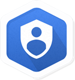

# Setting up a Private Kubernetes Cluster

## GSP178


## Overview

In Kubernetes Engine, a private cluster is a cluster that makes your master inaccessible from the public internet. In a private cluster, nodes do not have public IP addresses, only private addresses, so your workloads run in an isolated environment. Nodes and masters communicate with each other using VPC peering.

In the Kubernetes Engine API, address ranges are expressed as Classless Inter-Domain Routing (CIDR) blocks.

In this lab you will learn how to create a private Kubernetes cluster.

### What you'll do

- Create a Private Kubernetes Cluster.

### Prerequisites

- Student should already have experience creating and launching Kubernetes Clusters and be thoroughly versed in IP addressing in CIDR Range formats.

## Setup

#### Before you click the Start Lab button

Read these instructions. Labs are timed and you cannot pause them. The timer, which starts when you click Start Lab, shows how long Cloud resources will be made available to you.

This Qwiklabs hand-on lab lets you do the lab activities yourself in a real cloud environment, not in a simulation or demo environment. It does so by giving you new, temporary credentials that you use to sign in and access the Google Cloud Platform for the duration of the lab.

#### What you need

To complete this lab, you need:

- Access to a standard internet browser (Chrome browser recommended).
- Time to complete the lab.

**Note:** If you already have your own personal GCP account or project, do not use it for this lab.

#### How to start your lab and sign in to the Console

1. Click the **Start Lab** button. If you need to pay for the lab, a pop-up opens for you to select your payment method. On the left, the **Connection Details** panel becomes populated with the temporary credentials that you must use for this lab.

   

2. Copy the username, and then click **Open Google Console**. The lab spins up resources, and then opens another tab that shows the **Choose an account** page.

   **Tip:** Open the tabs in separate windows, side-by-side.

3. On the Choose an account page, click **Use Another Account**.

   

4. The Sign in page opens. Paste the username that you copied from the Connection Details panel. Then copy and paste the password.

   **Important:** You must use the credentials from the Connection Details panel. Do not use your Qwiklabs credentials. If you have your own GCP account, do not use it for this lab (avoids incurring charges).

5. Click through the subsequent pages:

   - Accept the terms and conditions.
   - Do not add recovery options or two-factor authentication (because this is a temporary account).
   - Do not sign up for free trials.

After a few moments, the GCP console opens in this tab.

**Note:** You can view the menu with a list of GCP Products and Services by clicking the **Navigation menu** at the top-left, next to “Google Cloud Platform”. 

### Activate Google Cloud Shell

Google Cloud Shell is a virtual machine that is loaded with development tools. It offers a persistent 5GB home directory and runs on the Google Cloud. Google Cloud Shell provides command-line access to your GCP resources.

1. In GCP console, on the top right toolbar, click the Open Cloud Shell button.

   

2. In the dialog box that opens, click **START CLOUD SHELL**:

   

   You can click "START CLOUD SHELL" immediately when the dialog box opens.

It takes a few moments to provision and connect to the environment. When you are connected, you are already authenticated, and the project is set to your *PROJECT_ID*. For example:


**gcloud** is the command-line tool for Google Cloud Platform. It comes pre-installed on Cloud Shell and supports tab-completion.

You can list the active account name with this command:

```
gcloud auth list
```

Output:

```output
Credentialed accounts:
 - <myaccount>@<mydomain>.com (active)
```

Example output:

```Output
Credentialed accounts:
 - google1623327_student@qwiklabs.net
```

You can list the project ID with this command:

```
gcloud config list project
```

Output:

```output
[core]
project = <project_ID>
```

Example output:

```Output
[core]
project = qwiklabs-gcp-44776a13dea667a6
```

Full documentation of **gcloud** is available on [Google Cloud gcloud Overview](https://cloud.google.com/sdk/gcloud).

## Set a zone

Run the following to set the default zone:

```
gcloud config set compute/zone us-central1-a
```

You can list all available zones with: `gcloud compute zones list`

## Creating a private cluster

When you create a private cluster, you must specify a `/28` CIDR range for the VMs that run the Kubernetes master components and you need to enable IP aliases.

Next you'll create a cluster named `private-cluster`, and specify a CIDR range of `172.16.0.16/28` for the masters. When you enable IP aliases, you let Kubernetes Engine automatically create a subnetwork for you.

You'll create the private cluster by using the `--private-cluster`, `--master-ipv4-cidr`, and `--enable-ip-alias` flags.

Run the following to create the cluster:

```
gcloud beta container clusters create private-cluster \
    --private-cluster \
    --master-ipv4-cidr 172.16.0.16/28 \
    --enable-ip-alias \
    --create-subnetwork ""
```

## Viewing your subnet and secondary address ranges

List the subnets in the default network:

```
gcloud compute networks subnets list --network default
```

In the output, find the name of the subnetwork that was automatically created for your cluster. For example, `gke-private-cluster-subnet-xxxxxxxx`. Save the name of the cluster, you'll use it in the next step.

now get information about the automatically created subnet, replacing `[SUBNET_NAME]` with your subnet by running:

```
gcloud compute networks subnets describe [SUBNET_NAME] --region us-central1
```

The output shows you the primary address range with the name of your GKE private cluster and the secondary ranges:

```bash
...
ipCidrRange: 10.0.0.0/22
kind: compute#subnetwork
name: gke-private-cluster-subnet-163e3c97
...
privateIpGoogleAccess: true
...
secondaryIpRanges:
- ipCidrRange: 10.40.0.0/14
  rangeName: gke-private-cluster-pods-163e3c97
- ipCidrRange: 10.0.16.0/20
  rangeName: gke-private-cluster-services-163e3c97
...
```

In the output you can see that one secondary range is for **pods** and the other secondary range is for **services**.

Notice that `privateIPGoogleAccess` is set to `true`. This enables your cluster hosts, which have only private IP addresses, to communicate with Google APIs and services.

## Enabling master authorized networks

At this point, the only IP addresses that have access to the master are the addresses in these ranges:

- The primary range of your subnetwork. This is the range used for nodes.
- The secondary range of your subnetwork that is used for pods.

To provide additional access to the master, you must authorize selected address ranges.

#### Create a VM instance

Create a source instance which you'll use to check the connectivity to Kubernetes clusters:

```
gcloud compute instances create source-instance --zone us-central1-a --scopes 'https://www.googleapis.com/auth/cloud-platform'
```

Get the `<External_IP>` of the `source-instance` with:

```
gcloud compute instances describe source-instance --zone us-central1-a | grep natIP
```

**Example Output:**

```bash
natIP: 35.192.107.237
```

Copy the `<nat_IP>` address and save it to use in later steps.

Run the following to Authorize your external address range, replacing `[MY_EXTERNAL_RANGE]` with the CIDR range of the external addresses from the previous output (your CIDR range is `natIP/32`). With CIDR range as `natIP/32`, we are whitelisting one specific IP address:

```
gcloud container clusters update private-cluster \
    --enable-master-authorized-networks \
    --master-authorized-networks [MY_EXTERNAL_RANGE]
```

In a production environment replace `[MY_EXTERNAL_RANGE]` with your network external address CIDR range.

Now that you have access to the master from a range of external addresses, you'll install `kubectl` so you can use it to get information about your cluster. For example, you can use `kubectl` to verify that your nodes do not have external IP addresses.

SSH into `source-instance` with:

```
gcloud compute ssh source-instance --zone us-central1-a
```

Press `Y` to contine. **Enter** through the passphrase questions.

In SSH shell install `kubectl` component of Cloud-SDK

```
gcloud components install kubectl
```

If you get the error: `You cannot perform this action because the Cloud SDK component manager is disabled for this installation` try to install `kubectl` component with: `sudo apt-get install kubectl`

Configure access to the Kubernetes cluster from SSH shell with:

```
gcloud container clusters get-credentials private-cluster --zone us-central1-a
```

Verify that your cluster nodes do not have external IP addresses:

```
kubectl get nodes --output yaml | grep -A4 addresses
```

The output shows that the nodes have internal IP addresses but do not have external addresses:

```bash
...
addresses:
- address: 10.0.0.4
  type: InternalIP
- address: ""
  type: ExternalIP
...
```

Here is another command you can use to verify that your nodes do not have external IP addresses:

```
kubectl get nodes --output wide
```

The output shows an empty column for `EXTERNAL-IP`:

```bash
STATUS ... VERSION        EXTERNAL-IP   OS-IMAGE ...
Ready      v1.8.7-gke.1                 Container-Optimized OS from Google
Ready      v1.8.7-gke.1                 Container-Optimized OS from Google
Ready      v1.8.7-gke.1                 Container-Optimized OS from Google
```

Close the SSH shell by typing:

```
exit
```

## Clean Up

Delete the Kubernetes cluster:

```
gcloud container clusters delete private-cluster --zone us-central1-a
```

Press `Y` to contine.

## Creating a private cluster that uses a custom subnetwork (Optional)

In the previous section Kubernetes Engine automatically created a subnetwork for you. In this section, you'll create your own custom subnetwork, and then create a private cluster. Your subnetwork has a primary address range and two secondary address ranges.

Create a subnetwork and secondary ranges:

```
gcloud compute networks subnets create my-subnet \
    --network default \
    --range 10.0.4.0/22 \
    --enable-private-ip-google-access \
    --region us-central1 \
    --secondary-range my-svc-range=10.0.32.0/20,my-pod-range=10.4.0.0/14
```

Create a private cluster that uses your subnetwork:

```
gcloud beta container clusters create private-cluster2 \
    --private-cluster \
    --enable-ip-alias \
    --master-ipv4-cidr 172.16.0.32/28 \
    --subnetwork my-subnet \
    --services-secondary-range-name my-svc-range \
    --cluster-secondary-range-name my-pod-range
```

Authorize your external address range, replacing `[MY_EXTERNAL_RANGE]` with the CIDR range of the external addresses from the previous output:

```
gcloud container clusters update private-cluster2 \
    --enable-master-authorized-networks \
    --master-authorized-networks [MY_EXTERNAL_RANGE]
```

SSH into `source-instance` with:

```
gcloud compute ssh source-instance --zone us-central1-a
```

Configure access to the Kubernetes cluster from SSH shell with:

```
gcloud container clusters get-credentials private-cluster2 --zone us-central1-a
```

Verify that your cluster nodes do not have external IP addresses:

```
kubectl get nodes --output yaml | grep -A4 addresses
```

The output shows that the nodes have internal IP addresses but do not have external addresses:

```
...
addresses:
- address: 10.0.4.3
  type: InternalIP
- address: ""
  type: ExternalIP
...
```

At this point, the only IP addresses that have access to the master are the addresses in these ranges:

- The primary range of your subnetwork. This is the range used for nodes. In this example, the range for nodes is `10.0.4.0/22`.
- The secondary range of your subnetwork that is used for pods. In this example, the range for pods is `10.4.0.0/14`.

## Congratulations!

This concludes hands-on lab with Kubernetes private cluster.

 

### Finish Your Quest

This self-paced lab is part of the [Kubernetes in the Google Cloud](https://google.qwiklabs.com/quests/29) and [Security & Identity](https://google.qwiklabs.com/quests/40) Quests. A Quest is a series of related labs that form a learning path. Completing this Quest earns you the badge above, to recognize your achievement. You can make your badge (or badges) public and link to them in your online resume or social media account. Enroll in a Quest and get immediate completion credit if you've taken this lab. [See other available Qwiklabs Quests](https://google.qwiklabs.com/catalog).

### Take Your Next Lab

Continue your Quest with [Continuous Delivery with Jenkins in Kubernetes Engine](https://google.qwiklabs.com/catalog_lab/984), or [Building a High-throughput VPN](https://google.qwiklabs.com/catalog_lab/620), or check out these suggestions:

- [Hello Node Kubernetes](https://google.qwiklabs.com/catalog_lab/468)
- [Introduction to Docker](https://google.qwiklabs.com/catalog_lab/944)
- [Cloud IAM: Qwik Start](https://google.qwiklabs.com/catalog_lab/686)

### Google Cloud Training & Certification

...helps you make the most of Google Cloud technologies. [Our classes](https://cloud.google.com/training/courses) include technical skills and best practices to help you get up to speed quickly and continue your learning journey. We offer fundamental to advanced level training, with on-demand, live, and virtual options to suit your busy schedule. [Certifications](https://cloud.google.com/certification/) help you validate and prove your skill and expertise in Google Cloud technologies.

##### Manual Last Updated August 3, 2018

##### Lab Last Tested July 16, 2018

Copyright 2018 Google LLC All rights reserved. Google and the Google logo are trademarks of Google LLC. All other company and product names may be trademarks of the respective companies with which they are associated.