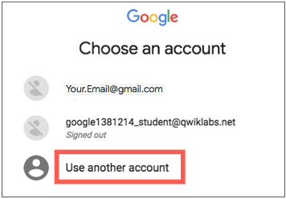
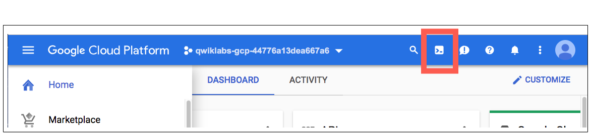
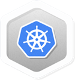

# Helm Package Manager

## GSP052


## Overview

Helm is a toolset for managing Kubernetes packages (also called `Charts`), which contain pre-configured Kubernetes resources. In this lab, you will learn how to install the Helm server and client, how to configure MySQL via a Chart, and how to test the installed MySQL app.

### **What you'll do**

- Create a Kubernetes Cluster in Kubernetes Engine.
- Install and configure the Helm toolset.
- Install the MySQL chart.
- Test the MySQL chart installation with a MySQL client.

### Prerequisites

This is an **advanced** lab. Before taking it, you should be familiar with at least the basics of Docker and Kubernetes. Here are some Qwiklabs that can get you up to speed:

- [Introduction to Docker](https://google.qwiklabs.com/catalog_lab/944)
- [Kubernetes Engine: Qwik Start](https://google.qwiklabs.com/catalog_lab/911)
- [Hello Node Kubernetes](https://google.qwiklabs.com/catalog_lab/468)

You should also have a basic knowledge of Linux system administration/command line tools.

Once your prepared, scroll down to learn the basics of Helm.

## What is Helm?


Helm is a Kubernetes package manager currently maintained by the `Cloud Native Computing Foundation (CNCF)`, which is a cloud industry consortium composed of Google, Microsoft, and Bitnami amongst other companies. Helm has become quite popular with cloud developers largely because it simplifies Kubernetes application management, the roll out of updates, and options to share applications.

There are two parts to Helm:

- The **client** (`Helm`) and the **server** (`Tiller`).

This lab will step you through the installation of both `Helm` and `Tiller`. It will also show you how to configure a Chart (based in MySQL) so you can start integrating your applications with Helm today.

After completing this lab you'll be ready to explore other `Charts`. For more details on the internals of charts, how to construct them, and links to Helm repositories, check out the following blog post: [Kubernetes blog on Helm](https://kubernetes.io/blog/2016/10/helm-charts-making-it-simple-to-package-and-deploy-apps-on-kubernetes/).

Now let's get down to business and start developing with Helm!

## Setup

#### Before you click the Start Lab button

Read these instructions. Labs are timed and you cannot pause them. The timer, which starts when you click Start Lab, shows how long Cloud resources will be made available to you.

This Qwiklabs hand-on lab lets you do the lab activities yourself in a real cloud environment, not in a simulation or demo environment. It does so by giving you new, temporary credentials that you use to sign in and access the Google Cloud Platform for the duration of the lab.

#### What you need

To complete this lab, you need:

- Access to a standard internet browser (Chrome browser recommended).
- Time to complete the lab.

**Note:** If you already have your own personal GCP account or project, do not use it for this lab.

#### How to start your lab and sign in to the Console

1. Click the **Start Lab** button. If you need to pay for the lab, a pop-up opens for you to select your payment method. On the left, the **Connection Details** panel becomes populated with the temporary credentials that you must use for this lab.

   

2. Copy the username, and then click **Open Google Console**. The lab spins up resources, and then opens another tab that shows the **Choose an account** page.

   **Tip:** Open the tabs in separate windows, side-by-side.

3. On the Choose an account page, click **Use Another Account**.

   

4. The Sign in page opens. Paste the username that you copied from the Connection Details panel. Then copy and paste the password.

   **Important:** You must use the credentials from the Connection Details panel. Do not use your Qwiklabs credentials. If you have your own GCP account, do not use it for this lab (avoids incurring charges).

5. Click through the subsequent pages:

   - Accept the terms and conditions.
   - Do not add recovery options or two-factor authentication (because this is a temporary account).
   - Do not sign up for free trials.

After a few moments, the GCP console opens in this tab.

**Note:** You can view the menu with a list of GCP Products and Services by clicking the **Navigation menu** at the top-left, next to “Google Cloud Platform”. 

### Activate Google Cloud Shell

Google Cloud Shell is a virtual machine that is loaded with development tools. It offers a persistent 5GB home directory and runs on the Google Cloud. Google Cloud Shell provides command-line access to your GCP resources.

1. In GCP console, on the top right toolbar, click the Open Cloud Shell button.

   

2. In the dialog box that opens, click **START CLOUD SHELL**:

   

   You can click "START CLOUD SHELL" immediately when the dialog box opens.

It takes a few moments to provision and connect to the environment. When you are connected, you are already authenticated, and the project is set to your *PROJECT_ID*. For example:


**gcloud** is the command-line tool for Google Cloud Platform. It comes pre-installed on Cloud Shell and supports tab-completion.

You can list the active account name with this command:

```
gcloud auth list
```

Output:

```output
Credentialed accounts:
 - <myaccount>@<mydomain>.com (active)
```

Example output:

```Output
Credentialed accounts:
 - google1623327_student@qwiklabs.net
```

You can list the project ID with this command:

```
gcloud config list project
```

Output:

```output
[core]
project = <project_ID>
```

Example output:

```Output
[core]
project = qwiklabs-gcp-44776a13dea667a6
```

Full documentation of **gcloud** is available on [Google Cloud gcloud Overview](https://cloud.google.com/sdk/gcloud).

## Set your Local Zone

Since Cloud Shell comes preinstalled with Kubernetes and the `kubectl` command line tool, we can create a Kubernetes cluster right away. The first thing that we'll have to do is set our zone, which is done by running the following command:

```
gcloud config set compute/zone us-central1-a
```

Now that we have our zone configured, we can instantiate a Kubernetes cluster.

## Create the Kubernetes Cluster

Let's create a Kubernetes cluster so we have a sample containerized application to play with. To create a Kubernetes cluster, run the following command (this might take a while to execute):

```
gcloud container clusters create my-cluster --scopes "https://www.googleapis.com/auth/projecthosting,storage-rw"
```

You should see a similar output:

```bash
Created [https://container.googleapis.com/v1/projects/qwiklabs-gcp-0286d80b4438f082/zones/us-central1-a/clusters/my-cluster].
kubeconfig entry generated for my-cluster.
NAME        ZONE           MASTER_VERSION  MASTER_IP       MACHINE_TYPE   NODE_VERSION  NUM_NODES  STATUS
my-cluster  us-central1-f  1.9.7-gke.3           35.188.161.231  n1-standard-1  1.9.7         3          RUNNING
```

### Test Completed Task

Click **Check my progress** to verify your performed task. If you have completed the task successfully you will granted with an assessment score.


Create a Kubernetes Cluster (zone: us-central1-a)

Check my progress


Now that our cluster is created, we want to install the server (`Tiller`). To get the cluster name, run the following command:

```
kubectl config current-context
```

Example command output (yours will differ):

```bash
gke_qwiklabs-gcp-0286d80b4438f082_us-central1-f_my-cluster
```

If we want some more detailed information about our cluster, we can run the following command:

```
kubectl cluster-info
```

Example command output (yours will differ):

```bash
Kubernetes master is running at https://35.227.106.109
GLBCDefaultBackend is running at https://35.227.106.109/api/v1/namespaces/kube-system/services/default-http-backend/proxy
Heapster is running at https://35.227.106.109/api/v1/namespaces/kube-system/services/heapster/proxy
KubeDNS is running at https://35.227.106.109/api/v1/namespaces/kube-system/services/kube-dns/proxy
kubernetes-dashboard is running at https://35.227.106.109/api/v1/namespaces/kube-system/services/kubernetes-dashboard/proxy
```

## Install Helm

Now that we have our Kubernetes cluster up and running, it's time to install Helm (the client). Helm comes preconfigured with an installer script that automatically grabs the latest version of the Helm client and installs it locally.

Let's fetch the script, which we'll do by running the following command:

```
curl https://raw.githubusercontent.com/kubernetes/helm/master/scripts/get > get_helm.sh
```

Next, we'll change the permissions so that we have full access to the file:

```
chmod 700 get_helm.sh
```

Now let's save it locally:

```
./get_helm.sh
```

Before we can initialize Helm and Tiller, we need to make a `tiller` service account, which you do by running the following command:

```
kubectl -n kube-system create sa tiller
```

### Test Completed Task

Click **Check my progress** to verify your performed task. If you have completed the task successfully you will granted with an assessment score.


Create a tiller Service Account.

Check my progress


Finally, we bind `clusterrole` (a set of rules around the cluster) to our service account:

```
kubectl create clusterrolebinding tiller --clusterrole cluster-admin --serviceaccount=kube-system:tiller
```

### **Initialize Helm and Install Tiller**

Now that we have Helm installed and a service account created, it's time to configure Helm's local environment so we can install `Tiller`. Run the following command to do so:

```
helm init --service-account tiller
```

Command output:

```bash
Creating /home/gcpstaging3629_student/.helm
Creating /home/gcpstaging3629_student/.helm/repository
Creating /home/gcpstaging3629_student/.helm/repository/cache
Creating /home/gcpstaging3629_student/.helm/repository/local
Creating /home/gcpstaging3629_student/.helm/plugins
Creating /home/gcpstaging3629_student/.helm/starters
Creating /home/gcpstaging3629_student/.helm/cache/archive
Creating /home/gcpstaging3629_student/.helm/repository/repositories.yaml
$HELM_HOME has been configured at /home/gcpstaging3629_student/.helm.
```

### Test Completed Task

Click **Check my progress** to verify your performed task. If you have completed the task successfully you will granted with an assessment score.


Initialize Helm and Install Tiller.

Check my progress


As a sanity check, let's make sure that the Tiller server is running correctly. Run the following command:

```
kubectl get po --namespace kube-system
```

Command output:

```bash
NAME                          READY       STATUS    RESTARTS      AGE
fluentd-gcp-v2.0-jvqc2    2/2       Running    0          34m
fluentd-gcp-v2.0-tv0kt    2/2       Running    0          34m
fluentd-gcp-v2.0-tzkkq    2/2       Running    0          34m
Heapster-v1.3.0-128....     2/2       Running    0          33m
kube-dns-3664836949-78znt 3/3       Running    0          34m
kube-dns-3664836949-8c27t 3/3       Running    0          34m
kube-dns-autoscaler-2667913178-jbqqp                   1/1       Running   0          34m
kube-proxy-gke-my-cluster-default-pool-8c8019d4-9xz9   1/1       Running   0          35m
kube-proxy-gke-my-cluster-default-pool-8c8019d4-ghj6   1/1       Running   0          35m
kube-proxy-gke-my-cluster-default-pool-8c8019d4-r3xk   1/1       Running   0          33m
kubernetes-dashboard-2917854236-sh7xx                  1/1       Running   0          34m
l7-default-backend-1044750973-hv34r                    1/1       Running   0          34m
tiller-deploy-4026033803-gdrrg                         1/1       Running   0          3m
```

Now that Tiller has been installed, we can run the command `helm version` to see what client and server version Helm is running:

```
helm version
```

Command output:

```bash
Client: &version.Version{SemVer:"v2.6.1", GitCommit:"bbc1f71dc03afc5f00c6ac84b9308f8ecb4f39ac", GitTreeState:"clean"}

Server: &version.Version{SemVer:"v2.6.1", GitCommit:"bbc1f71dc03afc5f00c6ac84b9308f8ecb4f39ac", GitTreeState:"clean"}
```

## Install a Chart

Now that we have the client and server sides of Helm in place, let's install a chart. There are a few different ways to install charts, but we'll step you through a common one. To get the latest list of available charts run this command:

```
helm repo update
```

Sample output:

```
Hang tight while we grab the latest from your chart repositories...
...Skip local chart repository
...Successfully got an update from the "stable" chart repository
Update Complete. ⎈ Happy Helming!⎈
```

For this exercise, we'll use the `stable/mysql` chart. To install it, run the following command:

```
helm install stable/mysql
```

The output provides commands you'll use in the following sections to get the root password, install an Ubuntu pod, and connect to your MySQL database.

Sample Output:

```bash
NAME:   giddy-rodent
LAST DEPLOYED: Tue Sep 19 17:04:27 2017
NAMESPACE: default
STATUS: DEPLOYED
RESOURCES:
==> v1/Secret
NAME                TYPE    DATA  AGE
giddy-rodent-mysql  Opaque  2     1s
==> v1/PersistentVolumeClaim
NAME                STATUS   VOLUME    CAPACITY  ACCESSMODES  STORAGECLASS  AGE
giddy-rodent-mysql  Pending  standard  1s
==> v1/Service
NAME                CLUSTER-IP    EXTERNAL-IP  PORT(S)   AGE
giddy-rodent-mysql  10.31.247.29  <none>       3306/TCP  1s
==> v1beta1/Deployment
NAME                DESIRED  CURRENT  UP-TO-DATE  AVAILABLE  AGE
giddy-rodent-mysql  1        1        1           0          1s
NOTES:
MySQL can be accessed via port 3306 on the following DNS name from within your cluster:
giddy-rodent-mysql.default.svc.cluster.local

To get your root password run:
    kubectl get secret --namespace default giddy-rodent-mysql -o jsonpath="{.data.mysql-root-password}" | base64 --decode; echo

To connect to your database:
1. Run an Ubuntu pod that you can use as a client:
    kubectl run -i --tty ubuntu --image=ubuntu:16.04 --restart=Never -- bash -il

2. Install the mysql client:
    $ apt-get update && apt-get install mysql-client -y

3. Connect using the mysql cli, then provide your password:
    $ mysql -h giddy-rodent-mysql -p
```

### Test Completed Task

Click **Check my progress** to verify your performed task. If you have completed the task successfully you will granted with an assessment score.


Install a MySQL Chart.

Check my progress


**Note: The commands provided in this sample output are unique to each lab session, the commands in your output will be different, you need to use those commands in order to get the desired output.**

### Get your Root Password

To get your root password, **use the command provided in the helm install stable/mysql command output. For example**, the command from the sample output is:

```
kubectl get secret --namespace default giddy-rodent-mysql -o jsonpath="{.data.mysql-root-password}" | base64 --decode; echo
```

**Note**: Make sure to keep this root password, you'll need it to connect your mysql client to the MySQL database in the next section.

### Install an Ubuntu Pod

Now we will install an Ubuntu pod to use as a client, which we find from the command provided in the `helm install stable/mysql` command output. **For example**, the command from the sample output log is:

```
kubectl run -i --tty ubuntu --image=ubuntu:16.04 --restart=Never -- bash -il
```

## Connect to your MYSQL Database

Now we need to install the MySQL client, which we do by running the following command:

```
apt-get update && apt-get install mysql-client -y
```

Connect to your MySQL database by entering the **command provided in the helm install stable/mysql command output**. For example, the command from the sample output is:

```
mysql -h giddy-rodent-mysql -p
```

You will be asked for a password—use the password you kept from the "Get your password" section.

To get a basic view of the features of this MySQL chart, log out of the connection and enter the `helm inspect stable/mysql` command:

```
exit
exit
helm inspect stable/mysql
```

## Test your Understanding

Below are a multiple choice questions to reinforce your understanding of this lab's concepts. Answer them to the best of your abilities.


Helm is the application package manager running atop Kubernetes.True False


Which cluster role is bind to tiller service account in the lab?


basic-user


cluster-admin


rbac-defaults

Submit


## Congratulations!

This concludes this hands-on lab on the Helm package manager. You've learned how to install, configure, and run a Helm client and server in the Kubernetes Engine. You also located and installed a Helm chart containing a MySQL application successfully. From this point on you should be comfortable using Helm in your environment and as a means to package and share your applications with your community and customers.



### Finish Your Quest

This self-paced lab is part of the Qwiklabs [Kubernetes in the Google Cloud](https://google.qwiklabs.com/quests/29) Quest. A Quest is a series of related labs that form a learning path. Completing this Quest earns you the badge above, to recognize your achievement. You can make your badge (or badges) public and link to them in your online resume or social media account. [Enroll in this Quest](https://google.qwiklabs.com/quests/29) and get immediate completion credit if you've taken this lab. [See other available Qwiklabs Quests](https://google.qwiklabs.com/catalog).

### Take Your Next Lab

Continue your Quest with [NGINX Ingress Controller on Google Kubernetes Engine](https://google.qwiklabs.com/catalog_lab/910) , or check out these suggestions:

- [Continuous Delivery with Jenkins in Kubernetes Engine](https://google.qwiklabs.com/catalog_lab/984)
- [Introduction to Docker](https://google.qwiklabs.com/catalog_lab/944)

### Next Steps / Learn More

- Read further via the online [Helm Documentation](https://docs.helm.sh/).
- Access [Helm source code on Github](https://github.com/kubernetes/helm).
- Visit the [Chart Directory](https://kubeapps.com/) at [kubeapps.com](https://kubeapps.com/) to explore and use community-created Helm charts.

### Google Cloud Training & Certification

...helps you make the most of Google Cloud technologies. [Our classes](https://cloud.google.com/training/courses) include technical skills and best practices to help you get up to speed quickly and continue your learning journey. We offer fundamental to advanced level training, with on-demand, live, and virtual options to suit your busy schedule. [Certifications](https://cloud.google.com/certification/) help you validate and prove your skill and expertise in Google Cloud technologies.

##### Manual Last Updated October 8, 2018

##### Lab Last Tested October 8, 2018

Copyright 2018 Google LLC All rights reserved. Google and the Google logo are trademarks of Google LLC. All other company and product names may be trademarks of the respective companies with which they are associated.